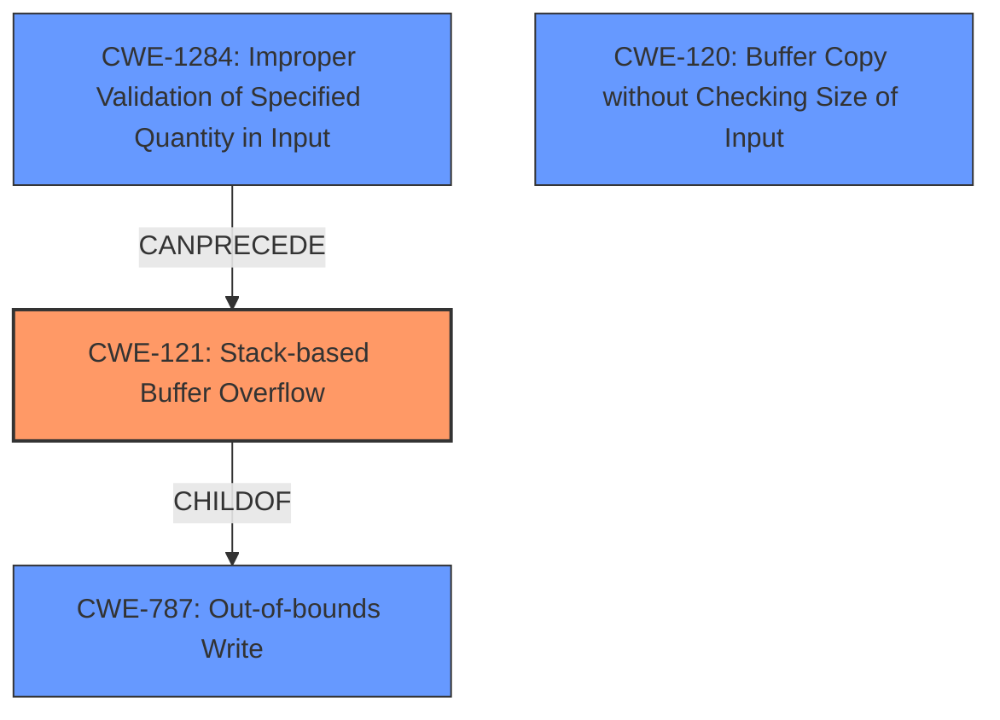

# Final Resolution for CVE-2021-21890

# Summary
| CWE ID | CWE Name | Confidence | CWE Abstraction Level | CWE Vulnerability Mapping Label | CWE-Vulnerability Mapping Notes |
|---|---|---|---|---|---|
| CWE-121 | Stack-based Buffer Overflow | 0.95 | Variant | Allowed | Primary CWE |
| CWE-787 | Out-of-bounds Write | 0.70 | Base | Allowed | Secondary Candidate |
| CWE-1284 | Improper Validation of Specified Quantity in Input | 0.60 | Base | Allowed | Secondary Candidate |
| CWE-120 | Buffer Copy without Checking Size of Input ('Classic Buffer Overflow') | 0.50 | Base | Allowed-with-Review | Secondary Candidate |
| CWE-131 | Incorrect Calculation of Buffer Size | 0.40 | Base | Allowed | Secondary Candidate |

## Evidence and Confidence

*   **Confidence Score:** 0.93
*   **Evidence Strength:** HIGH

## Relationship Analysis
The analysis considered parent-child relationships, identifying CWE-121 as a child of CWE-787 and a variant of a buffer overflow. The chain relationship shows that improper input validation (CWE-1284) can precede a buffer overflow (CWE-121). Peer relationships weren't directly applicable, but the analysis considered alternative classifications based on the similarity of CWE descriptions. The abstraction levels influenced the decision to choose CWE-121 (Variant) for its specificity and CWE-787 (Base) as a broader secondary classification.

## Vulnerability Chain
The vulnerability chain starts with **CWE-1284 (Improper Validation of Specified Quantity in Input)**, where the `path` parameter's length isn't validated. This leads to **CWE-121 (Stack-based Buffer Overflow)** when `sprintf` copies the unchecked input to a stack buffer, causing an out-of-bounds write (**CWE-787**). The consequence is remote code execution due to the ability to overwrite stack memory. **CWE-120** is present as `sprintf` copies the buffer.

## Summary of Analysis
The initial analysis and the provided criticism were both well-reasoned. The decision to include CWE-1284 as a secondary candidate, stems from the overflow being directly linked to the lack of input validation on the 'path' parameter, which is a specified quantity. While CWE-121 remains the primary **WEAKNESS** due to the direct evidence of a stack-based buffer overflow as described in the vulnerability description ("A **stack-based buffer overflow** vulnerability exists...").

The graph relationships influenced the final selection by highlighting the parent-child relationship between CWE-121 and CWE-787, justifying CWE-787 as a related **ROOTCAUSE**. The chain relationship, showing that CWE-1284 can precede CWE-121, further supports the inclusion of CWE-1284.

The selected CWEs are at the optimal level of specificity. CWE-121 accurately describes the stack-based nature of the overflow, while CWE-787 captures the general out-of-bounds write condition. CWE-1284 highlights the missing input validation as a contributing factor. CWE-120 is less specific but relevant given the use of `sprintf`. CWE-131 is least relevant because the core issue is not the calculation of the buffer size, but the lack of validation of the length of the input being copied.