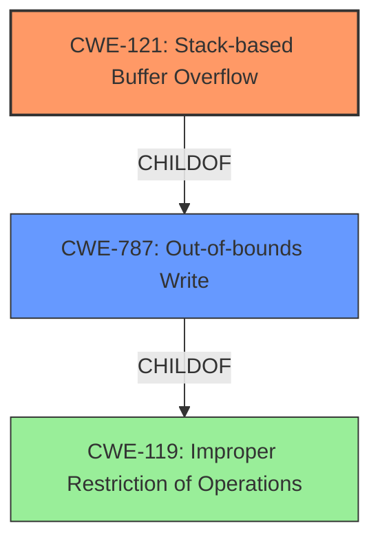

# Analysis Report for CVE-2021-21891

# Vulnerability Analysis Report: CVE-2021-21891

## Description

A stack-based buffer overflow vulnerability exists in the Web Manager FsBrowseClean functionality of Lantronix PremierWave 2050 8.9.0.0R4 (in QEMU). A specially crafted HTTP request can lead to remote code execution in the vulnerable portion of the branch (deletefile). An attacker can make an authenticated HTTP request to trigger this vulnerability.

## Vulnerability Description Key Phrases

**Rootcause:** stack-based buffer overflow
**Impact:** remote code execution
**Vector:** specially crafted HTTP request
**Attacker:** attacker
**Product:** Lantronix PremierWave 2050
**Version:** 8.9.0.0R4
**Component:** Web Manager FsBrowseClean functionality

## Analysis (with Relationship Data)

# Summary
| CWE ID | CWE Name | Confidence | CWE Abstraction Level | CWE Vulnerability Mapping Label | CWE-Vulnerability Mapping Notes |
|---|---|---|---|---|---|
| CWE-121 | Stack-based Buffer Overflow | 1.0 | Variant | Primary | Allowed |
| CWE-787 | Out-of-bounds Write | 0.7 | Base | Secondary | Allowed |

## Evidence and Confidence

*   **Confidence Score:** 0.9
*   **Evidence Strength:** HIGH

- **Analysis and Justification:**  
  - *Explanation:* The vulnerability description explicitly states "**stack-based buffer overflow**" and the CVE reference links content summary further confirms the **root cause** as a "**Stack-based buffer overflow** vulnerability". This aligns directly with CWE-121 (Stack-based Buffer Overflow), which is a Variant level CWE. The vulnerability occurs in the `FsBrowseClean` functionality due to the use of `sprintf` with a fixed-size buffer and user-controlled input (`path` parameter) without any size validation. This allows an attacker to overwrite the stack, leading to remote code execution. The mapping guidance for CWE-121 specifies that it is ALLOWED. While CWE-787 (Out-of-bounds Write) could also be considered, CWE-121 is more specific because it identifies the overflow occurs on the stack.
  
  - *Relationship Analysis:* CWE-121 is a variant of CWE-119 (Improper Restriction of Operations within the Bounds of a Memory Buffer), but CWE-121 is more specific in this case, as it identifies the location of the buffer on the stack. CWE-121 is also a child of CWE-787 (Out-of-bounds Write).

- **Confidence Score:**  
  - Confidence: 1.0 (Explicit mention of "stack-based buffer overflow" and detailed technical analysis in the CVE reference materials)

---

## Criticism of Analysis

Okay, let's review the provided analysis and critique it based on the full CWE specifications.

**Overall Assessment:**

The analysis is generally strong and well-justified. The primary CWE mapping to CWE-121 (Stack-based Buffer Overflow) is correct and supported by the evidence. The confidence score of 1.0 is appropriate. Including CWE-787 as a secondary mapping is also reasonable, as it's a broader category that encompasses the specific issue. The analysis clearly explains why CWE-121 is a better fit than its parent, CWE-787, which is a good practice.

**Detailed Critique:**

*   **CWE-121 (Primary Mapping):**
    *   **Strengths:**
        *   The analysis correctly identifies that the vulnerability involves a buffer on the stack being overwritten.
        *   It clearly states the root cause: the use of `sprintf` with a fixed-size buffer and user-controlled input without size validation.
        *   It aligns with the CWE-121 description: "A stack-based buffer overflow condition is a condition where the buffer being overwritten is allocated on the stack (i.e., is a local variable or, rarely, a parameter to a function)."
        *   The analysis explicitly mentions that CWE-121 is at the "Variant" level of abstraction, which is a preferred level.
        *   The analysis correctly states that CWE-121 is ALLOWED per mapping guidance.
    *   **Considerations based on CWE specs:**
        *   Mitigations: The analysis could benefit from briefly mentioning some relevant mitigations from the CWE-121 specification. For example: "Applying compiler extensions for automatic buffer overflow detection mechanisms (e.g., /GS flag in Visual Studio)" or "Implementing input validation to limit the size of the 'path' parameter". While the mitigations are high level, they should at least be mentioned.

*   **CWE-787 (Secondary Mapping):**
    *   **Strengths:**
        *   Recognizes that the vulnerability *is* an out-of-bounds write.
        *   The base-level CWE being ALLOWED is also correctly recognized.
    *   **Considerations based on CWE specs:**
        *   The analysis does a good job of explaining why CWE-121 is more specific and a better primary mapping.
        *   Mitigations: Similar to CWE-121, mentioning mitigations like "Using safe string handling libraries" or "Implementing strict input validation" would be helpful.

*   **Retriever Results Critique:**
    * The retriever results section has some incorrect results. Specifically CWE-190, CWE-120, CWE-1284, CWE-131, CWE-122, CWE-126, CWE-195, CWE-119, and CWE-674 are all not helpful for this type of vulnerability.
    * It may be useful to understand the algorithms that resulted in these classifications, to better tune for future scans.

*   **General Notes:**
    *   **Clarity:** The analysis is well-written and easy to understand.
    *   **Evidence:** The evidence provided is strong, citing both the vulnerability description and the CVE reference links content summary.
    *   **Confidence:**  The confidence score is well-justified given the explicit mention of "stack-based buffer overflow" in the vulnerability description.
    *   **Relationships:**  The relationship analysis, particularly explaining why CWE-121 is more specific than CWE-119 or CWE-787, is excellent.

**Recommendations:**

1.  **Add Mitigation Mentions:** Include a brief mention of relevant mitigations for both CWE-121 and CWE-787, drawing directly from the "Potential Mitigations" sections of the CWE specifications. Even high-level mitigation strategies can add value.
2.  **Input Validation Emphasis:** While it's implied, explicitly state that *lack* of input validation is a key contributing factor to this vulnerability. This connects the buffer overflow back to a design/implementation flaw.
3.  **Consider CWE-120 (Buffer Copy without Checking Size of Input):** While CWE-121 is more specific, CWE-120 *could* be argued as a contributing factor, as the `sprintf` function is essentially copying data without a size check. However, since sprintf *can* technically be used safely (if input sizes are controlled), it's not a perfect fit. This is a judgment call, and the current analysis is reasonable in not including it.
4.  **Omit unhelpful Retriever Results** Consider not including CWEs that aren't likely root causes, or in any way related to the vulnerability. It can be distracting to a reader.

By incorporating these recommendations, the analysis will be even more comprehensive and provide greater value to developers and security professionals seeking to understand and address this type of vulnerability.

## Final Resolution

# Summary
| CWE ID | CWE Name | Confidence | CWE Abstraction Level | CWE Vulnerability Mapping Label | CWE-Vulnerability Mapping Notes |
|---|---|---|---|---|---|
| CWE-121 | Stack-based Buffer Overflow | 1.0 | Variant | Primary | Allowed |
| CWE-787 | Out-of-bounds Write | 0.7 | Base | Secondary | Allowed |

## Evidence and Confidence

*   **Confidence Score:** 1.0
*   **Evidence Strength:** HIGH

## Relationship Analysis
The primary CWE is CWE-121, which is a variant of CWE-119 (Improper Restriction of Operations within the Bounds of a Memory Buffer). CWE-121 is more specific because it clearly states that the buffer is allocated on the stack. CWE-121 is also a child of CWE-787 (Out-of-bounds Write). CWE-787 is more general and less specific, but accurately describes that the code writes data past the end of the intended buffer.

## Vulnerability Chain
The vulnerability chain starts with the **lack of input validation** on the `path` parameter in the HTTP request. This leads to the use of `sprintf` with a fixed-size buffer and user-controlled input, which allows an attacker to overwrite the stack, resulting in **CWE-121 (Stack-based Buffer Overflow)** and ultimately remote code execution. This is also an instance of **CWE-787 (Out-of-bounds Write)**.

## Summary of Analysis
The initial analysis and criticism both align strongly with the determination that **CWE-121 (Stack-based Buffer Overflow)** is the most appropriate primary classification. The vulnerability description explicitly states "stack-based buffer overflow," providing direct evidence for this classification. The detailed technical analysis in the CVE reference materials further supports this conclusion.

The graph relationships influenced the final selection by highlighting the hierarchical relationship between CWE-121, CWE-787, and CWE-119. While CWE-119 is a parent of CWE-121, it is too general. CWE-787 is also a parent of CWE-121, but is less specific than CWE-121.

The selected CWEs are at the optimal level of specificity because CWE-121 accurately reflects the specific type of buffer overflow (stack-based) that occurs in this vulnerability. CWE-787 is included as a secondary classification because it accurately describes the **out-of-bounds write** condition that results from the overflow.

The analysis is heavily based on the provided evidence, specifically the vulnerability description stating "**stack-based buffer overflow**" and the CVE reference materials confirming this **root cause**.

*Report generated on 2025-03-17 22:56:44*
