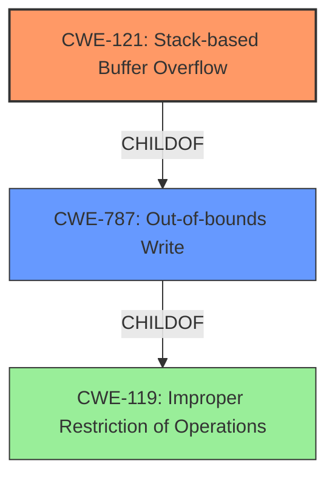

# Final Resolution for CVE-2021-21891

# Summary
| CWE ID | CWE Name | Confidence | CWE Abstraction Level | CWE Vulnerability Mapping Label | CWE-Vulnerability Mapping Notes |
|---|---|---|---|---|---|
| CWE-121 | Stack-based Buffer Overflow | 1.0 | Variant | Primary | Allowed |
| CWE-787 | Out-of-bounds Write | 0.7 | Base | Secondary | Allowed |

## Evidence and Confidence

*   **Confidence Score:** 1.0
*   **Evidence Strength:** HIGH

## Relationship Analysis
The primary CWE is CWE-121, which is a variant of CWE-119 (Improper Restriction of Operations within the Bounds of a Memory Buffer). CWE-121 is more specific because it clearly states that the buffer is allocated on the stack. CWE-121 is also a child of CWE-787 (Out-of-bounds Write). CWE-787 is more general and less specific, but accurately describes that the code writes data past the end of the intended buffer.

## Vulnerability Chain
The vulnerability chain starts with the **lack of input validation** on the `path` parameter in the HTTP request. This leads to the use of `sprintf` with a fixed-size buffer and user-controlled input, which allows an attacker to overwrite the stack, resulting in **CWE-121 (Stack-based Buffer Overflow)** and ultimately remote code execution. This is also an instance of **CWE-787 (Out-of-bounds Write)**.

## Summary of Analysis
The initial analysis and criticism both align strongly with the determination that **CWE-121 (Stack-based Buffer Overflow)** is the most appropriate primary classification. The vulnerability description explicitly states "stack-based buffer overflow," providing direct evidence for this classification. The detailed technical analysis in the CVE reference materials further supports this conclusion.

The graph relationships influenced the final selection by highlighting the hierarchical relationship between CWE-121, CWE-787, and CWE-119. While CWE-119 is a parent of CWE-121, it is too general. CWE-787 is also a parent of CWE-121, but is less specific than CWE-121.

The selected CWEs are at the optimal level of specificity because CWE-121 accurately reflects the specific type of buffer overflow (stack-based) that occurs in this vulnerability. CWE-787 is included as a secondary classification because it accurately describes the **out-of-bounds write** condition that results from the overflow.

The analysis is heavily based on the provided evidence, specifically the vulnerability description stating "**stack-based buffer overflow**" and the CVE reference materials confirming this **root cause**.