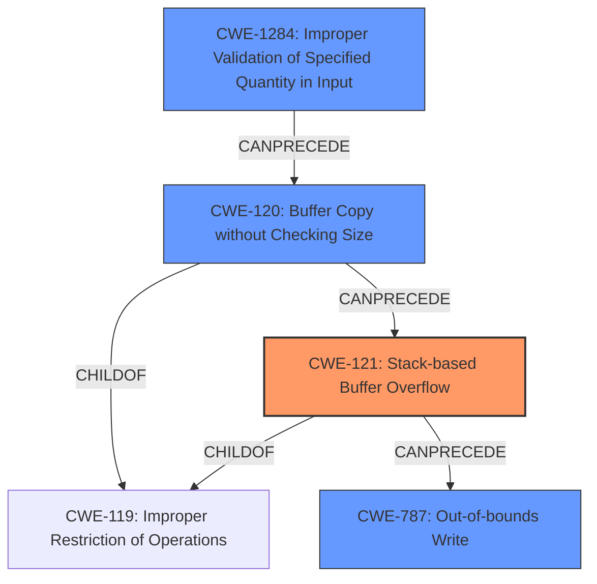

# Analysis Report for CVE-2021-21892

# Vulnerability Analysis Report: CVE-2021-21892

## Description

A stack-based buffer overflow vulnerability exists in the Web Manager FsUnmount functionality of Lantronix PremierWave 2050 8.9.0.0R4 (in QEMU). A specially crafted HTTP request can lead to remote code execution. An attacker can make an authenticated HTTP request to trigger this vulnerability.

## Vulnerability Description Key Phrases

**Rootcause:** stack-based buffer overflow
**Impact:** remote code execution
**Vector:** specially crafted HTTP request
**Attacker:** attacker
**Product:** Lantronix PremierWave 2050
**Version:** 8.9.0.0R4
**Component:** Web Manager FsUnmount functionality

## Analysis (with Relationship Data)

# Summary
| CWE ID | CWE Name | Confidence | CWE Abstraction Level | CWE Vulnerability Mapping Label | CWE-Vulnerability Mapping Notes |
|---|---|---|---|---|---|
| CWE-121 | Stack-based Buffer Overflow | 0.95 | Variant | Primary | Allowed |
| CWE-120 | Buffer Copy without Checking Size of Input ('Classic Buffer Overflow') | 0.70 | Base | Secondary | Allowed-with-Review |
| CWE-787 | Out-of-bounds Write | 0.60 | Base | Secondary | Allowed |
| CWE-1284 | Improper Validation of Specified Quantity in Input | 0.50 | Base | Secondary | Allowed |

## Evidence and Confidence

*   **Confidence Score:** 0.90
*   **Evidence Strength:** HIGH

- **Analysis and Justification:**
  - *Explanation:* The vulnerability is described as a **stack-based buffer overflow** in the Web Manager FsUnmount functionality of Lantronix PremierWave 2050. The **root cause** is attributed to a `sprintf` function used with a fixed-size stack buffer, where the size of the input `path` parameter from an HTTP POST request is not validated. This aligns directly with CWE-121 (Stack-based Buffer Overflow), which is a Variant of CWE-119 (Improper Restriction of Operations within the Bounds of a Memory Buffer). The CVE reference summary confirms this, stating the vulnerability is a "classic stack-based buffer overflow (CWE-121) due to the unsafe use of `sprintf`". This makes CWE-121 the most accurate primary mapping. CWE-120 (Buffer Copy without Checking Size of Input) is also relevant because the vulnerability involves copying data into a buffer without validating the size, which can lead to a buffer overflow. However, CWE-121 is more specific as it identifies the buffer's location as the stack. The use of `sprintf` without proper bounds checking directly leads to the overflow. While the description indicates an out-of-bounds write, CWE-787, it doesn't fully capture the stack context, making CWE-121 and CWE-120 more precise. Also, CWE-1284 (Improper Validation of Specified Quantity in Input) is relevant since the `path` parameter's length isn't validated, contributing to the overflow.

  - *Relationship Analysis:* CWE-121 is a Variant of CWE-119, representing a specific type of buffer overflow. It is also related to CWE-120, as the core issue involves copying data without size checks. CWE-120 is a child of CWE-20 because of the lack of input validation. CWE-1284 is related to CWE-20 as well and can precede CWE-789 (Memory Allocation with Excessive Size Value). This shows a chain of weaknesses starting from input validation to memory allocation and finally leading to the buffer overflow.

- **Confidence Score:**
  - Confidence: 0.95 (High confidence due to direct evidence and detailed technical description in CVE reference materials)

## Criticism of Analysis

Okay, I have reviewed the analysis of the stack-based buffer overflow vulnerability in Lantronix PremierWave 2050 8.9.0.0R4 (in QEMU) using the provided full CWE specifications. Here's a breakdown of my critique:

**Overall Assessment:**

The analysis is generally good and well-justified. The primary mapping to CWE-121 (Stack-based Buffer Overflow) is accurate and supported by the vulnerability description and the CVE reference summary. The secondary mappings are also relevant, but their ranking and justification could be refined slightly. The confidence level assigned is appropriate given the available information.

**Specific Feedback:**

1.  **CWE-121 (Stack-based Buffer Overflow) - Primary:**
    *   **Assessment:** Excellent choice for the primary CWE. The description clearly indicates a buffer overflow occurring on the stack, making this the most specific and accurate mapping.
    *   **Justification:** The justification provided is solid, emphasizing the use of `sprintf` with an unvalidated `path` parameter on the stack. This aligns perfectly with CWE-121's definition.
    *   **Mapping Guidance Check:** Aligns with the "Allowed" usage for CWE-121 since the analysis confirms the location of the overflow on the stack.

2.  **CWE-120 (Buffer Copy without Checking Size of Input ('Classic Buffer Overflow')) - Secondary:**
    *   **Assessment:** A good secondary mapping as the vulnerability is ultimately caused by copying an input buffer into a smaller output buffer without checking the input size.
    *   **Justification:** The analysis correctly notes that this CWE is relevant because it captures the core issue of copying data without size checks. However, the justification could be strengthened by explicitly stating why CWE-121 is still more specific (stack location).
    *   **Mapping Guidance Check:** The use of "Allowed-with-Review" for CWE-120 is suitable, since the description involves a buffer copy without size check, however, there are more specific CWEs to describe this issue.

3.  **CWE-787 (Out-of-bounds Write) - Secondary:**
    *   **Assessment:** This is a relevant but less precise secondary mapping. It describes the result of the overflow but not the specific nature of it.
    *   **Justification:** While correct that an out-of-bounds write occurs, the analysis should acknowledge that CWE-121 and CWE-120 provide more context about the nature of the overflow (stack-based, unchecked copy).
    *   **Mapping Guidance Check:** The usage of "Allowed" for CWE-787 is acceptable since it's a direct consequence of the overflow.

4.  **CWE-1284 (Improper Validation of Specified Quantity in Input) - Secondary:**
    *   **Assessment:** A highly relevant secondary CWE. The lack of input validation is a direct enabler of the buffer overflow.
    *   **Justification:** It is very accurate that the `path` parameter's length isn't validated, enabling the overflow.
    *   **Mapping Guidance Check:** The usage of "Allowed" for CWE-1284 is appropriate, reflecting the direct contribution of missing input validation to the vulnerability.

5.  **CWE-20 (Improper Input Validation):**
    *   **Assessment:** This CWE is too general and should not be used.

**Suggestions for Improvement:**

*   **Chain of Weaknesses:** The analysis could benefit from more explicitly outlining the chain of weaknesses, perhaps using a diagram or numbered list:
    1.  CWE-1284: The application fails to validate the length of the `path` parameter received in the HTTP POST request.
    2.  CWE-120: The application copies the unvalidated `path` parameter into a fixed-size buffer on the stack without checking the input size.
    3.  CWE-121: Because the buffer is on the stack, this results in a stack-based buffer overflow.
    4.  CWE-787:  This causes an out-of-bounds write.
*   **Mitigation Strategies:** While the analysis correctly identifies the CWEs, it doesn't delve into specific mitigation strategies beyond mentioning language selection and compiler flags. The analysis could be enriched by suggesting specific mitigations tied to each CWE. For instance:
    *   **CWE-1284:** Implement robust input validation on the `path` parameter to limit its length to the buffer's capacity.  Use an "accept known good" input validation strategy.
    *   **CWE-120:** Replace `sprintf` with safer alternatives like `snprintf` that allow specifying a maximum output length, preventing buffer overflows.
    *   **CWE-121:** Compile the code with stack protection mechanisms (e.g., /GS flag in Visual Studio, StackGuard, or ProPolice).
*   **CWE Usage:** Avoid CWE-119 as it is discouraged.
*   **CWE-20:** Remove CWE-20 and focus on CWE-1284 as the input validation issue.

**Revised Summary Table:**

| CWE ID | CWE Name | Confidence | CWE Abstraction Level | CWE Vulnerability Mapping Label | CWE-Vulnerability Mapping Notes |
|---|---|---|---|---|---|
| CWE-121 | Stack-based Buffer Overflow | 0.95 | Variant | Primary | Allowed |
| CWE-120 | Buffer Copy without Checking Size of Input ('Classic Buffer Overflow') | 0.80 | Base | Secondary | Allowed-with-Review |
| CWE-1284 | Improper Validation of Specified Quantity in Input | 0.75 | Base | Secondary | Allowed |
| CWE-787 | Out-of-bounds Write | 0.60 | Base | Secondary | Allowed |

**Revised Justification Highlights:**

*   **CWE-121:**  Explicitly states that `sprintf`'s use with an unvalidated `path` directly leads to overwriting stack memory.
*   **CWE-120:** Acknowledges it is a contributing factor but emphasizes that CWE-121 and CWE-1284 are more directly tied to the root cause.
*   **CWE-1284:** Specifically highlights the lack of input length validation on the `path` parameter as the enabler for the overflow.
*   **CWE-787:** Correctly identifies it as the consequence of overflowing into other memory addresses.

By incorporating these suggestions, the analysis would be even stronger and provide a more comprehensive understanding of the vulnerability and its potential mitigations.

## Final Resolution

# Summary
| CWE ID | CWE Name | Confidence | CWE Abstraction Level | CWE Vulnerability Mapping Label | CWE-Vulnerability Mapping Notes |
|---|---|---|---|---|---|
| CWE-121 | Stack-based Buffer Overflow | 0.95 | Variant | Primary | Allowed |
| CWE-1284 | Improper Validation of Specified Quantity in Input | 0.85 | Base | Secondary | Allowed |
| CWE-120 | Buffer Copy without Checking Size of Input ('Classic Buffer Overflow') | 0.75 | Base | Secondary | Allowed-with-Review |
| CWE-787 | Out-of-bounds Write | 0.60 | Base | Secondary | Allowed |

## Evidence and Confidence

*   **Confidence Score:** 0.90
*   **Evidence Strength:** HIGH

## Relationship Analysis
The primary weakness is a **CWE-121 (Stack-based Buffer Overflow)**, a variant of **CWE-119 (Improper Restriction of Operations within the Bounds of a Memory Buffer)**. **CWE-1284 (Improper Validation of Specified Quantity in Input)** is a root cause that **CanPrecede** the overflow. **CWE-120 (Buffer Copy without Checking Size of Input)** is also a contributing factor. **CWE-787 (Out-of-bounds Write)** is a consequence of the overflow. Choosing **CWE-121** provides the most specific description of the vulnerability's location.

## Vulnerability Chain
The vulnerability chain starts with **CWE-1284 (Improper Validation of Specified Quantity in Input)**. The `path` parameter's length isn't validated. Then, **CWE-120 (Buffer Copy without Checking Size of Input)** occurs when the unvalidated `path` is copied to a fixed-size buffer on the stack, leading to **CWE-121 (Stack-based Buffer Overflow)**. Finally, the overflow results in **CWE-787 (Out-of-bounds Write)**.

## Summary of Analysis
The initial analysis and criticism both align on **CWE-121 (Stack-based Buffer Overflow)** as the primary **WEAKNESS**. The evidence is strong, with the CVE summary confirming a "classic stack-based buffer overflow (CWE-121) due to the unsafe use of `sprintf`".

The graph relationships influenced the classification by highlighting the chain from input validation to the overflow. **CWE-1284 (Improper Validation of Specified Quantity in Input)** is key as it precedes the overflow. The decision to keep **CWE-121** as primary is due to its specificity regarding the stack location. **CWE-120 (Buffer Copy without Checking Size of Input)** remains a relevant secondary factor because the `sprintf` usage copies the unvalidated input. **CWE-787 (Out-of-bounds Write)** is the consequence of the overflow.

The selected CWEs are at the optimal level of specificity. **CWE-121** is a Variant, while **CWE-1284** and **CWE-120** are Bases, all providing granular descriptions.

*Report generated on 2025-03-17 22:57:44*
