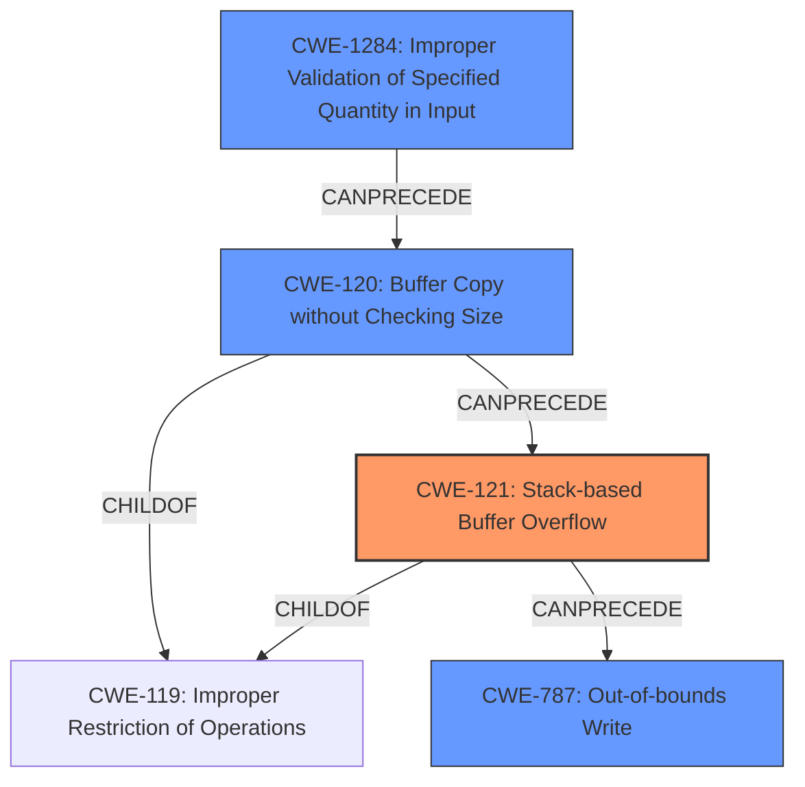

# Final Resolution for CVE-2021-21892

# Summary
| CWE ID | CWE Name | Confidence | CWE Abstraction Level | CWE Vulnerability Mapping Label | CWE-Vulnerability Mapping Notes |
|---|---|---|---|---|---|
| CWE-121 | Stack-based Buffer Overflow | 0.95 | Variant | Primary | Allowed |
| CWE-1284 | Improper Validation of Specified Quantity in Input | 0.85 | Base | Secondary | Allowed |
| CWE-120 | Buffer Copy without Checking Size of Input ('Classic Buffer Overflow') | 0.75 | Base | Secondary | Allowed-with-Review |
| CWE-787 | Out-of-bounds Write | 0.60 | Base | Secondary | Allowed |

## Evidence and Confidence

*   **Confidence Score:** 0.90
*   **Evidence Strength:** HIGH

## Relationship Analysis
The primary weakness is a **CWE-121 (Stack-based Buffer Overflow)**, a variant of **CWE-119 (Improper Restriction of Operations within the Bounds of a Memory Buffer)**. **CWE-1284 (Improper Validation of Specified Quantity in Input)** is a root cause that **CanPrecede** the overflow. **CWE-120 (Buffer Copy without Checking Size of Input)** is also a contributing factor. **CWE-787 (Out-of-bounds Write)** is a consequence of the overflow. Choosing **CWE-121** provides the most specific description of the vulnerability's location.

## Vulnerability Chain
The vulnerability chain starts with **CWE-1284 (Improper Validation of Specified Quantity in Input)**. The `path` parameter's length isn't validated. Then, **CWE-120 (Buffer Copy without Checking Size of Input)** occurs when the unvalidated `path` is copied to a fixed-size buffer on the stack, leading to **CWE-121 (Stack-based Buffer Overflow)**. Finally, the overflow results in **CWE-787 (Out-of-bounds Write)**.

## Summary of Analysis
The initial analysis and criticism both align on **CWE-121 (Stack-based Buffer Overflow)** as the primary **WEAKNESS**. The evidence is strong, with the CVE summary confirming a "classic stack-based buffer overflow (CWE-121) due to the unsafe use of `sprintf`".

The graph relationships influenced the classification by highlighting the chain from input validation to the overflow. **CWE-1284 (Improper Validation of Specified Quantity in Input)** is key as it precedes the overflow. The decision to keep **CWE-121** as primary is due to its specificity regarding the stack location. **CWE-120 (Buffer Copy without Checking Size of Input)** remains a relevant secondary factor because the `sprintf` usage copies the unvalidated input. **CWE-787 (Out-of-bounds Write)** is the consequence of the overflow.

The selected CWEs are at the optimal level of specificity. **CWE-121** is a Variant, while **CWE-1284** and **CWE-120** are Bases, all providing granular descriptions.