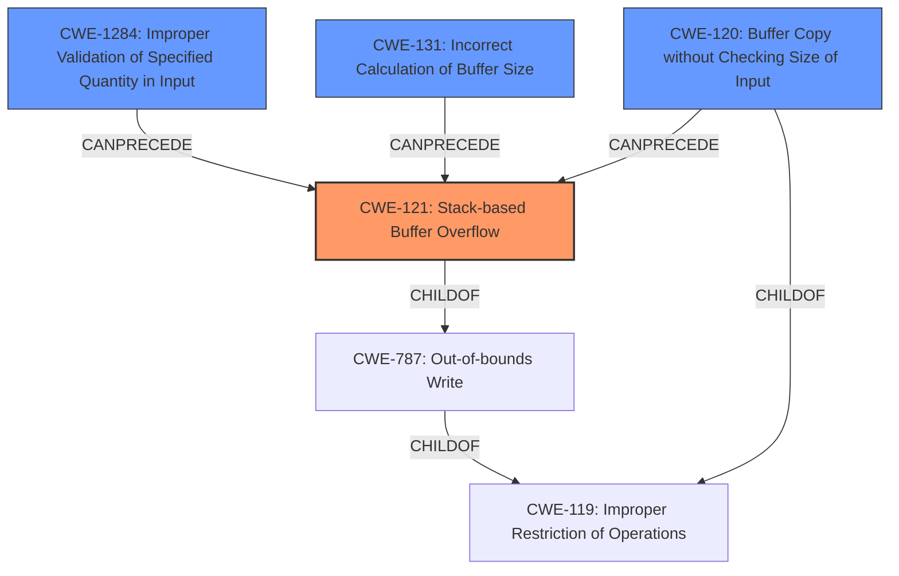

# Final Resolution for CVE-2021-21901

# Summary
| CWE ID | CWE Name | Confidence | CWE Abstraction Level | CWE Vulnerability Mapping Label | CWE-Vulnerability Mapping Notes |
|---|---|---|---|---|---|
| **CWE-121** | **Stack-based Buffer Overflow** | 0.95 | Variant | Allowed | Primary CWE. Overflow on the stack due to unchecked copy. |
| **CWE-120** | **Buffer Copy without Checking Size of Input ('Classic Buffer Overflow')** | 0.70 | Base | Allowed-with-Review | Secondary Candidate. The fundamental issue is an unchecked buffer copy. |
| **CWE-1284** | **Improper Validation of Specified Quantity in Input** | 0.30 | Base | Allowed | Additional Candidate. Root cause of the vulnerability is that the size was not validated. |
| **CWE-131** | **Incorrect Calculation of Buffer Size** | 0.30 | Base | Allowed | Additional Candidate. Root cause of the vulnerability is that the size was not validated. |

## Evidence and Confidence

*   **Confidence Score:** 0.95
*   **Evidence Strength:** HIGH

## Relationship Analysis
The primary **WEAKNESS**, **CWE-121 (Stack-based Buffer Overflow)**, is a variant of **CWE-787 (Out-of-bounds Write)**, which in turn is a child of **CWE-119 (Improper Restriction of Operations within the Bounds of a Memory Buffer)**. This hierarchical relationship indicates that **CWE-121** is the most specific and appropriate classification given the vulnerability description explicitly mentions a stack-based overflow. **CWE-120 (Buffer Copy without Checking Size of Input)**, a base CWE, is also related as it describes the fundamental error of copying a buffer without size validation, potentially preceding the **out-of-bounds write** condition. The lack of input validation, represented by **CWE-1284 (Improper Validation of Specified Quantity in Input)** or **CWE-131 (Incorrect Calculation of Buffer Size)**, can precede the buffer overflow.

## Vulnerability Chain
The vulnerability chain starts with the lack of input validation (**CWE-1284** or **CWE-131**), leading to an unchecked buffer copy (**CWE-120**). This, in turn, results in a **stack-based buffer overflow (CWE-121)**, allowing an attacker to overwrite the return address on the stack and potentially execute arbitrary code.
  - Initial Flaw: Missing input validation (**CWE-1284** or **CWE-131**)
  - Intermediate Weakness: Unchecked buffer copy (**CWE-120**)
  - Final Impact: Stack-based buffer overflow leading to arbitrary code execution (**CWE-121**)

## Summary of Analysis
The initial analysis and criticism both converge on **CWE-121 (Stack-based Buffer Overflow)** as the primary **WEAKNESS**, supported by strong evidence from the vulnerability description and CVE reference materials. The vulnerability is explicitly described as a stack-based buffer overflow, and the ability to overwrite the return address confirms this classification. The criticism suggests including mitigations, which is a good point. The relationship analysis supports **CWE-121** as the most specific CWE, given its hierarchical relationship with more general CWEs like **CWE-787** and **CWE-119**. The inclusion of **CWE-120** as a secondary candidate is also justified, as it highlights the fundamental issue of an unchecked buffer copy. The suggestion to include **CWE-1284** or **CWE-131** as additional candidates is also valid, as it represents the **ROOTCAUSE** of the vulnerability.

The decision to classify the vulnerability as **CWE-121** is based on the following evidence:

*   "A stack-based buffer overflow vulnerability exists..." (Vulnerability Description)
*   "...stack-based buffer overflow due to a size mismatch when copying the UDP payload." (CVE Reference Links Content Summary)
*   "...attacker can achieve arbitrary code execution by overwriting the return address on the stack..." (CVE Reference Links Content Summary)

These statements directly support the classification as **CWE-121**, which is at the optimal level of specificity for this vulnerability.