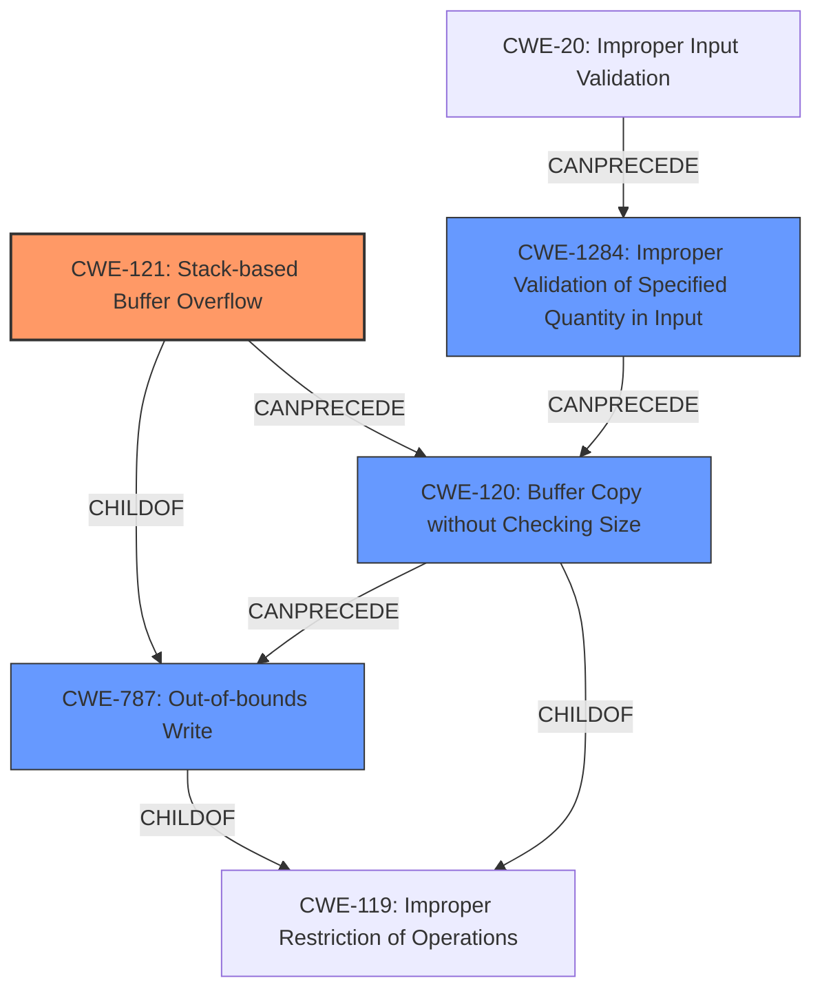

# Final Resolution for CVE-2021-21903

# Summary
| CWE ID | CWE Name | Confidence | CWE Abstraction Level | CWE Vulnerability Mapping Label | CWE-Vulnerability Mapping Notes |
|---|---|---|---|---|---|
| CWE-121 | Stack-based Buffer Overflow | 0.95 | Variant | Primary | The vulnerability is a **stack-based buffer overflow** due to the use of `strcpy` without proper bounds checking. |
| CWE-120 | Buffer Copy without Checking Size of Input ('Classic Buffer Overflow') | 0.60 | Base | Secondary | This CWE is related, but CWE-121 is more specific. The immediate cause is unbounded `strcpy`. |
| CWE-787 | Out-of-bounds Write | 0.40 | Base | Related | Mentioned for completeness; CWE-121 is a type of out-of-bounds write on the stack. |
| CWE-1284 | Improper Validation of Specified Quantity in Input | 0.30 | Base | Related (Consider) | The code doesn't validate size before copying, exposing an avenue for large packets. |

## Evidence and Confidence

*   **Confidence Score:** 0.95
*   **Evidence Strength:** HIGH

## Relationship Analysis
The primary relationship is that CWE-121 is a variant (child) of CWE-119 (Improper Restriction of Operations within the Bounds of a Memory Buffer) and also a child of **CWE-787 (Out-of-bounds Write)**. CWE-120 is a related **weakness** because it describes the specific operation that leads to the buffer overflow: copying a buffer without checking its size. CWE-1284 describes the lack of proper input validation which could have prevented the overflow. The abstraction levels influenced the selection because while CWE-119 is relevant, CWE-121 is more specific due to the **stack-based** nature of the overflow.

## Vulnerability Chain
The vulnerability chain starts with a lack of input validation (**CWE-1284** or **CWE-20**), leading to a buffer copy operation without size checking (**CWE-120**), which then results in a **stack-based buffer overflow** (**CWE-121**).
  - **Root Cause:** Lack of input validation (**CWE-1284**)
  - **Weakness 1:** Unchecked buffer copy (**CWE-120**)
  - **Impact:** Stack-based buffer overflow (**CWE-121**)

## Summary of Analysis
The initial analysis and criticism both accurately identify **CWE-121 (Stack-based Buffer Overflow)** as the primary **weakness**. The vulnerability description explicitly mentions a **stack-based buffer overflow** caused by `strcpy` without bounds checking. The use of CWE-120 as a secondary CWE is justified because it reflects the specific operation (buffer copy) that leads to the overflow.

The inclusion of **CWE-787 (Out-of-bounds Write)** is for completeness, as CWE-121 is a specific type of out-of-bounds write. The addition of **CWE-1284 (Improper Validation of Specified Quantity in Input)** acknowledges the missing input validation that could have prevented the vulnerability.

The selection of CWEs is at the optimal level of specificity. **CWE-121** is preferred over the more general **CWE-119** because the vulnerability is explicitly **stack-based**. **CWE-120** is included to highlight the buffer copy operation without size checking. **CWE-1284** is added to show the lack of input validation.

The analysis is primarily based on the provided evidence, specifically: "A **stack-based buffer overflow** vulnerability exists in the CMA check_udp_crc function of Garrett Metal Detectors iC Module CMA Version 5.0. A specially-crafted packet can lead to a **stack-based buffer overflow** during a call to strcpy."

The graph relationships reinforced the decision by highlighting the hierarchical relationship between CWE-121 and CWE-119 and the chain relationship between CWE-1284, CWE-120, and CWE-121. This provides a more complete understanding of the vulnerability's root cause and potential mitigations.