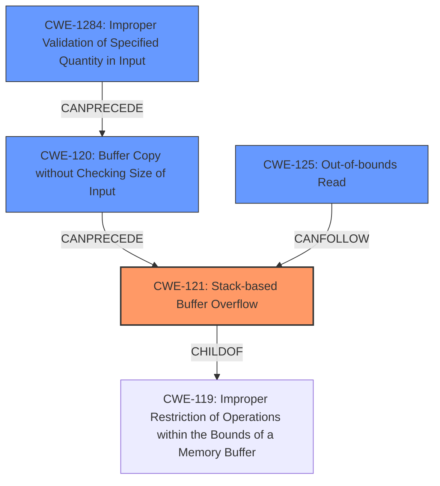

# Final Resolution for CVE-2021-21905

# Summary

| CWE ID | CWE Name | Confidence | CWE Abstraction Level | CWE Vulnerability Mapping Label | CWE-Vulnerability Mapping Notes |
|---|---|---|---|---|---|
| CWE-121 | Stack-based Buffer Overflow | 0.95 | Variant | Allowed | Primary CWE |
| CWE-120 | Buffer Copy without Checking Size of Input ('Classic Buffer Overflow') | 0.80 | Base | Allowed-with-Review | Secondary Candidate |
| CWE-125 | Out-of-bounds Read | 0.70 | Base | Allowed | Secondary Candidate |
| CWE-1284 | Improper Validation of Specified Quantity in Input | 0.50 | Base | Allowed | Additional contributing factor (potential). Only if the size is untrusted. |

## Evidence and Confidence

*   **Confidence Score:** 0.92
*   **Evidence Strength:** HIGH

## Relationship Analysis
The primary weakness is CWE-121 (**CWE-121: Stack-based Buffer Overflow**), a variant of CWE-119 (**CWE-119: Improper Restriction of Operations within the Bounds of a Memory Buffer**), specifying the buffer is on the stack. CWE-120 (**CWE-120: Buffer Copy without Checking Size of Input ('Classic Buffer Overflow')**) can precede CWE-121 as it describes the unbounded copy. CWE-125 (**CWE-125: Out-of-bounds Read**) is a consequence of the unbounded copy. CWE-1284 (**CWE-1284: Improper Validation of Specified Quantity in Input**) could be an upstream cause if the file size is from an untrusted source.

## Vulnerability Chain
The vulnerability chain starts with CWE-1284 (**CWE-1284: Improper Validation of Specified Quantity in Input**) (if file size is untrusted), leading to CWE-120 (**CWE-120: Buffer Copy without Checking Size of Input ('Classic Buffer Overflow')**), which causes CWE-121 (**CWE-121: Stack-based Buffer Overflow**), and can result in CWE-125 (**CWE-125: Out-of-bounds Read**). The root cause is the lack of size validation, leading to a buffer overflow on the stack, potentially enabling remote code execution.

## Summary of Analysis
The initial analysis correctly identifies the primary and secondary CWEs. The criticism provides valuable insights, particularly regarding potential upstream causes and the relationship between the CWEs.

The vulnerability description explicitly mentions a "stack-based buffer overflow", justifying the selection of CWE-121 as the primary weakness. The "CVE Reference Links Content Summary" highlights that "This function reads data from a specified file into a buffer without any bounds checking, leading to a stack-based buffer overflow," supporting the selection of CWE-120. The `readfile` function copies data into a fixed-size buffer on the stack without bounds checking.

The graph relationships confirm the hierarchical relationship between CWE-121 and CWE-119, and the chain relationships between CWE-120, CWE-121, and CWE-125. The addition of CWE-1284 as a potential contributing factor, dependent on whether the file size is untrusted, provides a more complete picture of the potential root causes.

The selected CWEs are at the optimal level of specificity. CWE-121 is a variant that specifies the location of the buffer, while CWE-120 and CWE-125 describe the specific operations that lead to the overflow. The addition of CWE-1284 (if applicable) addresses the lack of input validation.

Therefore, based on the evidence and relationship analysis, the final classification is: Primary CWE-121, Secondary Candidates CWE-120 and CWE-125, and additional contributing factor CWE-1284 (if applicable).