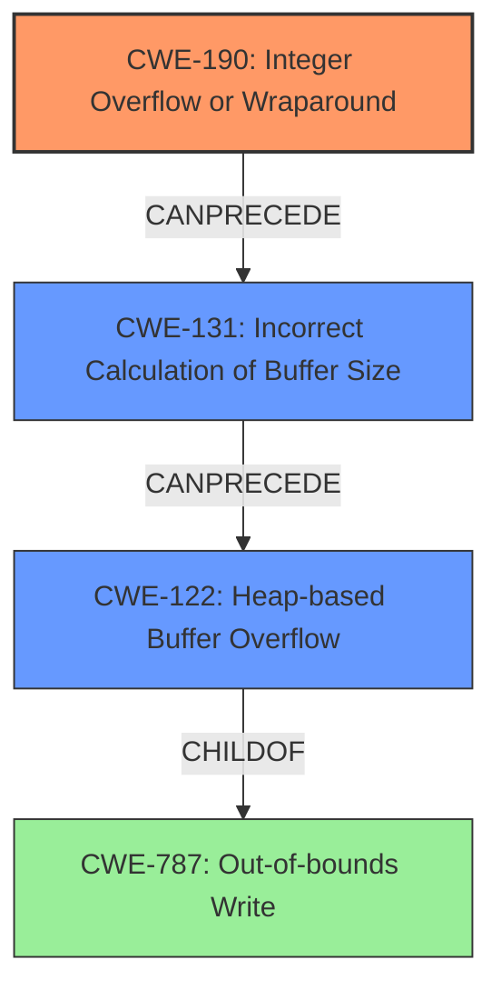

# Final Resolution for CVE-2021-21914

# Summary
| CWE ID | CWE Name | Confidence | CWE Abstraction Level | CWE Vulnerability Mapping Label | CWE-Vulnerability Mapping Notes |
|---|---|---|---|---|---|
| CWE-190 | Integer Overflow or Wraparound | 0.95 | Base | Primary | Allowed |
| CWE-131 | Incorrect Calculation of Buffer Size | 0.85 | Base | Contributing | Allowed |
| CWE-122 | Heap-based Buffer Overflow | 0.90 | Variant | Direct Effect | Allowed |
  - The Primary CWE should be first and noted as the Primary CWEs
  - The secondary candidate CWEs should be next and noted as secondary candidates.
  - The confidence is a confidence score 0 to 1 to rate your confidence in your assessment for that CWE.
  - The CWE Abstraction Level as one of these values: Base, Variant, Pillar, Class, Compound
  - The Mapping Notes Usage as one of these values: Allowed, Allowed-with-Review, Prohibited, Discouraged

## Evidence and Confidence

*   **Confidence Score:** 0.93
*   **Evidence Strength:** HIGH

## Relationship Analysis
The analysis emphasizes a clear causal chain: an integer overflow (CWE-190) leads to an incorrect buffer size calculation (CWE-131), which then results in a heap-based buffer overflow (CWE-122). The hierarchical relationships are considered, ensuring the selection of the most specific CWEs. Abstraction levels influenced the decision to prioritize root cause analysis over merely identifying the symptom (CWE-787).

## Vulnerability Chain
The chain of events is as follows:
  - **Root Cause:** CWE-190 (**Integer Overflow or Wraparound**) occurs during the calculation of the buffer size.
  - **Weakness:** CWE-131 (**Incorrect Calculation of Buffer Size**) results from the integer overflow, leading to an undersized buffer.
  - **Impact:** CWE-122 (**Heap-based Buffer Overflow**) occurs when data is written to the undersized buffer, exceeding its boundaries.

## Summary of Analysis
The initial analysis and criticism both correctly identify the core issue. The final determination is based on the provided evidence, particularly the mention of integer overflow in the CVE reference. The graph relationships highlight the vulnerability chain, with CWE-190 as the root cause, CWE-131 as a direct consequence, and CWE-122 as the manifestation. CWE-787 was rejected because it only describes the symptom (**Out-of-bounds Write**) and not the underlying cause. The selected CWEs are at the optimal level of specificity, providing a clear understanding of the vulnerability's origins and progression. The evidence from the CVE description, stating that the root cause is an **integer overflow** when calculating the size of the heap buffer in `DecoderStream::Append`, supports the selection of CWE-190.