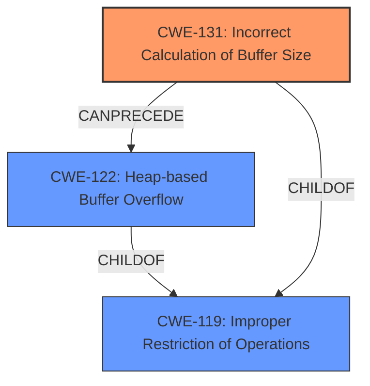

# Final Resolution for CVE-2021-21938

# Summary
| CWE ID | CWE Name | Confidence | CWE Abstraction Level | CWE Vulnerability Mapping Label | CWE-Vulnerability Mapping Notes |
|---|---|---|---|---|---|
| CWE-131 | Incorrect Calculation of Buffer Size | 0.95 | Base | Allowed | Root cause of heap buffer overflow due to undersized allocation. |
| CWE-122 | Heap-based Buffer Overflow | 0.85 | Variant | Allowed | Resulting vulnerability due to the incorrect buffer size calculation. |

## Evidence and Confidence

*   **Confidence Score:** 0.93
*   **Evidence Strength:** HIGH

## Relationship Analysis
The decision to replace CWE-193 with CWE-131 was heavily influenced by the need for a more precise root cause. While CWE-193 (Off-by-one Error) can contribute to buffer overflows, CWE-131 (Incorrect Calculation of Buffer Size) directly addresses the undersized heap allocation described in the vulnerability. CWE-122 (Heap-based Buffer Overflow) remains the appropriate consequence. Both CWE-131 and CWE-122 are children of CWE-119 (Improper Restriction of Operations within the Bounds of a Memory Buffer), showing a hierarchical relationship where the chosen CWEs are more specific.

## Vulnerability Chain
The vulnerability chain starts with **CWE-131 (Incorrect Calculation of Buffer Size)**, where the size calculation for the heap buffer is flawed. This leads to a smaller-than-required buffer being allocated. Subsequently, when data is written into this undersized buffer, it results in **CWE-122 (Heap-based Buffer Overflow)**, causing data to be written beyond the allocated memory region. This **out-of-bounds write** can lead to code execution.

## Summary of Analysis
The initial analysis correctly identified the heap-based buffer overflow but initially classified the root cause as CWE-193 (Off-by-one Error). The criticism highlighted that CWE-131 (Incorrect Calculation of Buffer Size) is a more direct and accurate representation of the **root cause**, as the CVE summary explicitly mentions a "smaller-than-required heap buffer allocation." This evidence from the CVE summary directly supports the selection of CWE-131.

The graph relationships further reinforce this decision, as CWE-131 directly precedes the heap-based buffer overflow (CWE-122). This change provides a more specific and accurate representation of the vulnerability, as CWE-131 directly describes the incorrect buffer size calculation that leads to the overflow. The selected CWEs are at the optimal level of specificity because CWE-131 is a Base level CWE that accurately describes the **root cause**, and CWE-122 is a Variant level CWE that specifies the type and location of the overflow.