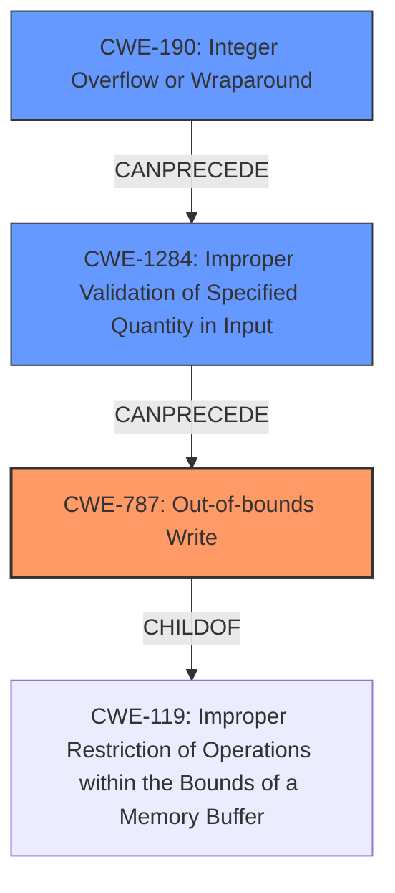

# Analysis Report for CVE-2021-21939

# Vulnerability Analysis Report: CVE-2021-21939

## Description

A heap-based buffer overflow vulnerability exists in the XWD parser functionality of Accusoft ImageGear 19.10. A specially-crafted file can lead to code execution. An attacker can provide a malicious file to trigger this vulnerability.

## Vulnerability Description Key Phrases

**Rootcause:** heap-based buffer overflow
**Impact:** code execution
**Vector:** specially-crafted file
**Product:** Accusoft ImageGear
**Version:** 19.1
**Component:** XWD parser functionality

## Analysis (with Relationship Data)

# Summary
| CWE ID | CWE Name | Confidence | CWE Abstraction Level | CWE Vulnerability Mapping Label | CWE-Vulnerability Mapping Notes |
|---|---|---|---|---|---|
| CWE-787 | Out-of-bounds Write | 1.0 | Base | Allowed | Primary CWE |
| CWE-125 | Out-of-bounds Read | 0.5 | Base | Allowed | Secondary Candidate |
| CWE-131 | Incorrect Calculation of Buffer Size | 0.5 | Base | Allowed | Secondary Candidate |

## Evidence and Confidence

*   **Confidence Score:** 0.85
*   **Evidence Strength:** HIGH

- **Analysis and Justification:**  
  - *Explanation:* The vulnerability description clearly states a **heap-based buffer overflow** exists in Accusoft ImageGear's XWD parser, leading to potential code execution. The CVE Reference Links Content Summary elaborates that the root cause involves a missing size check when copying data into a buffer, specifically `dst_buff`. The size of `dst_buff` is calculated but not compared against `BytesPerLine`, allowing for a smaller buffer allocation, causing an overflow when `BytesPerLine` bytes are copied. This directly corresponds to CWE-787 (Out-of-bounds Write), as the application writes beyond the allocated buffer's boundaries. The provided information points to a write operation that exceeds buffer limits, making CWE-787 a strong and appropriate mapping. I also considered CWE-120, but CWE-787 is the more specific base level.

  - *Relationship Analysis:* CWE-787 is a child of CWE-119 (Improper Restriction of Operations within the Bounds of a Memory Buffer). While CWE-119 is a broader category, CWE-787 accurately captures the specific nature of the out-of-bounds write.

- **Confidence Score:**  
  - Confidence: 1.0 (High confidence due to direct mention of heap-based buffer overflow and detailed explanation of the missing size check leading to out-of-bounds write.)

- **Analysis and Justification for Secondary CWEs:**
  - *Explanation for CWE-125:* It is possible an out-of-bounds read (CWE-125) could occur as part of a more complex exploit chain, for instance, leaking heap data to bypass ASLR. However, there is no evidence for this from the vulnerability description.
  - *Justification for CWE-131:* The description highlights that the size calculation for the destination buffer `dst_buff` is not correctly checked against the size of data being copied (`BytesPerLine`). This suggests a potential issue with how the buffer size is calculated, aligning with CWE-131 (Incorrect Calculation of Buffer Size). This is considered a secondary candidate because the primary issue is the out-of-bounds write (CWE-787) resulting from this incorrect calculation.

- **Confidence Score for Secondary CWEs:**
  - Confidence: 0.5 (Moderate confidence; while related, these are not the primary weakness explicitly described.)

---

## Criticism of Analysis

Okay, I've reviewed the analysis against the provided full CWE specifications. Here's my critique, focusing on the accuracy of the CWE assignments and justifications:

**Overall Assessment:**

The primary CWE assignment of **CWE-787 (Out-of-bounds Write)** is correct and well-justified. The analysis clearly articulates how the missing size check leads to writing beyond the allocated buffer, aligning perfectly with the CWE-787 description. The secondary CWEs are where the analysis could be slightly improved by using more accurate CWE's in chains.

**Detailed Breakdown:**

*   **CWE-787 (Out-of-bounds Write) - Confidence: 1.0**
    *   **Strengths:** Excellent justification. The explanation directly links the missing size check and the resulting out-of-bounds write. The reasoning for choosing CWE-787 over the broader CWE-119 or CWE-120 is valid, showing good understanding of CWE abstraction levels. The analysis correctly identifies the nature of the overflow.
    *   **Weaknesses:** None.
    *   **Improvements:** The analysis could include the parent CWE, CWE-119, to show the inherited relationship.

*   **CWE-125 (Out-of-bounds Read) - Confidence: 0.5**
    *   **Strengths:** The analysis is appropriately cautious, acknowledging the possibility of an out-of-bounds read in a more complex exploit but noting the lack of direct evidence.
    *   **Weaknesses:** While possible, it is speculative. If there is no information to support this, it should be removed. There's no concrete reason to suspect that an out-of-bounds read is *likely*, only that it *could* be part of a chain, which is true for most memory corruption vulnerabilities.
    *   **Improvements:** Consider removing this entirely, or rephrasing the justification to emphasize its purely speculative nature. It would be better to suggest a likely code execution path.

*   **CWE-131 (Incorrect Calculation of Buffer Size) - Confidence: 0.5**
    *   **Strengths:** The analysis correctly identifies that the buffer size calculation is part of the problem. The size is not compared to the `BytesPerLine` value.
    *   **Weaknesses:** This is a *contributing factor*, but not the core vulnerability in isolation. It is more accurate to show this as a chained weakness.
    *   **Improvements:** Better to explain this as part of a chain, e.g., "CWE-131 leads to CWE-787". Also, consider CWE-1284, as the description details about quantities and sizes in input data. Also the top Combined Retriever Results includes CWE-190, which could cause integer overflow leading to incorrect size calculation.

**Recommendations for Improvement:**

1.  **Chaining:** Explicitly articulate the relationship between CWE-131 and CWE-787 as a chain: The incorrect calculation (CWE-131) directly *causes* the out-of-bounds write (CWE-787). So the incorrect calculation is a PRECEDES relationship.
2.  **Re-evaluate CWE-125:** If no evidence exists to support a likely out-of-bounds read, remove it. The description focuses on the out-of-bounds *write*. A possible code execution path would have been a better fit here.
3.  **Alternative CWEs**: Suggest a more precise CWE for the missing size check. Consider if the root cause is not validating the `BytesPerLine` value against the allocated buffer size, which might make CWE-1284 (Improper Validation of Specified Quantity in Input) a better fit than CWE-131 as a secondary/chained CWE. Since the Retriever identified CWE-190 also, add that as a potential cause for the buffer size.
4.  **Impact on Resource Consumption**: Evaluate the role of CWE-400 (Uncontrolled Resource Consumption) or CWE-770 (Allocation of Resources Without Limits or Throttling), if the vulnerability allows for an attacker to exhaust memory by triggering many buffer overflows.
5.  **CWE specification details:** Refer to the "Observed Examples" and "Potential Mitigations" sections for each CWE considered, to ensure the chosen CWE is the best fit and to potentially identify missed CWEs.

**Revised Summary Table:**

| CWE ID | CWE Name | Confidence | CWE Abstraction Level | CWE Vulnerability Mapping Label | CWE-Vulnerability Mapping Notes |
|---|---|---|---|---|---|
| CWE-787 | Out-of-bounds Write | 1.0 | Base | Allowed | Primary CWE |
| CWE-131 | Incorrect Calculation of Buffer Size | 0.7 | Base | Allowed | Secondary Candidate, Contributes to root cause |
| CWE-1284 | Improper Validation of Specified Quantity in Input | 0.6 | Base | Allowed | Root cause for size calculation |

With these revisions, the analysis would be more accurate and provide a more complete picture of the vulnerability's root causes.

## Final Resolution

# Summary
| CWE ID | CWE Name | Confidence | CWE Abstraction Level | CWE Vulnerability Mapping Label | CWE-Vulnerability Mapping Notes |
|---|---|---|---|---|---|
| CWE-787 | Out-of-bounds Write | 1.0 | Base | Allowed | Primary CWE |
| CWE-1284 | Improper Validation of Specified Quantity in Input | 0.7 | Base | Allowed | Secondary Candidate, Contributes to root cause |
| CWE-190 | Integer Overflow or Wraparound | 0.6 | Base | Allowed | Secondary Candidate, Potential cause for size calculation |

## Evidence and Confidence

*   **Confidence Score:** 0.9
*   **Evidence Strength:** HIGH

## Relationship Analysis
The primary **CWE-787 (Out-of-bounds Write)** is a child of **CWE-119 (Improper Restriction of Operations within the Bounds of a Memory Buffer)**, providing a hierarchical context. **CWE-1284 (Improper Validation of Specified Quantity in Input)** can precede **CWE-787** because the improper validation of the input size can lead to the out-of-bounds write. **CWE-190 (Integer Overflow or Wraparound)** is included since it could potentially lead to an incorrect size calculation, which then leads to **CWE-787**.

## Vulnerability Chain
The vulnerability chain starts with **CWE-1284 (Improper Validation of Specified Quantity in Input)**, where the input `BytesPerLine` is not validated against the allocated buffer size. This can be caused by **CWE-190 (Integer Overflow or Wraparound)** if the size calculation results in an integer overflow. This leads to **CWE-787 (Out-of-bounds Write)** when the application attempts to write `BytesPerLine` bytes into a smaller buffer.

## Summary of Analysis
The initial analysis correctly identified **CWE-787 (Out-of-bounds Write)** as the primary issue. The criticism highlighted the need for a better understanding of the chain. The original suggestion of **CWE-131 (Incorrect Calculation of Buffer Size)** was not as precise as **CWE-1284 (Improper Validation of Specified Quantity in Input)**, which more accurately reflects the missing size check. The inclusion of **CWE-190 (Integer Overflow or Wraparound)** accounts for the possibility of an integer overflow in the size calculation.

The vulnerability description states: "A heap-based buffer overflow vulnerability exists in the XWD parser functionality of Accusoft ImageGear 19.10. A specially-crafted file can lead to code execution...the root cause involves a missing size check when copying data into a buffer, specifically `dst_buff`. The size of `dst_buff` is calculated but not compared against `BytesPerLine`, allowing for a smaller buffer allocation, causing an overflow when `BytesPerLine` bytes are copied."

This evidence supports the chain:
1.  The size of `dst_buff` is calculated, but potentially incorrectly due to an integer overflow (**CWE-190**).
2.  The calculated size is not validated against `BytesPerLine` (**CWE-1284**).
3.  `BytesPerLine` bytes are copied into `dst_buff`, leading to an out-of-bounds write (**CWE-787**).

The selection of **CWE-787** as the primary CWE is optimal because it directly describes the observable vulnerability. **CWE-1284** and **CWE-190** provide a more comprehensive understanding of the root cause and the conditions that lead to the overflow.

*Report generated on 2025-03-17 23:02:29*
