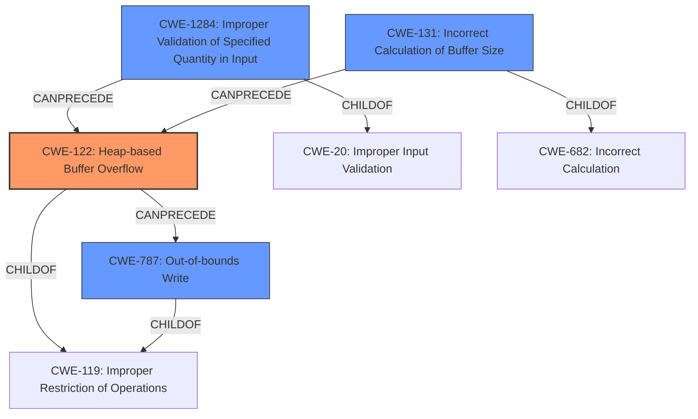

# Final Resolution for CVE-2021-21943

# Summary
| CWE ID | CWE Name | Confidence | CWE Abstraction Level | CWE Vulnerability Mapping Label | CWE-Vulnerability Mapping Notes |
|---|---|---|---|---|---|
| **CWE-122** | Heap-based Buffer Overflow | 0.95 | Variant | Allowed | Primary **CWE** |
| **CWE-1284** | Improper Validation of Specified Quantity in Input | 0.85 | Base | Allowed | Secondary Candidate |
| **CWE-131** | Incorrect Calculation of Buffer Size | 0.70 | Base | Allowed | Secondary Candidate |
| **CWE-787** | Out-of-bounds Write | 0.65 | Base | Allowed | Secondary Candidate |

## Evidence and Confidence

*   **Confidence Score:** 0.92
*   **Evidence Strength:** HIGH

## Relationship Analysis
The analysis hinges on a clear parent-child relationship. **CWE-122** (Heap-based Buffer Overflow) is the most specific manifestation of the vulnerability, with **CWE-1284** (Improper Validation of Specified Quantity in Input) and **CWE-131** (Incorrect Calculation of Buffer Size) acting as contributing factors, leading to the overflow and subsequent out-of-bounds write (**CWE-787**).

## Vulnerability Chain
The vulnerability chain starts with **CWE-1284** (Improper Validation of Specified Quantity in Input) where the input size isn't validated. This leads to **CWE-131** (Incorrect Calculation of Buffer Size) due to the missing validation. This calculation is based on `PixmapWidth` but doesn't take into account `BytesPerLine`. This incorrect size then causes **CWE-122** (Heap-based Buffer Overflow) when data larger than the allocated buffer is written. Finally, this results in **CWE-787** (Out-of-bounds Write), where the write operation goes beyond the allocated memory.

## Summary of Analysis
The initial analysis correctly identifies the core vulnerability as **CWE-122** (Heap-based Buffer Overflow), supported by the explicit mention in the vulnerability description: "A heap-based buffer overflow vulnerability exists...". This is further confirmed by the root cause analysis in the CVE reference, which points to a missing size check leading to the overflow.

The criticism correctly points out the relationship between the different **CWE**s in the analysis. **CWE-1284** (Improper Validation of Specified Quantity in Input) is indeed a crucial contributing factor, as the missing size check is the root cause that sets the stage for the subsequent buffer overflow. The analysis will strengthen this relationship in this final determination.

**CWE-131** (Incorrect Calculation of Buffer Size) is also relevant, as the size of the allocated buffer is calculated without proper validation, but is not as important as the lack of the check described in **CWE-1284**.

**CWE-787** (Out-of-bounds Write) is a direct consequence of the heap overflow, making it a relevant but secondary issue.

The confidence scores have been slightly adjusted based on the relationship analysis and the criticism. **CWE-1284** is increased to 0.85, and **CWE-131** is increased to 0.70 to reflect the importance of the missing input validation in the vulnerability chain.

The selected **CWE**s are at the optimal level of specificity, with **CWE-122** being the most specific variant that accurately describes the vulnerability, and **CWE-1284** and **CWE-131** capturing the root causes leading to the overflow.