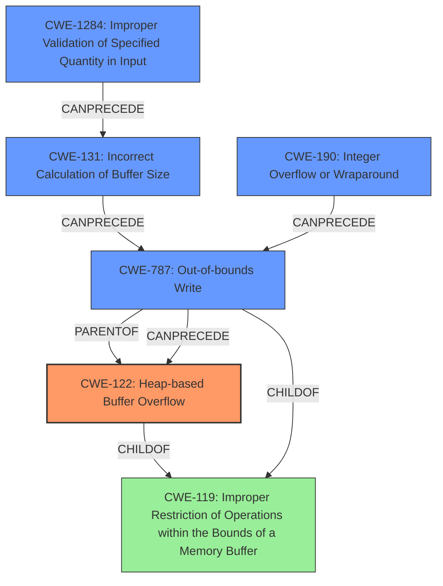

# Analysis Report for CVE-2021-21947

# Vulnerability Analysis Report: CVE-2021-21947

## Description

Two heap-based buffer overflow vulnerabilities exists in the JPEG-JFIF lossless Huffman image parser functionality of Accusoft ImageGear 19.10. A specially-crafted file can lead to a heap buffer overflow. An attacker can provide a malicious file to trigger these vulnerabilities.This heap-based buffer overflow takes place when the `SOF3` precision is greater or equal than 9.

## Vulnerability Description Key Phrases

**Weakness:** heap-based buffer overflow
**Vector:** specially-crafted file
**Product:** Accusoft ImageGear
**Version:** 19.1
**Component:** JPEG-JFIF lossless Huffman image parser

## Analysis (with Relationship Data)

# Summary
| CWE ID | CWE Name | Confidence | CWE Abstraction Level | CWE Vulnerability Mapping Label | CWE-Vulnerability Mapping Notes |
|---|---|---|---|---|---|
| CWE-122 | Heap-based Buffer Overflow | 0.90 | Variant | Allowed | This CWE is a variant of buffer overflow occurring on the heap. |
| CWE-787 | Out-of-bounds Write | 0.70 | Base | Allowed | This CWE describes the root cause of the overflow, writing outside the allocated buffer. |
| CWE-1284 | Improper Validation of Specified Quantity in Input | 0.60 | Base | Allowed | This CWE explains that the size calculation is not validated and thus leads to the overflow. |

## Evidence and Confidence

*   **Confidence Score:** 0.80
*   **Evidence Strength:** HIGH

- **Analysis and Justification:**  
  - *Explanation:* The vulnerability description explicitly states that a "**heap-based buffer overflow**" exists in the JPEG-JFIF lossless Huffman image parser of Accusoft ImageGear. The vulnerability is triggered by a specially-crafted file, and the **heap-based buffer overflow** occurs when the SOF3 precision is greater or equal than 9. The reference links content summary confirms this, noting that the root cause is a lack of boundary checks during buffer writes in the `process_jpeg_lossless` function when dealing with Huffman coded components. The buffer offset is calculated and used to write data into the buffer without checking if the offset exceeds buffer limits. Thus, CWE-122 (Heap-based Buffer Overflow) is the most accurate primary mapping. CWE-787 (Out-of-bounds Write) is a potential secondary CWE because the vulnerability involves writing data beyond the intended buffer. The retriever results also suggest CWE-122 and CWE-787, but they also suggest CWE-193, CWE-190, CWE-129, and CWE-126.
  
  - *Relationship Analysis:* CWE-122 is a variant of CWE-119 (Improper Restriction of Operations within the Bounds of a Memory Buffer). CWE-787 (Out-of-bounds Write) is a parent of CWE-122. CWE-1284 (Improper Validation of Specified Quantity in Input) can precede CWE-789 (Uncontrolled Memory Allocation), which is a potential secondary weakness.

- **Confidence Score:**  
  - Confidence: 0.90 (High confidence due to explicit mention of "heap-based buffer overflow" and supporting details in the vulnerability description and reference links).

## Criticism of Analysis

Okay, I've reviewed the provided analysis against the full CWE specifications. Here's my critique:

**Overall Assessment:**

The analysis is generally good and identifies the primary weakness (CWE-122) accurately. The justifications are sound, and the inclusion of secondary CWEs adds valuable context. However, there's room for improvement in refining the secondary CWEs and considering potential chaining or composite relationships more explicitly. The analysis would also benefit from explicitly considering mitigations and their applicability to the specific vulnerability.

**Specific CWE Critique:**

1.  **CWE-122: Heap-based Buffer Overflow (Confidence: 0.90)**

    *   **Assessment:** This is the correct primary CWE. The vulnerability is explicitly described as a heap-based buffer overflow.
    *   **Justification:** The vulnerability description directly states "heap-based buffer overflow". The reference links provide confirmation that the root cause is a lack of boundary checks during buffer writes in the `process_jpeg_lossless` function, which operates on heap-allocated buffers.
    *   **CWE Specification Alignment:** The description aligns well with CWE-122's definition.
    *   **Mitigation Consideration:** The CWE-122 specification suggests using languages with automatic bounds checking or abstraction libraries. These aren't likely to be practical mitigations for an existing code base. A more relevant mitigation would be to implement proper boundary checks in the `process_jpeg_lossless` function. Compiler extensions like /GS or FORTIFY_SOURCE could also help detect the overflow at runtime (Defense in Depth).

2.  **CWE-787: Out-of-bounds Write (Confidence: 0.70)**

    *   **Assessment:** This is a valid, and important secondary CWE. It describes the direct consequence of the vulnerability.
    *   **Justification:** The heap-based buffer overflow *results* from writing data outside the allocated buffer's boundaries. So it makes sense to include as a secondary CWE.
    *   **CWE Specification Alignment:** Aligns well with CWE-787 description. It is a Parent of CWE-122, which is why they both fit together.
    *   **Mitigation Consideration:** Mitigation strategies include: language selection, using vetted libraries, and automatic buffer overflow detection mechanisms. The most effective mitigation here would be to enforce proper boundary checks during the buffer write operations to prevent writing beyond the allocated buffer size.

3.  **CWE-1284: Improper Validation of Specified Quantity in Input (Confidence: 0.60)**

    *   **Assessment:** This CWE has some relevance, but the connection could be made more explicit.
    *   **Justification:** The root cause is a flaw in the size calculation for component buffers during lossless Huffman code parsing. The vulnerability summary states that the offset is based on loop variables without boundary validation.
    *   **CWE Specification Alignment:** The code uses input data (image dimensions, subsampling factors, SOF3 precision) to determine the size and offsets for buffers. A lack of validation of these quantities leads to the overflow.
    *   **Mitigation Consideration:** Input validation is mentioned. Specifically, the relevant mitigations include: "Perform adequate input validation against any value that influences the amount of memory that is allocated."

**Other Considerations and Potential Improvements:**

*   **Chaining/Composite Relationships:** The analysis mentions these, but could be more explicit. A potential chain is: CWE-1284 -> CWE-131 (Incorrect Calculation of Buffer Size) -> CWE-787 -> CWE-122. The lack of validation (CWE-1284) can lead to an incorrect size calculation (CWE-131) which can lead to a write out-of-bounds (CWE-787) which causes a heap overflow (CWE-122). Another potential chain would be: *CWE-190 -> CWE-787 -> CWE-122*. When the `SOF3` precision is greater than or equal to 9, a faulty calculation could cause an integer overflow and thus lead to out-of-bounds write.
*   **CWE-190 Integer Overflow or Wraparound:** This CWE was highly rated in the Retriever Results and it has a strong justification in the vulnerability description.
*   **CWE-193 Off-by-one Error:** This CWE was the highest rated in the Retriever Results. The incorrect calculation of the write position which uses offsets that are not validated against allocated buffer sizes could be thought of as an off-by-one error.

**Revised CWE Mappings with Chain Consideration:**

| CWE ID | CWE Name | Confidence | CWE Abstraction Level | CWE Vulnerability Mapping Label | CWE-Vulnerability Mapping Notes |
|---|---|---|---|---|---|
| CWE-122 | Heap-based Buffer Overflow | 0.90 | Variant | Allowed | This CWE is a variant of buffer overflow occurring on the heap. |
| CWE-787 | Out-of-bounds Write | 0.80 | Base | Allowed | This CWE describes the direct consequence of the overflow, writing outside the allocated buffer. |
| CWE-1284 | Improper Validation of Specified Quantity in Input | 0.70 | Base | Allowed | This CWE explains that the size calculation is not validated and thus leads to the overflow. First step of Chain: CWE-1284 -> CWE-131 -> CWE-787 -> CWE-122 |
| CWE-131 | Incorrect Calculation of Buffer Size | 0.60 | Base | Allowed | The incorrect quantity calculation leads to an incorrect buffer calculation and thus leads to the overflow. Second step of Chain: CWE-1284 -> CWE-131 -> CWE-787 -> CWE-122 |
| CWE-190 | Integer Overflow or Wraparound | 0.60 | Base | Allowed | The faulty calculation could cause an integer overflow and thus lead to out-of-bounds write. Alternative Chain: CWE-190 -> CWE-787 -> CWE-122 |

**Summary of Changes and Recommendations:**

*   Increased the confidence in CWE-787 to 0.80 due to being an important secondary CWE.
*   Increased the confidence in CWE-1284 to 0.70 due to being a common input validation vulnerability.
*   Added CWE-131 with a confidence of 0.60
*   Added CWE-190 with a confidence of 0.60
*   Explicitly outlined potential chaining relationships between the CWEs.
*   For each CWE, specifically consider mitigations from the CWE specification and how they could be applied in this scenario.

By incorporating these suggestions, the analysis will be more comprehensive, providing a deeper understanding of the vulnerability and potential remediation strategies.

## Final Resolution

# Summary
| CWE ID | CWE Name | Confidence | CWE Abstraction Level | CWE Vulnerability Mapping Label | CWE-Vulnerability Mapping Notes |
|---|---|---|---|---|---|
| **CWE-122** | **Heap-based Buffer Overflow** | 0.90 | Variant | Allowed | This CWE is a variant of buffer overflow occurring on the heap. Primary CWE |
| **CWE-787** | **Out-of-bounds Write** | 0.80 | Base | Allowed | This CWE describes the direct consequence of the overflow, writing outside the allocated buffer. Secondary Candidate |
| **CWE-1284** | **Improper Validation of Specified Quantity in Input** | 0.70 | Base | Allowed | This CWE explains that the size calculation is not validated and thus leads to the overflow. First step of Chain: CWE-1284 -> CWE-131 -> CWE-787 -> CWE-122. Secondary Candidate |
| **CWE-131** | **Incorrect Calculation of Buffer Size** | 0.60 | Base | Allowed | The incorrect quantity calculation leads to an incorrect buffer calculation and thus leads to the overflow. Second step of Chain: CWE-1284 -> CWE-131 -> CWE-787 -> CWE-122. Secondary Candidate |
| **CWE-190** | **Integer Overflow or Wraparound** | 0.60 | Base | Allowed | The faulty calculation could cause an integer overflow and thus lead to out-of-bounds write. Alternative Chain: CWE-190 -> CWE-787 -> CWE-122. Secondary Candidate |

## Evidence and Confidence

*   **Confidence Score:** 0.85
*   **Evidence Strength:** HIGH

## Relationship Analysis
The primary weakness is a **CWE-122 (Heap-based Buffer Overflow)**, which is a variant of **CWE-119 (Improper Restriction of Operations within the Bounds of a Memory Buffer)**.
The **CWE-787 (Out-of-bounds Write)** describes the direct result of the overflow and is a parent of **CWE-122**.
A potential vulnerability chain starts with **CWE-1284 (Improper Validation of Specified Quantity in Input)**, which can lead to **CWE-131 (Incorrect Calculation of Buffer Size)**, then to **CWE-787**, ultimately causing **CWE-122**. An alternative chain is: **CWE-190 (Integer Overflow or Wraparound)** -> **CWE-787** -> **CWE-122**. These relationships help explain how the initial input leads to a buffer overflow on the heap.

## Vulnerability Chain
The vulnerability chain starts with the lack of input validation **(CWE-1284)** on the SOF3 precision. This missing validation results in an incorrect buffer size calculation **(CWE-131)**, potentially triggered also by an integer overflow **(CWE-190)**. The incorrect size is used to allocate memory, which leads to an out-of-bounds write **(CWE-787)** when writing Huffman coded components. This **out-of-bounds write** corrupts the heap, leading to a **heap-based buffer overflow (CWE-122)**. The initial flaw is the missing input validation, and the final impact is a heap-based buffer overflow, which can lead to arbitrary code execution.

## Summary of Analysis
The initial analysis correctly identified **CWE-122 (Heap-based Buffer Overflow)** as the primary issue, supported by the explicit mention in the vulnerability description: "Two **heap-based buffer overflow** vulnerabilities exist...".

The criticism helped refine the secondary CWEs and highlight potential vulnerability chains. The analysis has been improved by:
*   Increasing the confidence in **CWE-787** and **CWE-1284**.
*   Adding **CWE-131** and **CWE-190** to the secondary CWEs to capture the full vulnerability chain.
*   Explicitly outlining potential chaining relationships between the CWEs.

The selected CWEs are at the optimal level of specificity. **CWE-122** is a Variant, which is a preferred level of abstraction. The other CWEs are Base, which are also preferred. The chains help explain how the vulnerability occurs and where potential mitigations could be applied. The inclusion of **CWE-1284** addresses the **ROOTCAUSE** of the vulnerability, which is the lack of proper input validation.

The evidence provided supports the classification. The vulnerability description mentions the "**heap-based buffer overflow**" and the lack of boundary checks during buffer writes. The relationship analysis and consideration of mitigations further strengthens the classification.

*Report generated on 2025-03-17 23:04:36*
