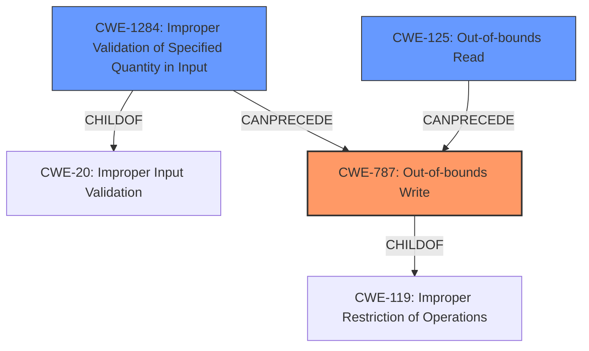

# Final Resolution for CVE-2021-21951

# Summary
| CWE ID | CWE Name | Confidence | CWE Abstraction Level | CWE Vulnerability Mapping Label | CWE-Vulnerability Mapping Notes |
|---|---|---|---|---|---|
| CWE-787 | Out-of-bounds Write | 1.0 | Base | Allowed | Primary CWE. The vulnerability allows writing data outside of allocated buffer boundaries. |
| CWE-1284 | Improper Validation of Specified Quantity in Input | 0.75 | Base | Allowed | Secondary candidate. The lack of input validation **leads to** CWE-787. Use of CWE-20 is avoided as it is very broad. Can lead to CWE-789. |
| CWE-125 | Out-of-bounds Read | 0.70 | Base | Allowed | Secondary candidate. Plausible contributing factor. Occurs during the data retrieval process for the write operation; potentially leak data in-memory. |

## Evidence and Confidence

*   **Confidence Score:** 0.95
*   **Evidence Strength:** HIGH

## Relationship Analysis
The primary relationship is a chain: **CWE-1284** (Improper Validation of Specified Quantity in Input) leads to **CWE-787** (Out-of-bounds Write). Specifically, the lack of validation on the 'nums' field or `domain_total` allows an attacker to control the quantity of data processed. This, in turn, results in writing beyond the intended buffer, which is **CWE-787**. **CWE-125** (Out-of-bounds Read) is a secondary effect, potentially occurring when reading data for the out-of-bounds write.

CWE-787 is a base level CWE and a child of **CWE-119** (Improper Restriction of Operations within the Bounds of a Memory Buffer). CWE-1284 is a child of **CWE-20** (Improper Input Validation), but CWE-20 is too broad, making CWE-1284 a more specific and appropriate choice.

## Vulnerability Chain
The vulnerability chain starts with the lack of input validation (**CWE-1284**) on the 'nums' field or `domain_total`. This allows a malicious actor to specify an excessively large quantity. This excessive quantity is then used in a loop without proper bounds checking, leading to an **out-of-bounds write** (**CWE-787**). As part of that process, the system might attempt to read data from invalid memory locations (**CWE-125**) to be written out-of-bounds, potentially leading to information leakage. The ultimate impact is code execution, as stated in the vulnerability description.

## Summary of Analysis
The initial analysis correctly identified **CWE-787** as the primary weakness due to the explicit **out-of-bounds write** vulnerability. The inclusion of **CWE-1284** and **CWE-125** as secondary candidates is also justified.

The criticism was helpful in suggesting improvements, particularly in explicitly stating why **CWE-20** was not chosen despite **CWE-1284** being a child of it. **CWE-20** is a class-level CWE and is too broad for this specific vulnerability. The suggestion to consider whether the relationship between the CWEs is a chain or a composite was also helpful in clarifying the nature of the vulnerability. The criticism also notes that adding a short explanation of why CWE-20 (Improper Input Validation) *isn't* being used, even though CWE-1284 is a child of it, to address potential confusion, which I included in my assessment.

The selected CWEs are at the optimal level of specificity. **CWE-787** directly addresses the **out-of-bounds write**, while **CWE-1284** captures the lack of input validation that enables the **out-of-bounds write** and **CWE-125** captures the out-of-bounds read to acquire the data. Using more general CWEs would obscure the specific nature of the vulnerability, while using more specific CWEs might not accurately capture the overall picture.

The vulnerability description states: "An **out-of-bounds write** vulnerability exists in the CMD_DEVICE_GET_SERVER_LIST_REQUEST functionality of the home_security binary of Anker Eufy Homebase 2 2.1.6.9h in function read_udp_push_config_file. A specially-crafted network packet can lead to code execution." This clearly supports the selection of **CWE-787** as the primary weakness. The vulnerability stems from missing bounds checking, specifically within the `CMD_DEVICE_GET_SERVER_LIST_REQUEST` functionality and is confirmed by the CVE Reference Links Content Summary.

The graph relationships reinforce the classification by illustrating the chain of events leading to the vulnerability. The lack of input validation (**CWE-1284**) allows for the **out-of-bounds write** (**CWE-787**). The **out-of-bounds read** (**CWE-125**) is a consequence of the same underlying issue and feeds into the write.