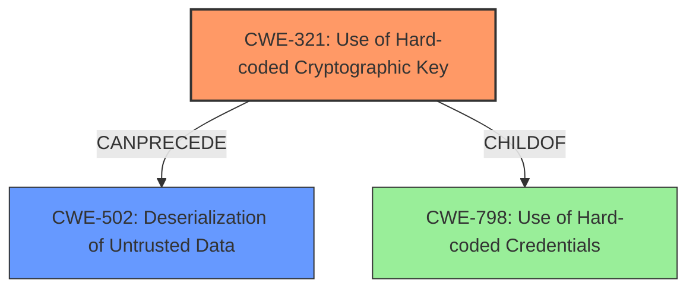

# Final Resolution for CVE-2021-21979

# Summary
| CWE ID | CWE Name | Confidence | CWE Abstraction Level | CWE Vulnerability Mapping Label | CWE-Vulnerability Mapping Notes |
|---|---|---|---|---|---|
| CWE-321 | Use of Hard-coded Cryptographic Key | 0.95 | Variant | Allowed | Primary CWE |
| CWE-502 | Deserialization of Untrusted Data | 0.70 | Base | Allowed | Secondary Candidate |

## Evidence and Confidence

*   **Confidence Score:** 0.90
*   **Evidence Strength:** HIGH

## Relationship Analysis
The primary relationship influencing the decision is that **CWE-321 (Use of Hard-coded Cryptographic Key)** can precede **CWE-502 (Deserialization of Untrusted Data)**. The **hard-coded key** enables the creation of malicious serialized data, which is then deserialized. **CWE-321** is a *Variant* of **CWE-798 (Use of Hard-coded Credentials)**. Although **CWE-259 (Use of Hard-coded Password)** is a peer of **CWE-321**, **CWE-321** is more specific in this case because it involves a cryptographic key. I am increasing the confidence in **CWE-502** slightly because of the explicit statement about PHP object serialization/unserialization.

## Vulnerability Chain
The vulnerability chain starts with the **ROOTCAUSE** of **CWE-321 (Use of Hard-coded Cryptographic Key)**. This leads to the ability to craft malicious serialized objects. The deserialization of these objects represents **CWE-502 (Deserialization of Untrusted Data)**. The ultimate impact is the potential for arbitrary class method execution, as stated in the description: "If your applications encryption key is in the hands of a malicious party, that party could craft cookie values using the encryption key and exploit vulnerabilities inherent to PHP object serialization / unserialization, such as calling arbitrary class methods within your application."

## Summary of Analysis
The initial analysis and criticism both agree that **CWE-321 (Use of Hard-coded Cryptographic Key)** is the primary **WEAKNESS**, and I concur. The vulnerability description explicitly states that "the file /tmp/app/.env is generated at the time that the docker image bitnami/laravel was built, and the value of APP_KEY is fixed under certain conditions." This directly supports the mapping to **CWE-321**. The relationship analysis confirms that **CWE-321** is the optimal choice, being more specific than broader categories like **CWE-798 (Use of Hard-coded Credentials)**. The abstraction level of *Variant* for **CWE-321** is also ideal.

The secondary **WEAKNESS**, **CWE-502 (Deserialization of Untrusted Data)**, is a consequence of the **hard-coded key**. The vulnerability description notes the ability to "craft cookie values using the encryption key and exploit vulnerabilities inherent to PHP object serialization / unserialization." This justifies the inclusion of **CWE-502** as a contributing factor. I am increasing the confidence from 0.65 to 0.70 for **CWE-502** because of this explicit mention.