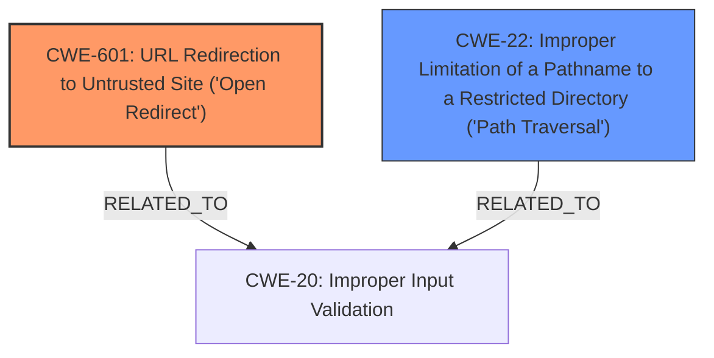

# Analysis Report for CVE-2021-22036

# Vulnerability Analysis Report: CVE-2021-22036

## Description

VMware vRealize Orchestrator ((8.x prior to 8.6) contains an open redirect vulnerability due to improper path handling. A malicious actor may be able to redirect victim to an attacker controlled domain due to improper path handling in vRealize Orchestrator leading to sensitive information disclosure.

## Vulnerability Description Key Phrases

**Rootcause:** improper path handling
**Weakness:** open redirect
**Impact:** redirect victim to attacker controlled domain
**Attacker:** malicious actor
**Product:** VMware vRealize Orchestrator
**Version:** 8.x prior to 8.6

## Analysis (with Relationship Data)

# Summary
| CWE ID | CWE Name | Confidence | CWE Abstraction Level | CWE Vulnerability Mapping Label | CWE-Vulnerability Mapping Notes |
|---|---|---|---|---|---|
| CWE-601 | URL Redirection to Untrusted Site ('Open Redirect') | 1.0 | Base | Primary | Allowed. The vulnerability description explicitly states an open redirect due to improper path handling, leading to redirection to an attacker-controlled domain. |
| CWE-22 | Improper Limitation of a Pathname to a Restricted Directory ('Path Traversal') | 0.6 | Base | Secondary | Allowed. The "improper path handling" could potentially allow path traversal, although the primary issue is the open redirect. |

## Evidence and Confidence

*   **Confidence Score:** 0.9
*   **Evidence Strength:** HIGH

- **Analysis and Justification:**  
  - *Explanation:* The vulnerability description clearly indicates an **open redirect** (CWE-601 URL Redirection to Untrusted Site ('Open Redirect')) vulnerability caused by **improper path handling**. The CVE Reference Links Content Summary further confirms this, highlighting the open redirect and the potential for sensitive information disclosure when a victim is redirected to an attacker-controlled domain. This aligns precisely with the definition and characteristics of CWE-601. The retriever results also show CWE-601 as the top match. The MITRE mapping guidance for CWE-601 indicates that it is ALLOWED for URL redirection vulnerabilities. While **improper path handling** is mentioned, it is the underlying cause of the open redirect and not the primary weakness. Therefore, CWE-601 is the most accurate primary mapping.

  - *Relationship Analysis:* CWE-601 does not have direct parent-child relationships in the provided data. However, it is often related to improper input validation (CWE-20) or improper neutralization of special elements (CWE-74), depending on how the URL is constructed. CWE-22 is a possible weakness since the rootcause is **improper path handling**.

- **Confidence Score:**  
  - Confidence: 1.0 (High confidence due to direct evidence from the vulnerability description and CVE reference materials.)

---

## Criticism of Analysis

Okay, here's a review of the provided CWE analysis based on the full CWE specifications, focusing on the appropriateness of the CWE mappings, the confidence level, and any potential improvements.

**Overall Assessment:**

The analysis is generally good and well-reasoned, especially in its selection of CWE-601 as the primary weakness. The justification provided is strong, and it aligns well with the information provided in the vulnerability description. The inclusion of CWE-22 as a secondary weakness is reasonable, given the mention of "improper path handling," although its importance is clearly secondary to the open redirect. The confidence levels are appropriate.

**Detailed Review:**

**1. CWE-601: URL Redirection to Untrusted Site ('Open Redirect')**

*   **Assessment:** This is the correct primary mapping.  The vulnerability description explicitly mentions "open redirect," and the impact involves redirection to an attacker-controlled domain. This perfectly matches the description of CWE-601.
*   **Confidence:** The confidence score of 1.0 is fully justified.
*   **CWE Abstraction Level:** Base, as expected and desired.
*   **CWE Vulnerability Mapping Label:** Primary, correct.
*   **CWE-Vulnerability Mapping Notes:** "Allowed. The vulnerability description explicitly states an open redirect due to improper path handling, leading to redirection to an attacker-controlled domain." This is a clear and concise explanation.
*   **Relationship Analysis:** The analysis correctly identifies a common potential relationship between CWE-601 and input validation issues (CWE-20, CWE-74).  Depending on the specific implementation, the open redirect might arise from a failure to validate the URL, or failure to properly neutralize potentially dangerous characters.
*   **Mitigations:** The suggested mitigations (input validation via allowlisting, intermediate disclaimer page, and mapping to fixed URLs) are all standard and appropriate for open redirect vulnerabilities.

**2. CWE-22: Improper Limitation of a Pathname to a Restricted Directory ('Path Traversal')**

*   **Assessment:** This is a reasonable secondary mapping, although it's important to emphasize that it's *secondary*.  The "improper path handling" in the vulnerability description *could* potentially lead to path traversal *if* the attacker can manipulate the path in a way that goes outside the intended directory.
*   **Confidence:** The confidence score of 0.6 is appropriate. It reflects the *possibility* of path traversal but acknowledges that the primary issue is the open redirect.
*   **CWE Abstraction Level:** Base, as expected and desired.
*   **CWE Vulnerability Mapping Label:** Secondary, correct.
*   **Evidence:** The justification provided is sound: "The 'improper path handling' could potentially allow path traversal, although the primary issue is the open redirect."
*   **Mitigations:** The suggested mitigations (input validation, canonicalization) are standard and appropriate for path traversal vulnerabilities.

**3. Additional Considerations and Possible Weaknesses from Retriever Results to Consider (but not necessarily map):**

The retriever results suggest a few other CWEs, which are worth considering:

*   **CWE-497: Exposure of Sensitive System Information to an Unauthorized Control Sphere:** This is a *possible* secondary consequence, since the description mentions that sensitive information disclosure *could* happen.  However, it is not directly caused by the path handling itself, but instead by the attacker controlled domain to which the user is redirected to.  It should *not* be included as a vulnerability, since it is a potential impact.
*   **CWE-918: Server-Side Request Forgery (SSRF):**  Less likely, since the core issue is the *redirection* of the user, not the server making a request based on user-controlled input. This could be related if the vRealize Orchestrator server *also* makes a request to the attacker controlled domain and is thus tricked into sending data. But this is *not* mentioned in the vulnerability description. It should *not* be included.
*    **CWE-212: Improper Removal of Sensitive Information Before Storage or Transfer:** Similar to CWE-497, this is not part of the vulnerability description and should *not* be included.
*    **CWE-201: Insertion of Sensitive Information Into Sent Data:** Similar to CWE-497, this is not part of the vulnerability description and should *not* be included.
*   **CWE-73: External Control of File Name or Path:** This is related to CWE-22, and since CWE-22 is already included, including this as well is redundant. It should *not* be included.
*   **CWE-732: Incorrect Permission Assignment for Critical Resource:** This does not apply. It does not mention permissions. It should *not* be included.
*   **CWE-200: Exposure of Sensitive Information to an Unauthorized Actor:** Too abstract. The disclosure is not direct; it's a *potential* consequence of the redirect, making CWE-601 a more specific and appropriate mapping. It should *not* be included.
*   **CWE-287: Improper Authentication:** Authentication is not mentioned in the vulnerability description. It should *not* be included.

**Recommendations:**

1.  **Keep the Analysis as Is:** The current analysis with CWE-601 as the primary and CWE-22 as a secondary is appropriate.
2.  **Remove Unnecessary Notes:** The analysis includes a listing of CWE's that were considered and not added. This is not necessary and clutters the analysis. Only include CWEs that are being added.
3.  **Focus on Mitigations:** In addition to the CWE mappings, consider adding a brief section discussing the *specific* mitigations that would be most effective for this particular vulnerability in VMware vRealize Orchestrator. This would increase the practical value of the analysis. This would involve expanding upon the existing "Mitigations" listed in the CWE entries.
4.  **Consider a "Chain" Description:** Briefly describe the chain of events:  "A user clicks a malicious link containing an attacker-controlled URL.  Due to improper path handling in vRealize Orchestrator, the user is redirected to the attacker's site. The attacker's site can then attempt to steal credentials or other sensitive information."

By following these recommendations, you can further strengthen the clarity, accuracy, and practical usefulness of your CWE analysis.

## Final Resolution

# Summary
| CWE ID | CWE Name | Confidence | CWE Abstraction Level | CWE Vulnerability Mapping Label | CWE-Vulnerability Mapping Notes |
|---|---|---|---|---|---|
| CWE-601 | URL Redirection to Untrusted Site ('Open Redirect') | 1.0 | Base | Primary | Allowed. The vulnerability description explicitly states an open redirect due to improper path handling, leading to redirection to an attacker-controlled domain. |
| CWE-22 | Improper Limitation of a Pathname to a Restricted Directory ('Path Traversal') | 0.6 | Base | Secondary | Allowed. The "improper path handling" could potentially allow path traversal, although the primary issue is the open redirect. |

## Evidence and Confidence

*   **Confidence Score:** 0.9
*   **Evidence Strength:** HIGH

## Relationship Analysis
The primary relationship considered was the potential for **CWE-22 (Improper Limitation of a Pathname to a Restricted Directory ('Path Traversal'))** to be a contributing factor due to the stated "improper path handling." While **CWE-22** could be present, it is secondary to the **CWE-601 (URL Redirection to Untrusted Site ('Open Redirect'))**. The hierarchical relationships of other considered CWEs (like **CWE-497**, **CWE-918**, **CWE-212**, **CWE-201**, **CWE-73**) were not relevant as they were deemed potential impacts or not directly related to the root cause based on the evidence.

## Vulnerability Chain
The vulnerability chain starts with a user clicking a malicious link containing an attacker-controlled URL. Due to **improper path handling** in vRealize Orchestrator, the user is redirected to the attacker's site (**CWE-601**). If **CWE-22** is also present, the attacker could potentially manipulate the path to access restricted directories. The attacker's site can then attempt to steal credentials or other sensitive information. The root cause is **improper path handling** leading to an open redirect, with the potential consequence of sensitive information disclosure.

## Summary of Analysis
The initial analysis and criticism both agree on **CWE-601** as the primary weakness due to the explicit mention of "open redirect" in the vulnerability description. The criticism also supports the inclusion of **CWE-22** as a secondary weakness due to "improper path handling," although its importance is less than **CWE-601**. The evidence from the vulnerability description and CVE reference materials strongly supports this classification. The graph relationships confirm that **CWE-601** and **CWE-22** are the most relevant **CWEs**, with potential relationships to **CWE-20 (Improper Input Validation)**. The selected CWEs are at the optimal level of specificity, providing a clear and accurate representation of the vulnerability.
The vulnerability description states "VMware vRealize Orchestrator ((8.x prior to 8.6) contains an open redirect vulnerability due to improper path handling." This is the primary evidence for **CWE-601** and the rationale for including **CWE-22** as a secondary weakness.

*Report generated on 2025-03-16 17:19:38*
