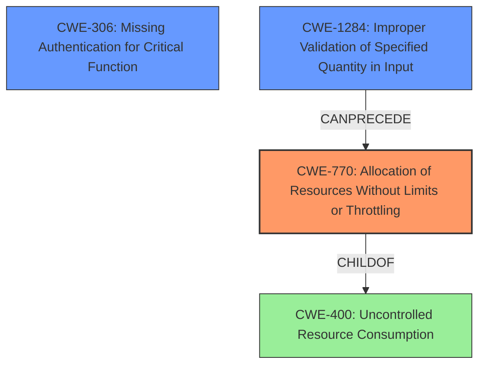

# Analysis Report for CVE-2021-22101

# Vulnerability Analysis Report: CVE-2021-22101

## Description

Cloud Controller versions prior to 1.118.0 are vulnerable to unauthenticated denial of Service(DoS) vulnerability allowing unauthenticated attackers to cause denial of service by using REST HTTP requests with label_selectors on multiple V3 endpoints by generating an enormous SQL query.

## Vulnerability Description Key Phrases

**Impact:** denial of service
**Vector:** REST HTTP requests with label_selectors
**Attacker:** unauthenticated attackers
**Product:** Cloud Controller
**Version:** prior to 1.118.0
**Component:** multiple V3 endpoints

## Analysis (with Relationship Data)

# Summary
| CWE ID | CWE Name | Confidence | CWE Abstraction Level | CWE Vulnerability Mapping Label | CWE-Vulnerability Mapping Notes |
|---|---|---|---|---|---|
| CWE-770 | Allocation of Resources Without Limits or Throttling | 0.9 | Base | Allowed | Primary CWE |
| CWE-400 | Uncontrolled Resource Consumption | 0.6 | Class | Discouraged | Secondary Candidate |
| CWE-89 | Improper Neutralization of Special Elements used in an SQL Command ('SQL Injection') | 0.5 | Base | Allowed | Secondary Candidate |
| CWE-306 | Missing Authentication for Critical Function | 0.4 | Base | Allowed | Secondary Candidate |

## Evidence and Confidence

*   **Confidence Score:** 0.8
*   **Evidence Strength:** HIGH

- **Analysis and Justification:**  
  - *Explanation:* The vulnerability description clearly states that the Cloud Controller is vulnerable to an unauthenticated denial of service due to the generation of enormous SQL queries when processing REST HTTP requests with `label_selectors` on multiple V3 endpoints. This directly aligns with CWE-770 (Allocation of Resources Without Limits or Throttling), as the system is allocating resources (in this case, database query processing) without proper limits, leading to denial of service. The **impact** is denial of service and the **vector** is crafted REST HTTP requests. While CWE-400 (Uncontrolled Resource Consumption) might seem relevant, CWE-770 is more specific because it highlights the **allocation** aspect of the resource consumption, which is more precise to the root cause. CWE-770 is a base level CWE and it's usage is "Allowed".

  - *Relationship Analysis:* CWE-770 is a child of CWE-400, but CWE-770 provides more specific context about the resource allocation. The relationship graph shows CWE-770 CanFollow CWE-20.

- **Confidence Score:**  
  - Confidence: 0.9 (High confidence due to the specific details in the vulnerability description and CVE reference materials.)

---

## Criticism of Analysis

Okay, let's review the provided CWE analysis for the Cloud Controller DoS vulnerability, considering the full CWE specifications.

**Overall Assessment:**

The analysis identifies CWE-770 as the primary CWE, which is a good start. The justification is reasonable, focusing on the resource allocation aspect. The secondary candidates, while relevant, are weaker. The confidence level of 0.9 for CWE-770 is justifiable given the information. However, there's room for improvement in exploring the nuances of the vulnerability and considering more specific CWEs related to input validation and SQL query generation.

**Detailed Review by CWE:**

*   **CWE-770: Allocation of Resources Without Limits or Throttling (Primary)**
    *   **Correctness:**  This is a good high-level fit. The description of CWE-770 directly matches the uncontrolled allocation of database processing resources leading to a DoS. The analysis correctly notes this.
    *   **Justification:** The justification is sound, highlighting the lack of limits on resource allocation.
    *   **Mapping Guidance:** The analysis follows the "Allowed" usage and rationale as it is at the base level of abstraction.
    *   **Mitigations:** The suggested mitigations are appropriate. Designing throttling mechanisms and setting resource limits are direct countermeasures to CWE-770. Mentioning authentication and access control is also relevant because those can help prevent unauthorized users from exploiting the vulnerability.
    *   **Potential Improvements:** Consider adding more specific mitigations related to SQL query optimization or database connection pooling, as those are particularly relevant in this context.

*   **CWE-400: Uncontrolled Resource Consumption (Secondary Candidate)**
    *   **Correctness:** This is a parent (class level) of CWE-770 and therefore a relevant, but less specific, choice.
    *   **Justification:** The analysis correctly identifies it as a potential, but weaker, candidate. It correctly points out that it's related to resource consumption.
    *   **Mapping Guidance:** The analysis does not use the "discouraged" usage and rationale for this CWE, as a secondary candidate, and mentions why CWE-770 is better (more specific context).
    *   **Mitigations:** Mitigations are appropriate but generic.
    *   **Potential Improvements:** Given that CWE-400 is a class-level CWE with discouraged usage, it should be omitted. If it is to be kept, a stronger justification on *why* it's also relevant despite CWE-770 being more specific is required. And the mitigations are too generic.

*   **CWE-89: Improper Neutralization of Special Elements used in an SQL Command ('SQL Injection') (Secondary Candidate)**
    *   **Correctness:** This is potentially relevant, but less direct. The vulnerability description mentions the generation of enormous SQL queries, but it doesn't explicitly state that the queries are constructed using unsanitized input in a way that allows SQL injection. The `label_selectors` could be used to inject SQL commands.
    *   **Justification:** A stronger justification is needed to connect the `label_selectors` and the SQL query generation process to demonstrate that malicious SQL commands can be injected through these parameters. Absent this connection, this CWE is weak.
    *   **Mapping Guidance:** The analysis does not use the "Allowed" usage and rationale for this CWE, which indicates the analysis is not confident that it fits.
    *   **Mitigations:** The mitigations related to parameterized queries and stored procedures are highly relevant if SQL injection is indeed possible.
    *   **Potential Improvements:** The analysis should investigate *how* the `label_selectors` are used to construct the SQL query. If they are simply used to build a large `WHERE` clause with valid data, then SQL injection is not the primary issue. However, if the `label_selectors` are concatenated directly into the SQL query without proper sanitization, then CWE-89 becomes more relevant.

*   **CWE-306: Missing Authentication for Critical Function (Secondary Candidate)**
    *   **Correctness:** This is directly relevant, as the vulnerability is exploitable by unauthenticated attackers.
    *   **Justification:** The analysis should explicitly state why lack of authentication makes the issue worse.
    *   **Mapping Guidance:** The analysis does not use the "Allowed" usage and rationale for this CWE, indicating the analysis is not confident that it fits.
    *   **Mitigations:** The mitigations related to authentication are a must.
    *   **Potential Improvements:** Authentication is only relevant in the fact that the DoS can be triggered without authentication. An unauthenticated user is able to trigger the SQL query.

**Missing CWE Considerations:**

*   **CWE-20: Improper Input Validation:** It's *likely* that the `label_selectors` are not properly validated for size, complexity, or the number of labels requested. While CWE-20 is discouraged, it's a parent of many more specific input validation errors. Since the description mentions `label_selectors`, the analysis should explore *what* about those selectors is not validated. Is it the number of selectors? The size of each selector? The characters used in the selectors?  This would lead to more specific CWEs like:
    *   **CWE-1284: Improper Validation of Specified Quantity in Input:** If the number of `label_selectors` or the size of each selector is not limited, this CWE would be highly relevant.
*   **CWE-1173: Improper Use of Validation Framework:** Given that there is a validation framework, is it used correctly?

**Recommendations:**

1.  **Strengthen the SQL Injection argument (CWE-89) OR remove it.** Demonstrate concretely how the `label_selectors` can be used to inject malicious SQL, or remove CWE-89 entirely.
2.  **Keep Authentication (CWE-306).** The unauthenticated aspect is important, keep this as a secondary candidate.
3.  **Explore Input Validation Issues:** Add **CWE-20** and explore more specific input validation CWEs related to the `label_selectors`.
4.  **Prioritize Base-Level CWEs:** When possible, favor Base-level CWEs over Class-level CWEs like CWE-400, as they provide more specific information about the vulnerability.
5.  **Tailor Mitigations:**  While the existing mitigations are generally correct, they should be tailored to the specifics of this vulnerability.  For example, instead of just "implement throttling mechanisms," suggest specific throttling strategies for SQL query generation.

By addressing these points, the analysis will become more comprehensive and provide a more accurate and actionable representation of the vulnerability.

## Final Resolution

# Summary
| CWE ID | CWE Name | Confidence | CWE Abstraction Level | CWE Vulnerability Mapping Label | CWE-Vulnerability Mapping Notes |
|---|---|---|---|---|---|
| CWE-770 | Allocation of Resources Without Limits or Throttling | 0.9 | Base | Allowed | Primary CWE |
| CWE-306 | Missing Authentication for Critical Function | 0.7 | Base | Allowed | Secondary Candidate |
| CWE-1284 | Improper Validation of Specified Quantity in Input | 0.6 | Base | Allowed | Secondary Candidate |

## Evidence and Confidence

*   **Confidence Score:** 0.8
*   **Evidence Strength:** MEDIUM

## Relationship Analysis
The primary CWE, CWE-770 **(Allocation of Resources Without Limits or Throttling)**, is a base-level CWE, which is optimal for representing the root cause. It is related to CWE-400 **(Uncontrolled Resource Consumption)** through a child-of relationship, with CWE-770 being more specific. CWE-1284 **(Improper Validation of Specified Quantity in Input)** is added to address the lack of validation on the 'label_selectors,' potentially involving quantity or size. CWE-306 **(Missing Authentication for Critical Function)** is kept as it highlights the unauthenticated access, exacerbating the DoS. The relationships inform the vulnerability chain from input to resource exhaustion.

## Vulnerability Chain
The vulnerability chain starts with the lack of authentication (**CWE-306**), allowing unauthenticated users to send requests. This leads to **CWE-1284** where the `label_selectors` are not validated for quantity. The lack of input validation then results in **CWE-770** **(Allocation of Resources Without Limits or Throttling)**, where the system allocates excessive resources to process an enormous SQL query, leading to a denial of service.

## Summary of Analysis
The initial analysis correctly identified **CWE-770** as the primary **weakness**. The criticism suggested exploring input validation issues and prioritizing base-level CWEs. Based on the vulnerability description "Cloud Controller versions prior to 1.118.0 are vulnerable to unauthenticated denial of Service(DoS) vulnerability allowing unauthenticated attackers to cause denial of service by using REST HTTP requests with label_selectors on multiple V3 endpoints by generating an enormous SQL query", the inclusion of **CWE-306** is relevant as it explains that the vulnerability is exploitable by unauthenticated attackers. The addition of **CWE-1284** addresses the improper validation of the quantity of `label_selectors`, contributing to the generation of the enormous SQL query. The initial consideration of **CWE-400** is less specific than **CWE-770** and is therefore not included as a primary or secondary CWE. The SQL injection concern (**CWE-89**) is omitted due to lack of explicit evidence in the description. **CWE-770, CWE-306,** and **CWE-1284** provide the optimal level of specificity based on the available evidence.

*Report generated on 2025-03-16 17:06:23*
