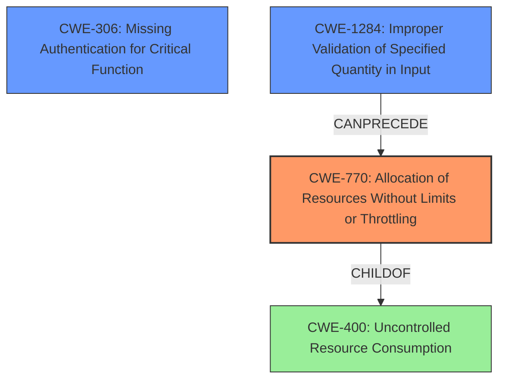

# Final Resolution for CVE-2021-22101

# Summary
| CWE ID | CWE Name | Confidence | CWE Abstraction Level | CWE Vulnerability Mapping Label | CWE-Vulnerability Mapping Notes |
|---|---|---|---|---|---|
| CWE-770 | Allocation of Resources Without Limits or Throttling | 0.9 | Base | Allowed | Primary CWE |
| CWE-306 | Missing Authentication for Critical Function | 0.7 | Base | Allowed | Secondary Candidate |
| CWE-1284 | Improper Validation of Specified Quantity in Input | 0.6 | Base | Allowed | Secondary Candidate |

## Evidence and Confidence

*   **Confidence Score:** 0.8
*   **Evidence Strength:** MEDIUM

## Relationship Analysis
The primary CWE, CWE-770 **(Allocation of Resources Without Limits or Throttling)**, is a base-level CWE, which is optimal for representing the root cause. It is related to CWE-400 **(Uncontrolled Resource Consumption)** through a child-of relationship, with CWE-770 being more specific. CWE-1284 **(Improper Validation of Specified Quantity in Input)** is added to address the lack of validation on the 'label_selectors,' potentially involving quantity or size. CWE-306 **(Missing Authentication for Critical Function)** is kept as it highlights the unauthenticated access, exacerbating the DoS. The relationships inform the vulnerability chain from input to resource exhaustion.

## Vulnerability Chain
The vulnerability chain starts with the lack of authentication (**CWE-306**), allowing unauthenticated users to send requests. This leads to **CWE-1284** where the `label_selectors` are not validated for quantity. The lack of input validation then results in **CWE-770** **(Allocation of Resources Without Limits or Throttling)**, where the system allocates excessive resources to process an enormous SQL query, leading to a denial of service.

## Summary of Analysis
The initial analysis correctly identified **CWE-770** as the primary **weakness**. The criticism suggested exploring input validation issues and prioritizing base-level CWEs. Based on the vulnerability description "Cloud Controller versions prior to 1.118.0 are vulnerable to unauthenticated denial of Service(DoS) vulnerability allowing unauthenticated attackers to cause denial of service by using REST HTTP requests with label_selectors on multiple V3 endpoints by generating an enormous SQL query", the inclusion of **CWE-306** is relevant as it explains that the vulnerability is exploitable by unauthenticated attackers. The addition of **CWE-1284** addresses the improper validation of the quantity of `label_selectors`, contributing to the generation of the enormous SQL query. The initial consideration of **CWE-400** is less specific than **CWE-770** and is therefore not included as a primary or secondary CWE. The SQL injection concern (**CWE-89**) is omitted due to lack of explicit evidence in the description. **CWE-770, CWE-306,** and **CWE-1284** provide the optimal level of specificity based on the available evidence.