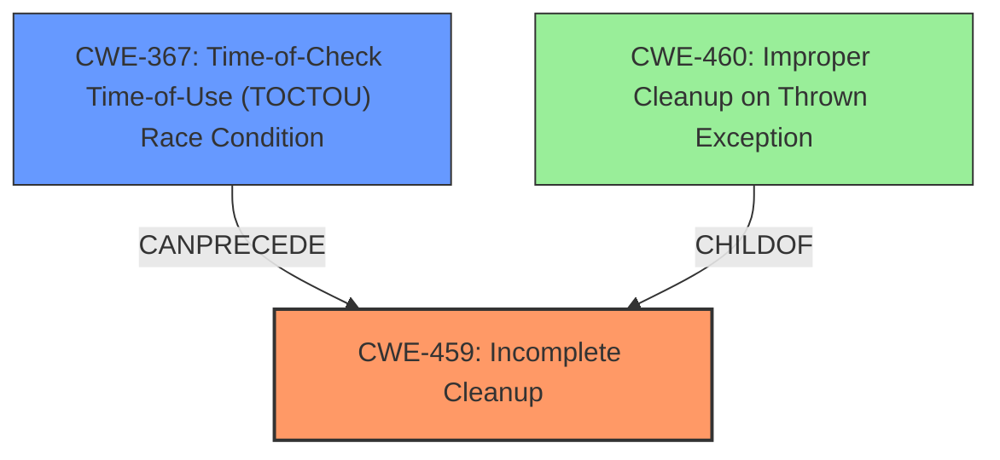

# Final Resolution for CVE-2021-22428

# Summary
| CWE ID | CWE Name | Confidence | CWE Abstraction Level | CWE Vulnerability Mapping Label | CWE-Vulnerability Mapping Notes |
|---|---|---|---|---|---|
| CWE-459 | Incomplete Cleanup | 0.9 | Base | Primary CWE | Allowed |
| CWE-367 | Time-of-Check Time-of-Use (TOCTOU) Race Condition | 0.7 | Base | Secondary Candidate | Allowed |

## Evidence and Confidence

*   **Confidence Score:** 0.8
*   **Evidence Strength:** MEDIUM

## Relationship Analysis
The primary relationship to consider is how a **race condition** (CWE-367) can lead to an **incomplete cleanup** (CWE-459). While there's no direct relationship between them in the provided data, logically, if a resource's state changes unexpectedly due to a race condition during a cleanup operation, the cleanup might fail, resulting in an incomplete cleanup. The abstraction levels are appropriate, with both CWEs at the Base level. Other high-scoring CWEs like CWE-460 (Improper Cleanup on Thrown Exception) are not as relevant since there is no mention of exceptions being thrown in the description.

## Vulnerability Chain
The vulnerability chain starts with a **race condition** (CWE-367), where the state of a resource can change between the check and the use, invalidating the results of the check. This **race condition** then leads to an **incomplete cleanup** (CWE-459), where temporary or supporting resources are not properly removed after use. The consequence of this **incomplete cleanup** is an authentication bypass, as the system is left in an insecure state.

## Summary of Analysis
The initial analysis and the criticism both converge on the idea that CWE-459 and CWE-367 are appropriate mappings. The vulnerability description mentions "incomplete cleanup" explicitly, making CWE-459 a strong primary candidate. The CVE Reference Links Content Summary indicating a "race condition" further strengthens the case for CWE-367 as a secondary weakness.

The relationship analysis highlights how a race condition can lead to an incomplete cleanup, solidifying the connection between CWE-367 and CWE-459. The MITRE mapping guidance for both CWEs indicates that they are ALLOWED because they are at the Base level of abstraction.

The mitigations suggested for CWE-459 (deleting temporary files immediately after use) and CWE-367 (avoiding checks before use, limiting interleaving of operations) are relevant to the vulnerability description, further supporting the classification.

The final decision is to classify the vulnerability as primarily CWE-459 (Incomplete Cleanup) and secondarily CWE-367 (Time-of-Check Time-of-Use (TOCTOU) Race Condition). These CWEs are at the optimal level of specificity, as they directly address the **rootcause** and contributing factors of the vulnerability. The **rootcause** is the **incomplete cleanup** of resources, and the contributing factor is the **race condition** that leads to the **incomplete cleanup**.

The assessment is based on the provided evidence, including the vulnerability description ("There is an Incomplete Cleanup Vulnerability") and the CVE Reference Links Content Summary ("race condition"). The graph relationships are used to understand how these weaknesses are related and how they contribute to the vulnerability.

The selection is justified by the direct match of "incomplete cleanup" with CWE-459 and the presence of a "race condition" that can cause such an **incomplete cleanup**.