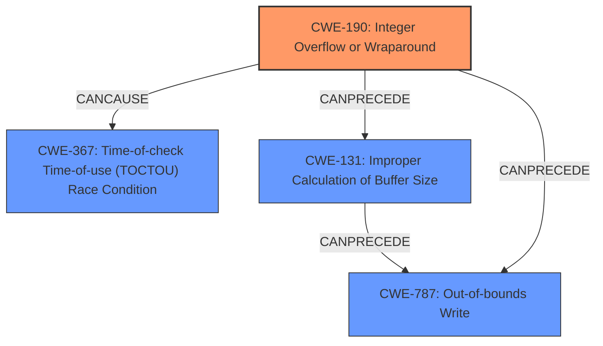

# Final Resolution for CVE-2021-22437

# Summary
| CWE ID | CWE Name | Confidence | CWE Abstraction Level | CWE Vulnerability Mapping Label | CWE-Vulnerability Mapping Notes |
|---|---|---|---|---|---|
| CWE-190 | Integer Overflow or Wraparound | 0.95 | Base | Primary | Allowed |
| CWE-367 | Time-of-check Time-of-use (TOCTOU) Race Condition | 0.85 | Secondary | Allowed |
| CWE-787 | Out-of-bounds Write | 0.70 | Secondary | Allowed |
| CWE-131 | Improper Calculation of Buffer Size | 0.60 | Secondary | Allowed |

## Evidence and Confidence

*   **Confidence Score:** 0.88
*   **Evidence Strength:** MEDIUM

## Relationship Analysis
The primary weakness is **CWE-190 (Integer Overflow or Wraparound)**, a Base level CWE, which can lead to **CWE-367 (TOCTOU Race Condition)** when concurrent access to a shared resource is involved. The integer overflow can result in an incorrect buffer size calculation (**CWE-131**), potentially leading to an out-of-bounds write (**CWE-787**). The **CWE-190** can precede **CWE-787** directly or via **CWE-131**. **CWE-367** is related to timing issues and concurrent access, which is a consequence of the unexpected state caused by the integer overflow.

## Vulnerability Chain
The vulnerability chain starts with **CWE-190 (Integer Overflow or Wraparound)**, leading to an incorrect calculation of a buffer size (**CWE-131**). This incorrect size calculation can then lead to an out-of-bounds write (**CWE-787**). The concurrent access to the shared resource, which is impacted by the integer overflow, can lead to a TOCTOU race condition (**CWE-367**), where the state of the resource changes between the check and use. The final impact is random address access, which could result in information disclosure, code execution, or denial of service.

## Summary of Analysis
The initial analysis correctly identified **CWE-190 (Integer Overflow or Wraparound)** as the primary **ROOTCAUSE** and **CWE-367 (TOCTOU Race Condition)** as a secondary weakness. However, the analysis can be improved by considering the consequences of the integer overflow more explicitly. The "random address access" impact suggests potential out-of-bounds memory operations, which are best represented by **CWE-787 (Out-of-bounds Write)** and **CWE-131 (Improper Calculation of Buffer Size)**.

The vulnerability description states: "There is a software integer overflow leading to a TOCTOU condition in smartphones. Successful exploitation of this vulnerability may cause random address access." This statement directly supports the selection of **CWE-190** and **CWE-367**.

The relationship analysis shows that **CWE-190** can precede **CWE-787** through an improper calculation of buffer size (**CWE-131**). This indirect relationship provides additional support for including **CWE-787** in the analysis. The **CWE-367** relates to the concurrent execution environment and timing issues, which are a consequence of the **WEAKNESS**.

The selected CWEs are at the optimal level of specificity because they directly address the **ROOTCAUSE** and consequences of the vulnerability, as described in the vulnerability description. **CWE-190** is a Base level CWE and provides a clear description of the integer overflow. **CWE-367**, **CWE-787**, and **CWE-131** are also Base level CWEs and provide specific details about the race condition, out-of-bounds write, and buffer size calculation, respectively.