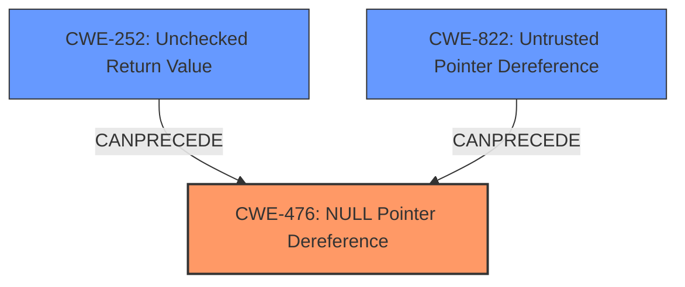

# Analysis Report for CVE-2021-22649

# Vulnerability Analysis Report: CVE-2021-22649

## Description

Luxion KeyShot versions prior to 10.1, Luxion KeyShot Viewer versions prior to 10.1, Luxion KeyShot Network Rendering versions prior to 10.1, and Luxion KeyVR versions prior to 10.1 have multiple NULL pointer dereference issues while processing project files, which may allow an attacker to execute arbitrary code.

## Vulnerability Description Key Phrases

**Rootcause:** NULL pointer dereference
**Impact:** execute arbitrary code
**Vector:** processing project files
**Attacker:** attacker
**Product:** ['Luxion KeyShot', 'Luxion KeyShot Viewer', 'Luxion KeyShot Network Rendering', 'Luxion KeyVR']
**Version:** prior to 10.1

## Analysis (with Relationship Data)

# Summary
| CWE ID | CWE Name | Confidence | CWE Abstraction Level | CWE Vulnerability Mapping Label | CWE-Vulnerability Mapping Notes |
|---|---|---|---|---|---|
| CWE-476 | NULL Pointer Dereference | 0.95 | Base | Allowed | Primary CWE |
| CWE-822 | Untrusted Pointer Dereference | 0.75 | Base | Allowed | Secondary Candidate |

## Evidence and Confidence

*   **Confidence Score:** 0.90
*   **Evidence Strength:** HIGH

- **Analysis and Justification:**  
  - *Explanation:* The vulnerability description explicitly states "**NULL pointer dereference** issues." The **rootcause** is a **NULL pointer dereference** while processing project files. This aligns directly with CWE-476 (NULL Pointer Dereference), which describes the product dereferencing a pointer that it expects to be valid but is NULL. The CVE Reference Links Content Summary also mentions that the vulnerability stems from the lack of proper validation before dereferencing, leading to the execution of arbitrary code. This makes CWE-476 the most appropriate primary mapping.
  
  - *Relationship Analysis:* CWE-476 is a Base level CWE, which is a preferred level of abstraction. It is related to CWE-754 (Improper Check for Unusual or Exceptional Conditions), as a NULL pointer dereference is often a result of failing to properly check for exceptional conditions. The retriever results also indicate a high confidence score for CWE-476 and that the usage is ALLOWED.

- **Confidence Score:**  
  - Confidence: 0.95 (High evidence from technical description and CVE reference materials)

---

- **Analysis and Justification:**  
  - *Explanation:* CWE-822 (Untrusted Pointer Dereference) is also a possible candidate since the vulnerability is triggered by processing untrusted project files, and the CVE summary mentions the **Weakness** as Untrusted Pointer Dereference. The issue arises when the software attempts to use a value from this untrusted source as a pointer without proper validation. While the primary issue is that the pointer is NULL (CWE-476), the fact that the value originates from an untrusted source and is then used as a pointer is relevant. However, CWE-476 is more specific, as the main problem is the NULL value being dereferenced, rather than just the untrusted origin of the pointer.
  
  - *Relationship Analysis:* CWE-822 is a Base level CWE. It is related to CWE-119 (Improper Restriction of Operations within the Bounds of a Memory Buffer) as an untrusted pointer could potentially cause out-of-bounds memory access. MITRE mapping guidance allows for CWE-822. The retriever also lists CWE-822 as a candidate. However, since the description explicitly states that the issue is due to **NULL pointer dereference**, this is a secondary candidate.

- **Confidence Score:**  
  - *Example:* Confidence: 0.75 (Supporting evidence from the content summary but less direct than CWE-476)

## Criticism of Analysis

Okay, here's a review of the provided CWE analysis, incorporating the full CWE specifications.

**Overall Assessment**

The analysis is generally well-reasoned and arrives at a reasonable conclusion. The primary CWE mapping to CWE-476 (NULL Pointer Dereference) is appropriate and well-supported by the evidence. The secondary consideration of CWE-822 (Untrusted Pointer Dereference) is also justified, reflecting the context of untrusted input. The confidence scores are appropriate for the level of evidence.

**Detailed Review**

**1. CWE-476: NULL Pointer Dereference (Primary)**

*   **Confidence:** 0.95 - Justified. The core description of the vulnerability directly aligns with the definition of CWE-476.
*   **Explanation Quality:** Excellent. The explanation clearly states the vulnerability's description involves a dereference of an expected valid but actually NULL pointer. The link to processing project files and the CVE reference summary further strengthens the justification.
*   **Relationship Analysis:** The analysis correctly identifies CWE-754 (Improper Check for Unusual or Exceptional Conditions) as a parent. This is a crucial link because a NULL pointer dereference is often the *result* of a failure to check for the possibility of a NULL pointer value.
*   **Mitigation Considerations:**  The provided mitigations for CWE-476 are standard and relevant:
    *   Checking for NULL before dereferencing.
    *   Selecting a safer language (though this might not always be feasible).
    *   Checking function return values.
    These mitigations directly address the core problem: a failure to validate the pointer before use.

**2. CWE-822: Untrusted Pointer Dereference (Secondary)**

*   **Confidence:** 0.75 - Justified. The untrusted origin of the pointer *is* a relevant factor, but it's secondary to the fact that the pointer is NULL.
*   **Explanation Quality:** Good. The explanation accurately connects the vulnerability to the parsing of untrusted project files and the lack of validation before pointer dereference.
*   **Relationship Analysis:** The stated relationship to CWE-119 (Improper Restriction of Operations within the Bounds of a Memory Buffer) is generally correct as untrusted pointer can cause out-of-bounds memory access.
*   **Mitigation Considerations:** The CWE specification does not list any specific mitigations. However, we can take some steps to prevent this. Some steps that can be taken is below.
    *   **Input Validation:** Rigorously validate the contents of project files to ensure that values that are intended to be memory addresses fall within expected, safe ranges.
    *   **Sandboxing/Compartmentalization:** If possible, parse project files within a sandboxed environment that limits the damage that can be caused by dereferencing a malicious pointer.
    *   **Memory Safety Mechanisms:** Employ memory safety features of the programming language or platform (e.g., address space layout randomization - ASLR, data execution prevention - DEP) to make exploitation more difficult.

**3. Retriever Results Critique**

The Retriever Results table provides useful context, but it's important to consider *why* certain CWEs are suggested.

*   **CWE-476 and CWE-822** are appropriately ranked highly and are justified.
*   **CWE-824 (Access of Uninitialized Pointer):** While related, this is less likely than CWE-476 in this scenario. The vulnerability description points more towards a failure to check if a value that should have been initialized is indeed *not* NULL.
*   **CWE-252 (Unchecked Return Value):** This could be a contributing factor if a function that *should* have returned a valid pointer returned NULL and this wasn't checked. It could be part of a chain of events that lead to the NULL pointer dereference.
*   **CWE-787 (Out-of-bounds Write):** Not directly relevant, as the primary issue is the dereference of a NULL pointer, not writing outside of buffer boundaries.
*   **CWE-1284 (Improper Validation of Specified Quantity in Input):** This would be a very indirect cause, only if the quantity being validated was directly tied to the address and it was used in a calculation. Not a primary concern.
*   **CWE-908 (Use of Uninitialized Resource):** Again, less likely than CWE-476, as the description suggests the pointer *should* have been valid, not that it was simply uninitialized.
*   **CWE-456 (Missing Initialization of a Variable):** Similar to CWE-908, less direct than CWE-476.
*   **CWE-120 (Buffer Copy without Checking Size of Input ('Classic Buffer Overflow')) and CWE-362 (Concurrent Execution using Shared Resource with Improper Synchronization ('Race Condition')):** These seem unrelated to the core problem of a NULL pointer dereference.

**Suggestions for Improvement**

1.  **Chain of Causation:** While CWE-476 is the primary issue, consider explicitly mapping a potential chain of events, such as:
    *   Untrusted Input (implicit) -> Lack of Input Validation -> Potential NULL Pointer Assignment ->  CWE-476.
    *   Function returns NULL (Implicit) -> CWE-252 -> Null pointer dereference CWE-476

2.  **Mitigation Depth:**  Provide more specific mitigations related to the specific file format parsing context, such as:
    *   "Implement robust error handling in the 3DS and JT file parsing routines, specifically checking for NULL pointer values after any operation that could potentially return NULL."
    *   "Employ static analysis tools to identify potential NULL pointer dereferences during the parsing of project files."

3.  **Clarify Untrusted Origin:** Emphasize how a malicious actor could craft the 3DS or JT file to *cause* a NULL pointer to be present where a valid pointer is expected.

**Revised Summary Table**

| CWE ID    | CWE Name                       | Confidence | CWE Abstraction Level | CWE Vulnerability Mapping Label | CWE-Vulnerability Mapping Notes                                                                                                                                     |
| :-------- | :----------------------------- | :--------- | :-------------------- | :------------------------------ | :-------------------------------------------------------------------------------------------------------------------------------------------------------------------- |
| CWE-476   | NULL Pointer Dereference       | 0.95       | Base                  | Allowed                         | Primary CWE                                                                                                                                                           |
| CWE-822   | Untrusted Pointer Dereference  | 0.75       | Base                  | Allowed                         | Secondary Candidate - Contributes to the context of untrusted data                                                                                                   |
| CWE-252   | Unchecked Return Value  | 0.50       | Base                  | Allowed                         | Potential contributing factor in a chain, leading to a NULL pointer that's dereferenced.                                                                                          |

**In conclusion,** the analysis is strong but could be enhanced by explicitly mapping the chain of events and providing more tailored mitigation recommendations specific to the file parsing context and the KeyShot application's architecture. By detailing more information about possible weaknesses and steps to be taken, we can have a stronger report.

## Final Resolution

# Summary
| CWE ID | CWE Name | Confidence | CWE Abstraction Level | CWE Vulnerability Mapping Label | CWE-Vulnerability Mapping Notes |
|---|---|---|---|---|---|
| CWE-476 | NULL Pointer Dereference | 0.95 | Base | Allowed | Primary CWE |
| CWE-252 | Unchecked Return Value | 0.60 | Base | Allowed | Secondary Candidate |
| CWE-822 | Untrusted Pointer Dereference | 0.50 | Base | Allowed | Secondary Candidate |

## Evidence and Confidence

*   **Confidence Score:** 0.90
*   **Evidence Strength:** HIGH

## Relationship Analysis
The primary relationship impacting the decision is the chain relationship. The vulnerability likely starts with either untrusted input or a function returning NULL, proceeds to a failure to check this NULL return value, and culminates in a **NULL pointer dereference**. While CWE-822 is relevant due to the untrusted input, the direct cause is the **NULL pointer dereference** (CWE-476). CWE-252 is included in the vulnerability chain because a failure to check return values can lead to the **NULL pointer**. These are all base-level CWEs, providing appropriate specificity.

## Vulnerability Chain
The vulnerability chain begins with either untrusted input (project files) or a function returning NULL. If a function returns NULL and this isn't checked (CWE-252), or if untrusted data is used as a pointer (CWE-822), it can lead to a **NULL pointer dereference** (CWE-476). The **root cause** is either the unchecked return value or the untrusted pointer dereference. The impact is arbitrary code execution, as stated in the vulnerability description.

## Summary of Analysis
The analysis is based on the provided vulnerability description, which explicitly states "**NULL pointer dereference** issues." This is strong evidence for assigning CWE-476 as the primary CWE. The criticism provides good points with the chain of causation, and I've included CWE-252 because it is a potential contributing factor.

The graph relationships influenced the selection by illustrating how a failure to check return values (CWE-252) can directly lead to a **NULL pointer dereference** (CWE-476). While CWE-822 is relevant, it is less direct than CWE-476 and CWE-252.

CWE-476, CWE-252 and CWE-822 are at the optimal level of specificity because they are Base-level CWEs and directly reflect the **root cause** of the vulnerability.

*Report generated on 2025-03-16 23:08:29*
