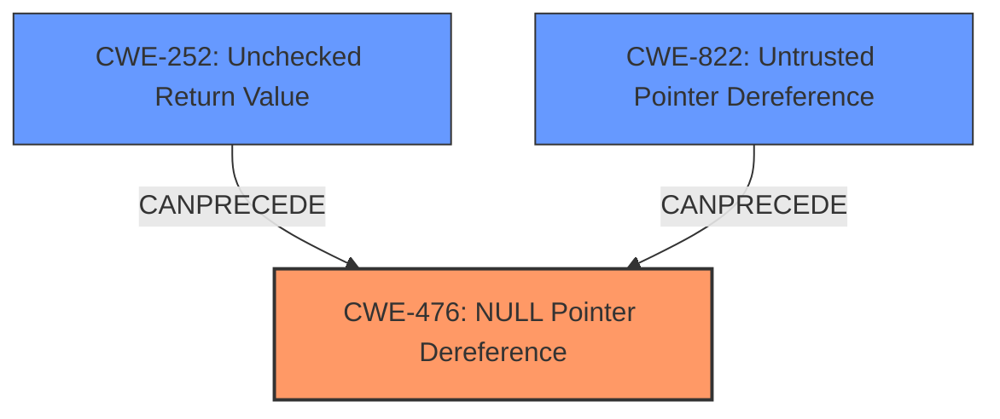

# Final Resolution for CVE-2021-22649

# Summary
| CWE ID | CWE Name | Confidence | CWE Abstraction Level | CWE Vulnerability Mapping Label | CWE-Vulnerability Mapping Notes |
|---|---|---|---|---|---|
| CWE-476 | NULL Pointer Dereference | 0.95 | Base | Allowed | Primary CWE |
| CWE-252 | Unchecked Return Value | 0.60 | Base | Allowed | Secondary Candidate |
| CWE-822 | Untrusted Pointer Dereference | 0.50 | Base | Allowed | Secondary Candidate |

## Evidence and Confidence

*   **Confidence Score:** 0.90
*   **Evidence Strength:** HIGH

## Relationship Analysis
The primary relationship impacting the decision is the chain relationship. The vulnerability likely starts with either untrusted input or a function returning NULL, proceeds to a failure to check this NULL return value, and culminates in a **NULL pointer dereference**. While CWE-822 is relevant due to the untrusted input, the direct cause is the **NULL pointer dereference** (CWE-476). CWE-252 is included in the vulnerability chain because a failure to check return values can lead to the **NULL pointer**. These are all base-level CWEs, providing appropriate specificity.

## Vulnerability Chain
The vulnerability chain begins with either untrusted input (project files) or a function returning NULL. If a function returns NULL and this isn't checked (CWE-252), or if untrusted data is used as a pointer (CWE-822), it can lead to a **NULL pointer dereference** (CWE-476). The **root cause** is either the unchecked return value or the untrusted pointer dereference. The impact is arbitrary code execution, as stated in the vulnerability description.

## Summary of Analysis
The analysis is based on the provided vulnerability description, which explicitly states "**NULL pointer dereference** issues." This is strong evidence for assigning CWE-476 as the primary CWE. The criticism provides good points with the chain of causation, and I've included CWE-252 because it is a potential contributing factor.

The graph relationships influenced the selection by illustrating how a failure to check return values (CWE-252) can directly lead to a **NULL pointer dereference** (CWE-476). While CWE-822 is relevant, it is less direct than CWE-476 and CWE-252.

CWE-476, CWE-252 and CWE-822 are at the optimal level of specificity because they are Base-level CWEs and directly reflect the **root cause** of the vulnerability.