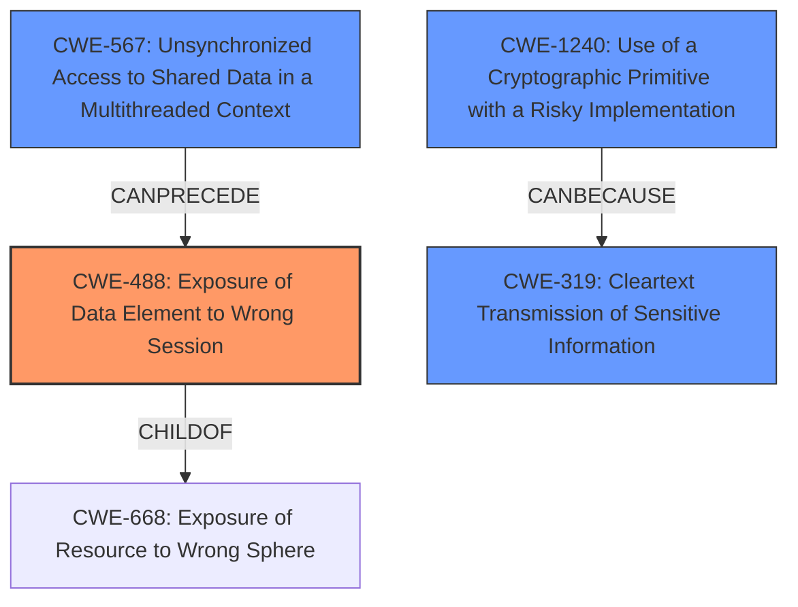

# Final Resolution for CVE-2021-22897

# Summary
| CWE ID | CWE Name | Confidence | CWE Abstraction Level | CWE Vulnerability Mapping Label | CWE-Vulnerability Mapping Notes |
|---|---|---|---|---|---|
| CWE-488 | Exposure of Data Element to Wrong Session | 1.0 | Base | Allowed | Primary CWE |
| CWE-567 | Unsynchronized Access to Shared Data in a Multithreaded Context | 0.6 | Base | Allowed | Secondary Candidate. Addresses the underlying concurrency issue. |
| CWE-1240 | Use of a Cryptographic Primitive with a Risky Implementation| 0.4 | Base | Allowed | Secondary Candidate |
| CWE-319 | Cleartext Transmission of Sensitive Information | 0.3 | Base | Allowed | Secondary Candidate |

## Evidence and Confidence

*   **Confidence Score:** 0.85
*   **Evidence Strength:** HIGH

## Relationship Analysis
The primary weakness is classified as CWE-488 (**Exposure of Data Element to Wrong Session**), a base-level CWE. The analysis also considers CWE-567 (**Unsynchronized Access to Shared Data in a Multithreaded Context**) as a secondary candidate, addressing the concurrency aspect of the vulnerability. The relationship between CWE-488 and its parent, CWE-668 (**Exposure of Resource to Wrong Sphere**), is acknowledged, but CWE-668 is considered too abstract. CWE-327 (**Use of a Broken or Risky Cryptographic Algorithm**) was replaced with CWE-1240 (**Use of a Cryptographic Primitive with a Risky Implementation**) which is a more accurate fit. Finally, CWE-319 (**Cleartext Transmission of Sensitive Information**) is retained due to it being a potential consequence.

## Vulnerability Chain
The vulnerability chain begins with unsynchronized access to a shared static variable in a multithreaded context (**CWE-567**). This leads to the exposure of the cipher list to the wrong session (**CWE-488**). If a weak or null cipher is selected due to this exposure, it could result in the use of a risky cryptographic implementation (**CWE-1240**), potentially leading to cleartext transmission of sensitive information (**CWE-319**).

## Summary of Analysis
The initial analysis correctly identified CWE-488 as the primary weakness. The criticism correctly suggested that CWE-567 could be added. CWE-327 was changed to CWE-1240 as a better fit.
*Evidence:* "curl 7.61.0 through 7.76.1 suffers from exposure of data element to wrong session due to a mistake in the code for CURLOPT_SSL_CIPHER_LIST when libcurl is built to use the Schannel TLS library."

The graph relationships influenced the selection by highlighting the connection between CWE-567 and CWE-488.

The selected CWEs are at the optimal level of specificity because they directly address the **root cause** (CWE-567), the immediate consequence (CWE-488), and the potential impacts (CWE-1240, CWE-319).