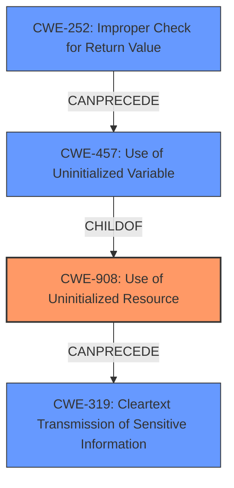

# Final Resolution for CVE-2021-22898

# Summary
| CWE ID | CWE Name | Confidence | CWE Abstraction Level | CWE Vulnerability Mapping Label | CWE-Vulnerability Mapping Notes |
|---|---|---|---|---|---|
| CWE-908 | Use of Uninitialized Resource | 0.9 | Base | Primary | Allowed |
| CWE-252 | Improper Check for Return Value | 0.8 | Base | Secondary | Allowed |
| CWE-319 | Cleartext Transmission of Sensitive Information | 0.7 | Base | Secondary | Allowed |

## Evidence and Confidence

*   **Confidence Score:** 0.85
*   **Evidence Strength:** HIGH

## Relationship Analysis
The initial analysis correctly identified CWE-908 as the primary **WEAKNESS**, focusing on the use of **uninitialized data**. The criticism suggested considering CWE-457 (Use of Uninitialized Variable), which is a variant of CWE-908. While CWE-457 is more specific to variables, CWE-908 is kept as it captures the broader sense of an uninitialized resource. CWE-252 is also relevant because the lack of return value checking leads to the use of the **uninitialized resource**, which then gets sent in **cleartext** (CWE-319). Therefore, we have a vulnerability chain. All three CWEs are base-level, so the level of abstraction is adequate.

## Vulnerability Chain
The **ROOTCAUSE** starts with the `sscanf()` function not having its return value checked (CWE-252). This leads to a variable remaining uninitialized (CWE-457, Use of Uninitialized Variable). This then results in the broader issue of using an **uninitialized resource** (CWE-908). Finally, this **uninitialized data** is sent over the TELNET protocol in **cleartext** (CWE-319), potentially exposing sensitive information.

## Summary of Analysis
The initial analysis and the criticism both agree on the relevance of CWE-908, CWE-319, and CWE-252. The final assessment is highly based on the evidence that "curl did not check the return code from a sscanf() function invoke correctly" and that curl suffers from an information disclosure when the `-t` command line option is used and results in "passing on **uninitialized data** from a stack based buffer to the server, resulting in potentially revealing sensitive internal information to the server using a **clear-text network protocol**." The graph relationships highlight the chain of events, starting from the missing return value check to the **cleartext** transmission of **uninitialized data**. The selected CWEs are at the optimal level of specificity, as they are all base-level CWEs that accurately represent the **WEAKNESS** and its context. The confidence score is slightly raised to 0.85 to reflect the inclusion of the vulnerability chain. The inclusion of CWE-252 and its placement in the chain leading to the **uninitialized data** being sent in **cleartext** increases the confidence in the overall assessment.