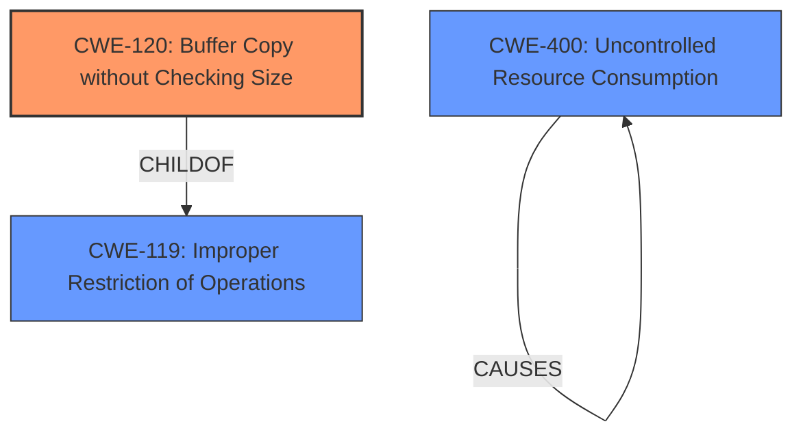

# Final Resolution for CVE-2021-22991

# Summary
| CWE ID | CWE Name | Confidence | CWE Abstraction Level | CWE Vulnerability Mapping Label | CWE-Vulnerability Mapping Notes |
|---|---|---|---|---|---|
| CWE-120 | Buffer Copy without Checking Size of Input ('Classic Buffer Overflow') | 0.85 | Base | Allowed-with-Review | Primary CWE: The vulnerability description explicitly mentions a **buffer overflow** due to incorrect handling of requests by the Traffic Management Microkernel (TMM) URI normalization, suggesting a copy operation without proper size validation. |
| CWE-400 | Uncontrolled Resource Consumption | 0.6 | Class | Allowed-with-Review | Secondary CWE: The **buffer overflow** leading to a crash can exhaust resources, resulting in a DoS. |

## Evidence and Confidence

*   **Confidence Score:** 0.75
*   **Evidence Strength:** MEDIUM

## Relationship Analysis
The decision was influenced by the following CWE relationships:
  - CWE-120 is a base level CWE and a child of CWE-119 (Improper Restriction of Operations within the Bounds of a Memory Buffer), but CWE-120 provides a more specific description related to buffer copies.
  - CWE-400 is related to the DoS impact.
  - The abstraction levels of Base (CWE-120) and Class (CWE-400) were considered, favoring the more specific Base for the primary **weakness**.

## Vulnerability Chain
The chain of events is as follows:
  1. **ROOTCAUSE**: Incorrect handling of requests by TMM URI normalization leads to a **buffer overflow** (CWE-120).
  2. **WEAKNESS**: The **buffer overflow** causes a crash.
  3. **IMPACT**: The crash leads to a denial-of-service (DoS) (CWE-400) due to resource exhaustion.

## Summary of Analysis
The initial analysis correctly identified CWE-120 as the primary **weakness** due to the explicit mention of "buffer overflow". The criticism suggested re-evaluating CWE-770 and considering alternatives, which led to the replacement of CWE-770 with CWE-400.

The evidence for CWE-120 is based on the vulnerability description: "undisclosed requests to a virtual server may be incorrectly handled by the Traffic Management Microkernel (TMM) URI normalization, which may trigger a **buffer overflow**". This suggests a potential lack of input size checking before copying data into a buffer. I am assuming there is a copy operation involved.

The graph relationships influenced the decision by highlighting the hierarchical relationship between CWE-120 and CWE-119, reinforcing the specificity of CWE-120.

CWE-120 is at the optimal level of specificity because it directly addresses the **buffer overflow** caused by the lack of size checking during the copy operation. CWE-400 is a contributing factor for the DoS impact.