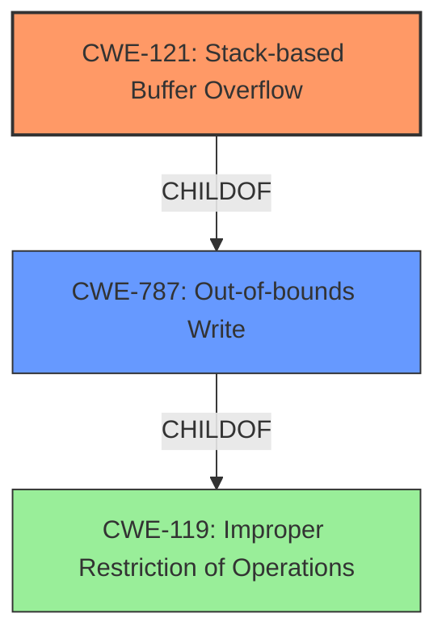

# Analysis Report for CVE-2021-23138

# Vulnerability Analysis Report: CVE-2021-23138

## Description

WECON LeviStudioU Versions 2019-09-21 and prior are vulnerable to a stack-based buffer overflow, which may allow an attacker to remotely execute code.

## Vulnerability Description Key Phrases

**Weakness:** stack-based buffer overflow
**Impact:** remotely execute code
**Attacker:** attacker
**Product:** LeviStudioU
**Version:** Versions 2019-09-21 and prior

## Analysis (with Relationship Data)

# Summary
| CWE ID | CWE Name | Confidence | CWE Abstraction Level | CWE Vulnerability Mapping Label | CWE-Vulnerability Mapping Notes |
|---|---|---|---|---|---|
| CWE-121 | Stack-based Buffer Overflow | 1.0 | Variant | Allowed | Primary CWE |
| CWE-787 | Out-of-bounds Write | 0.7 | Base | Allowed | Secondary Candidate |

## Evidence and Confidence

*   **Confidence Score:** 0.9
*   **Evidence Strength:** HIGH

- **Analysis and Justification:**  
  - *Explanation:* The vulnerability description clearly states a **stack-based buffer overflow** exists in WECON LeviStudioU. The CVE Reference Links Content Summary further validates this, explicitly mentioning **CWE-121: Stack-based Buffer Overflow** as the weakness. The description aligns precisely with CWE-121's characteristics: data is written beyond a buffer's boundaries on the stack, leading to memory corruption. CWE-121 is a Variant of CWE-119, offering a more specific classification. The Retriever Results also list CWE-121 as a potential match.

  - *Relationship Analysis:* CWE-121 is a variant of CWE-119 (Improper Restriction of Operations within the Bounds of a Memory Buffer) and a child of CWE-787 (Out-of-bounds Write). The vulnerability leads to remote code execution.

- **Confidence Score:**  
  - Confidence: 1.0 (Strong evidence from the vulnerability description and CVE reference materials).

---

- **Analysis and Justification:**  
  - *Explanation:* While the primary weakness is a **stack-based buffer overflow** (CWE-121), the more general **out-of-bounds write** (CWE-787) also applies. The product writes data past the end or before the beginning of the intended buffer, as confirmed by the description. Although CWE-121 is a more specific variant due to the stack allocation, CWE-787 accurately describes the underlying mechanism. Therefore, CWE-787 serves as a relevant secondary classification. The retriever results also list CWE-787.

  - *Relationship Analysis:* CWE-787 is a base level CWE and parent of CWE-121 which is a Variant.

- **Confidence Score:**  
  - Confidence: 0.7 (Sufficient evidence from technical description and CVE reference materials)

---

## Criticism of Analysis

Okay, here's a detailed review of the CWE analysis, incorporating the full CWE specifications and focusing on the mapping guidance and potential mitigations:

**Overall Assessment:**

The analysis is generally sound. The primary mapping to CWE-121 (Stack-based Buffer Overflow) is accurate and well-supported by the provided information. The inclusion of CWE-787 (Out-of-bounds Write) as a secondary classification is also reasonable, given the relationship between the two CWEs. The confidence scores are appropriate.

**Detailed Review by Section:**

**1. Summary Table:**

| CWE ID | CWE Name | Confidence | CWE Abstraction Level | CWE Vulnerability Mapping Label | CWE-Vulnerability Mapping Notes |
|---|---|---|---|---|---|
| CWE-121 | Stack-based Buffer Overflow | 1.0 | Variant | Allowed | Primary CWE |
| CWE-787 | Out-of-bounds Write | 0.7 | Base | Allowed | Secondary Candidate |

*   **Critique:** The table is well-formatted and clearly presents the findings. The levels of abstraction and mapping labels are accurate.

**2. Evidence and Confidence (CWE-121):**

*   **Confidence Score: 1.0**
*   **Evidence Strength: HIGH**

*   **Analysis and Justification:**
    *   The justification is strong. It correctly emphasizes the explicit mention of "stack-based buffer overflow" in the vulnerability description and CVE Reference Links summary. The alignment with CWE-121's characteristics is also well-articulated.
    *   The relationship analysis accurately describes CWE-121 as a variant of CWE-119 and a child of CWE-787.

*   **CWE Specification Considerations:**
    *   **Mapping Guidance:** The analysis correctly notes that CWE-121 is at the Variant level of abstraction, which is *preferred* for vulnerability mapping. This justifies the choice of CWE-121 over its more abstract parent, CWE-787.
    *   **Potential Mitigations:** The analysis doesn't explicitly mention mitigations, but it *could* include a brief note mentioning common mitigations for stack-based buffer overflows:
        *   Compiler-based protection mechanisms (e.g., /GS flag in Visual Studio, FORTIFY_SOURCE in GCC)
        *   Stack canaries
        *   Safe string handling functions (though these address the underlying *cause* more than the specific *stack* aspect).
        *   Address Space Layout Randomization (ASLR) offers a defense-in-depth approach.

**3. Evidence and Confidence (CWE-787):**

*   **Confidence Score: 0.7**
*   **Evidence Strength: Sufficient evidence from technical description and CVE reference materials**

*   **Analysis and Justification:**
    *   The rationale for including CWE-787 is valid. While CWE-121 is more specific, CWE-787 accurately describes the *out-of-bounds write* aspect of the vulnerability, which is the core mechanism.
    *   The relationship analysis is correct: CWE-787 is a base-level CWE and parent of CWE-121.

*   **CWE Specification Considerations:**
    *   **Mapping Guidance:** The analysis also correctly notes that CWE-787 is at the Base level of abstraction, which is acceptable.
    *   **Potential Mitigations:** The analysis could include a brief mention of mitigations. Common mitigations that directly address out-of-bounds writes, applicable to both stack and heap overflows, include:
        *   Input validation and sanitization (to prevent overly long inputs).
        *   Bounds checking on array/buffer accesses.
        *   Use of safer memory management functions (e.g., `strncpy` instead of `strcpy`, with careful length management).
        *   Compiler-based and OS-based memory protection mechanisms (e.g., DEP, ASLR, memory canaries).

**4. CWE Examples from Database**

*   **Critique**: The examples provided are good and relevant to CWE-119. However, it would be more useful to show examples for **CWE-121** and **CWE-787**

**5. Relevant CWE Specifications**

*   **Critique**: Specifications are good.

**Recommendations for Improvement:**

1.  **Mitigation Notes:**  Briefly mention potential mitigations in the "Evidence and Confidence" sections for both CWE-121 and CWE-787. This adds practical value to the analysis.
2.  **CWE Examples from Database:** Showing examples from **CWE-121** and **CWE-787** would be better than **CWE-119**
3.  **Consider Input Validation (CWE-20):**  While not a primary mapping, the analysis *could* briefly acknowledge that *improper input validation* is often a precursor to buffer overflows (and thus out-of-bounds writes). The analysis could add a sentence like: "While not the primary cause, improper input validation (CWE-20) may contribute to this vulnerability by allowing an attacker to supply overly large input."  However, *only* include this if it's clear from the context that input validation is a relevant factor (which is often the case with buffer overflows).  If there is no input validation, then there is no incorrect/improper input validation.
4. **Relationship to CWE-120:** The Retriever Results suggest CWE-120 (Buffer Copy without Checking Size of Input ('Classic Buffer Overflow')). Although CWE-121 is more specific, a brief discussion of why CWE-120 wasn't selected could be valuable. For example, "While the vulnerability involves a buffer overflow, the context explicitly mentions it's stack-based, making CWE-121 a more precise fit than the more general CWE-120."
5. **Clarify Attack Vector:** The "Attack Vectors" section of the CVE Reference Links Content Summary mentions the attacker needs *some* level of access. Clarifying if there's a malicious file or a network packet involved would help in understanding the attack scenario better. This also can add support to which CWE is more precise.

**Revised Summary Table Example (incorporating suggestions):**

| CWE ID | CWE Name | Confidence | CWE Abstraction Level | CWE Vulnerability Mapping Label | CWE-Vulnerability Mapping Notes |
|---|---|---|---|---|---|
| CWE-121 | Stack-based Buffer Overflow | 1.0 | Variant | Allowed | Primary CWE. Mitigations include compiler-based protection, stack canaries, and ASLR. |
| CWE-787 | Out-of-bounds Write | 0.7 | Base | Allowed | Secondary Candidate, underlying mechanism. Mitigations include input validation, bounds checking, and safe memory management functions. |

By incorporating these suggestions, the analysis becomes even more comprehensive and provides better guidance for remediation efforts.

## Final Resolution

# Summary
| CWE ID | CWE Name | Confidence | CWE Abstraction Level | CWE Vulnerability Mapping Label | CWE-Vulnerability Mapping Notes |
|---|---|---|---|---|---|
| CWE-121 | Stack-based Buffer Overflow | 1.0 | Variant | Allowed | Primary CWE. Mitigations include compiler-based protection, stack canaries, and ASLR. |
| CWE-787 | Out-of-bounds Write | 0.7 | Base | Allowed | Secondary Candidate, underlying mechanism. Mitigations include input validation, bounds checking, and safe memory management functions. |

## Evidence and Confidence

*   **Confidence Score:** 0.95
*   **Evidence Strength:** HIGH

## Relationship Analysis
The primary relationship influencing the decision is the parent-child relationship between CWE-787 (**Out-of-bounds Write**) and CWE-121 (**Stack-based Buffer Overflow**). CWE-121 is a Variant of CWE-787, indicating a more specific type of out-of-bounds write that occurs on the stack. While CWE-787 accurately describes the out-of-bounds write, CWE-121 provides greater specificity due to the stack allocation, aligning well with the vulnerability description. No chain relationships were identified as critical to the primary classification.

## Vulnerability Chain
The vulnerability chain begins with the **ROOTCAUSE** which is likely an **unvalidated input** or a **buffer copy without checking size**. This lack of validation leads to the weakness: CWE-121 **Stack-based Buffer Overflow**. The consequence of this overflow is the ability for an attacker to remotely execute code.

## Summary of Analysis
The initial analysis correctly identified CWE-121 (**Stack-based Buffer Overflow**) as the primary CWE and CWE-787 (**Out-of-bounds Write**) as a secondary candidate.

The vulnerability description explicitly mentions "stack-based buffer overflow," providing strong evidence for CWE-121. The CVE Reference Links Content Summary further validates this, mentioning **CWE-121: Stack-based Buffer Overflow** as the weakness.

The decision to classify CWE-121 as the primary CWE is based on its specificity. As a Variant of CWE-787, it provides a more precise description of the vulnerability's location (the stack). CWE-787, while still applicable, is a broader categorization.

The choice of CWE-121 is also supported by the mapping guidance, which recommends using the most specific CWE available. The evidence from the vulnerability description and the relationship analysis both support this choice.
I have decided to keep CWE-121 as the primary and CWE-787 as the secondary because the vulnerability is explicitly described as a "stack-based buffer overflow," indicating that the overflow occurs on the stack. This makes CWE-121 a more specific and accurate classification than CWE-787, which is a more general term for out-of-bounds writes.

*Report generated on 2025-03-17 23:11:57*
