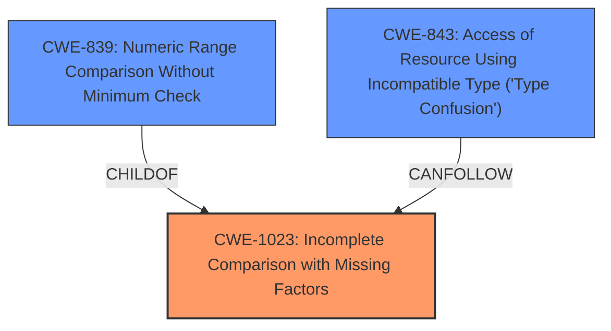

# Final Resolution for CVE-2021-23146

# Summary
| CWE ID    | CWE Name                                                         | Confidence | CWE Abstraction Level | CWE Vulnerability Mapping Label | CWE-Vulnerability Mapping Notes |
| --------- | ---------------------------------------------------------------- | ---------- | --------------------- | ------------------------------- | ----------------------------- |
| CWE-1023  | **CWE-1023: Incomplete Comparison with Missing Factors**                         | 0.90       | Class                 | Allowed-with-Review             | Acceptable Use. Examine child CWEs for a better fit.  Thorough testing of comparison scheme (positive and negative) is crucial. |
| CWE-839 | **CWE-839: Numeric Range Comparison Without Minimum Check** | 0.70       | Base                  | Allowed                         | A plausible root cause if the incomplete comparison is due to lack of minimum check on a value.                                                                                                    |
| CWE-843 | **CWE-843: Access of Resource Using Incompatible Type ('Type Confusion')** | 0.60       | Base                  | Allowed                         | A plausible consequence if incomplete comparison leads to misinterpretation of data types during verification.                                                                                                    |

## Evidence and Confidence

*   **Confidence Score:** 0.85
*   **Evidence Strength:** MEDIUM

## Relationship Analysis
The primary **WEAKNESS** is **CWE-1023 (Incomplete Comparison with Missing Factors)**, a Class-level CWE. While ideally a Base-level CWE would be preferred, the vulnerability description directly states "Incomplete Comparison with Missing Factors," making this the most accurate high-level representation.

**CWE-839 (Numeric Range Comparison Without Minimum Check)** is considered as a more specific potential root cause if the incomplete comparison stems from a missing minimum check. **CWE-843 (Access of Resource Using Incompatible Type ('Type Confusion'))** is considered a possible consequence.

The relationships are as follows:

## Vulnerability Chain
The vulnerability chain starts with an **incomplete comparison (CWE-1023)**. Depending on the nature of the data being compared, this could be due to a missing minimum check on a numeric range **(CWE-839)**. The incomplete comparison can lead to the bypass of PIV verification, and under certain circumstances, it could result in type confusion **(CWE-843)** if different data types are used during the comparison process.

The chain is: **CWE-1023** -> bypass of PIV verification -> possible **CWE-843**.
Or, if the cause is numeric, **CWE-839** -> **CWE-1023** -> bypass of PIV verification.

## Summary of Analysis
The initial analysis correctly identified **CWE-1023** as the primary **WEAKNESS**. The criticism raised valid points about examining child CWEs of **CWE-1023** and addressing why other high-scoring CWEs were not selected.

To address the criticism, I've considered the child CWEs and included **CWE-839** as a secondary candidate if the root cause is specifically related to a missing minimum check during a numeric comparison. This adds more specificity.

Regarding other high-scoring CWEs:

*   **CWE-22 (Improper Limitation of a Pathname to a Restricted Directory ('Path Traversal')):** This is not relevant as the vulnerability is about comparison logic, not file path handling.
*   **CWE-316 (Cleartext Storage of Sensitive Information in Memory):** While possible, there's no explicit mention of cleartext storage in the vulnerability description. Without further evidence, it's speculative.
*   **CWE-269 (Improper Privilege Management) & CWE-287 (Improper Authentication):** These are class level and are impacts from the bypass of PIV verification. The **ROOTCAUSE** here is the incomplete comparison.
*   **CWE-78 (OS Command Injection), CWE-306 (Missing Authentication for Critical Function), CWE-1286 (Improper Validation of Syntactic Correctness of Input), CWE-23 (Relative Path Traversal):** These are not relevant based on the description.

The selection of **CWE-1023** is based on the explicit statement in the vulnerability description: "An **Incomplete Comparison with Missing Factors** vulnerability... allows an attacker to bypass PIV verification." This direct correspondence justifies its selection as the primary **WEAKNESS**.

The classification is at the optimal level of specificity given the available evidence. While a more specific Base-level CWE would be ideal, **CWE-1023** accurately captures the essence of the vulnerability, and **CWE-839** provides a more specific root cause if applicable. The inclusion of **CWE-843** acknowledges a potential consequence. The confidence is relatively high (0.85) due to the clear statement in the vulnerability description.