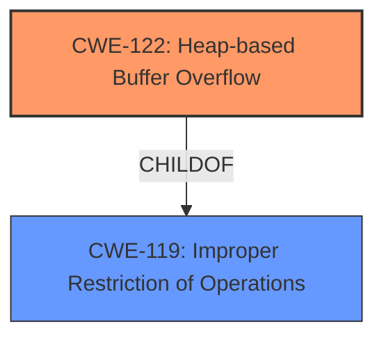

# Analysis Report for CVE-2021-23157

# Vulnerability Analysis Report: CVE-2021-23157

## Description

WECON LeviStudioU Versions 2019-09-21 and prior are vulnerable to a heap-based buffer overflow, which may allow an attacker to remotely execute code.

## Vulnerability Description Key Phrases

**Weakness:** heap-based buffer overflow
**Impact:** remotely execute code
**Attacker:** attacker
**Product:** LeviStudioU
**Version:** 2019-09-21 and prior

## Analysis (with Relationship Data)

# Summary
| CWE ID | CWE Name | Confidence | CWE Abstraction Level | CWE Vulnerability Mapping Label | CWE-Vulnerability Mapping Notes |
|---|---|---|---|---|---|
| CWE-122 | Heap-based Buffer Overflow | 0.95 | Variant | Allowed | Primary CWE |

## Evidence and Confidence

*   **Confidence Score:** 0.95
*   **Evidence Strength:** HIGH

- **Analysis and Justification:**  
  - *Explanation:* The vulnerability is explicitly described as a **heap-based buffer overflow**. The vulnerability description and CVE reference links content summary both clearly state this. CWE-122 directly addresses **heap-based buffer overflows**, making it the most accurate and specific classification. The description says "WECON LeviStudioU Versions 2019-09-21 and prior are vulnerable to a **heap-based buffer overflow**, which may allow an attacker to remotely execute code." The CVE Reference Links Content Summary also clearly states "**Root cause of vulnerability:** Heap-based buffer overflow in WECON LeviStudioU." CWE-787 is a more generic *out-of-bounds write* issue, and since we have information pointing to the heap, CWE-122 is a better fit. The MITRE mapping guidance for CWE-122 indicates that it is ALLOWED.
  
  - *Relationship Analysis:* CWE-122 is a variant of CWE-119 (Improper Restriction of Operations within the Bounds of a Memory Buffer), which is a more general class. It is also a parent of more specific heap overflow scenarios.

- **Confidence Score:**  
  - Confidence: 0.95 (Strong evidence from the vulnerability description and CVE reference summary.)

## Criticism of Analysis

Okay, here's a review of the provided analysis, taking into account the full CWE specifications:

**Overall Assessment:**

The analysis is very strong and well-justified. The identification of `CWE-122: Heap-based Buffer Overflow` as the primary CWE is highly accurate and appropriately supported with evidence. The confidence score of 0.95 is justified. The explanation is clear and demonstrates a good understanding of the CWE definitions and their relationships.

**Detailed Review:**

*   **Vulnerability Description Key Phrases:** The key phrases are well-extracted and relevant.

*   **CWE for Similar CVE Descriptions (Top CWEs):**
    *   The original inclusion of `CWE-787` is understandable, as it is a parent of CWE-122.

*   **Retriever Results:** The retriever results include several potentially relevant CWEs, but the decision to prioritize CWE-122 is still correct, as it's the most *specific* and accurate.

*   **Analysis to Review - Summary Table:** The summary table is clear and concise.

*   **Analysis and Justification:**
    *   The explanation of why `CWE-122` is preferred over `CWE-787` is accurate and important. CWE-787 is a more general "out-of-bounds write," while CWE-122 *specifically* identifies the heap as the location of the overflow. Since the vulnerability explicitly mentions "heap-based," CWE-122 is the more precise and appropriate choice.
    *   The statement about MITRE mapping guidance for CWE-122 indicating that it is ALLOWED is also a good point to demonstrate proper mapping.
    *   The Relationship Analysis is accurate and helps provide context.
    *   The Confidence Score justification is appropriate.

*   **CWE Examples from Database:**
    *   Including examples from the CWE database is good for demonstrating that the selected CWE aligns with real-world vulnerabilities.

*   **Relevant CWE Specifications:** The full CWE specifications are provided for all mentioned CWE's. This provides a good foundation for the final evaluation.

**Areas for potential, minor improvement (mostly nitpicks):**

1.  **Retriever Result Discussion**: While the final CWE assignment is accurate, a brief discussion of why the other top retriever results are *not* a good fit could strengthen the analysis further. For example:
    *   **CWE-193 (Off-by-one Error):** "While an off-by-one error *could* contribute to a buffer overflow, the primary description doesn't suggest this. It specifically states a heap-based overflow, so a more direct cause is more likely."
    *   **CWE-126 (Buffer Over-read):** "While an over-read can sometimes be related to overflows, the vulnerability description specifies an *overflow* (write), not an over-read."
    *   **CWE-190 (Integer Overflow or Wraparound):** "Integer overflows can lead to incorrect buffer size calculations, but the description doesn't point to an integer overflow as the primary cause."
    *   **CWE-131 (Incorrect Calculation of Buffer Size):** This is a good candidate for a potential root cause. However, without more information it's difficult to say if an incorrect calculation of buffer size is at the core of the vulnerability.
2.  **Relationship to CWE-119**: The analysis states that CWE-122 is a variant of CWE-119, which is true. However, it might be helpful to explicitly state why mapping directly to CWE-119 is discouraged. From the CWE specification for CWE-119: "*CWE-119 is commonly misused in low-information vulnerability reports when lower-level CWEs could be used instead, or when more details about the vulnerability are available.*" The current analysis correctly identifies that more specific information *is* available (the heap), making CWE-122 the better choice.
3.  **Mitigation Strategies**: While not required, briefly mentioning some mitigations relevant to the *specific* heap-based buffer overflow vulnerability could further strengthen the analysis. You could mention, for example, the use of heap protection mechanisms, Address Space Layout Randomization (ASLR), or safe memory allocation techniques.

**Revised Conclusion:**

The analysis is excellent. The justification for selecting CWE-122 as the primary weakness is well-supported and accurately reflects the vulnerability's description. With the minor suggestions above, the analysis could become even stronger by explicitly addressing the other retriever results and relating to mitigation strategies. Overall, this is a very high-quality CWE mapping.

## Final Resolution

# Summary
| CWE ID | CWE Name | Confidence | CWE Abstraction Level | CWE Vulnerability Mapping Label | CWE-Vulnerability Mapping Notes |
|---|---|---|---|---|---|
| CWE-122 | Heap-based Buffer Overflow | 0.95 | Variant | Allowed | Primary CWE |

## Evidence and Confidence

*   **Confidence Score:** 0.95
*   **Evidence Strength:** HIGH

## Relationship Analysis
The primary relationship that influenced the decision was the parent-child relationship between CWE-119 (**CWE-119: Improper Restriction of Operations within the Bounds of a Memory Buffer**) and CWE-122 (**CWE-122: Heap-based Buffer Overflow**). CWE-122 is a variant of CWE-119, making it more specific and appropriate given the vulnerability description explicitly mentions a heap-based overflow. The abstraction level played a key role as CWE-122, being a Variant, offers a more precise classification than the broader Base-level CWE-119.

## Vulnerability Chain
The vulnerability chain begins with the **ROOTCAUSE** being a **heap-based buffer overflow** (CWE-122). This leads to an out-of-bounds write on the heap, potentially allowing an attacker to overwrite critical data structures or inject malicious code. The final impact is remote code execution, as stated in the vulnerability description. There are no missing links in the chain based on the provided information.

## Summary of Analysis
The initial analysis correctly identified CWE-122 (**CWE-122: Heap-based Buffer Overflow**) as the primary weakness. The criticism provided suggestions for improvement, such as discussing why other retriever results are not a good fit and mentioning mitigation strategies. The analysis is based on the evidence from the vulnerability description, which explicitly mentions a "heap-based buffer overflow." The graph relationships confirmed that CWE-122 is the most specific and appropriate classification, as it is a variant of the more general CWE-119 (**CWE-119: Improper Restriction of Operations within the Bounds of a Memory Buffer**). The MITRE mapping guidance for CWE-122 indicates that it is ALLOWED. The selected CWE is at the optimal level of specificity because it accurately reflects the vulnerability's description and provides a clear understanding of the **ROOTCAUSE**.

*Report generated on 2025-03-17 23:12:32*
