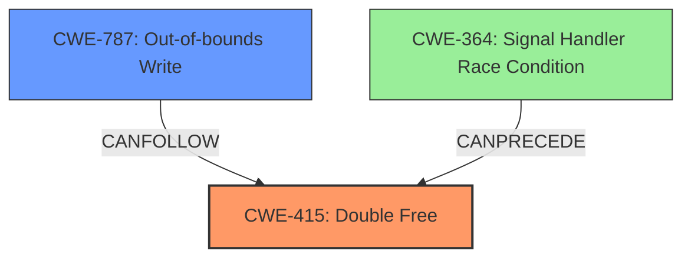

# Final Resolution for CVE-2021-23158

# Summary
| CWE ID | CWE Name | Confidence | CWE Abstraction Level | CWE Vulnerability Mapping Label | CWE-Vulnerability Mapping Notes |
|---|---|---|---|---|---|
| CWE-415 | Double Free | 1.0 | Variant | Allowed | The vulnerability is a **double free**, which is exactly what CWE-415 [CWE-415: Double Free] describes. |
| CWE-787 | Out-of-bounds Write | 0.1 | Base | Consequence | The **double free** can lead to a write-what-where condition, which is a type of out-of-bounds write. This is a consequence of the **double free**, not the **root cause**. CANFOLLOW relationship. |

## Evidence and Confidence

*   **Confidence Score:** 0.95
*   **Evidence Strength:** HIGH

## Relationship Analysis
The primary relationship that impacted the decision was the understanding that CWE-415 [CWE-415: Double Free] is the **root cause**, while CWE-787 [CWE-787: Out-of-bounds Write] is a potential impact. The initial analysis correctly identified this, but the criticism highlighted the need to emphasize CWE-415 as the primary weakness. While CWE-787 can `CANFOLLOW` CWE-415, it's crucial to maintain the correct level of abstraction and not misclassify the root cause based on potential consequences. Also, the `CANPRECEDE` relationship from CWE-364 [CWE-364: Signal Handler Race Condition] to CWE-415 hints at the potential circumstances of the vulnerability, although it is not always the case. The abstraction levels are also important: CWE-415 is a Variant, which is more specific than the Base-level CWE-787.

## Vulnerability Chain
The vulnerability chain starts with the **double free** (CWE-415 [CWE-415: Double Free]) in the `pspdf_export` function. This **double free** can lead to a write-what-where condition (CWE-123 [CWE-123: Write-what-where Condition]), which may result in an out-of-bounds write (CWE-787 [CWE-787: Out-of-bounds Write]). The final impact is the potential for arbitrary code execution or denial of service. The **root cause** is the **double free**, while the other CWEs represent potential consequences.

## Summary of Analysis
The initial analysis was accurate in identifying CWE-415 [CWE-415: Double Free] as the primary weakness. The criticism helped refine the analysis by emphasizing the importance of focusing on the **root cause** and accurately representing the relationships between CWEs. The vulnerability description explicitly states a **double-free**, which aligns perfectly with CWE-415. The statement in the vulnerability description is "*Double-free in function pspdf_export(),in ps-pdf.cxx may result in a write-what-where condition...*". The graph relationships reinforced the decision to prioritize CWE-415 and to consider CWE-787 as a potential impact rather than a secondary weakness. CWE-415 is at the optimal level of specificity (Variant), while CWE-787 is a more general (Base) description of a potential consequence. The final decision is based on the evidence from the vulnerability description, relationship analysis, and abstraction level considerations. The confidence score remains high due to the clear evidence supporting the classification of CWE-415 as the primary **root cause**.