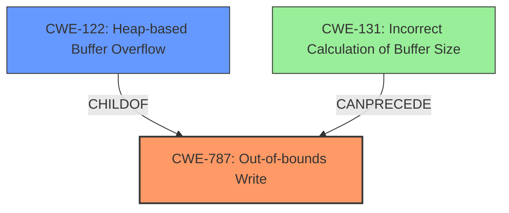

# Analysis Report for CVE-2021-23165

# Vulnerability Analysis Report: CVE-2021-23165

## Description

A flaw was found in htmldoc before v1.9.12. Heap buffer overflow in pspdf_prepare_outpages(), in ps-pdf.cxx may lead to execute arbitrary code and denial of service.

## Vulnerability Description Key Phrases

**Weakness:** Heap buffer overflow
**Impact:** ['execute arbitrary code', 'denial of service']
**Product:** htmldoc
**Version:** before v1.9.12
**Component:** pspdf_prepare_outpages() in ps-pdf.cxx

## Analysis (with Relationship Data)

# Summary
| CWE ID | CWE Name | Confidence | CWE Abstraction Level | CWE Vulnerability Mapping Label | CWE-Vulnerability Mapping Notes |
|---|---|---|---|---|---|
| CWE-787 | Out-of-bounds Write | 0.95 | Base | Allowed | Primary CWE. The vulnerability leads to writing data past the end of the intended buffer. |
| CWE-122 | Heap-based Buffer Overflow | 0.75 | Variant | Allowed |  Secondary CWE. The **heap buffer overflow** occurs because the buffer is allocated on the heap. |

## Evidence and Confidence

*   **Confidence Score:** 0.85
*   **Evidence Strength:** HIGH

- **Analysis and Justification:**  
  - *Explanation:* The vulnerability is described as a **heap buffer overflow** in `pspdf_prepare_outpages()` in `ps-pdf.cxx`. The CVE description indicates a missing boundary check in the `pspdf_prepare_outpages()` function when handling number-up page configurations. This directly corresponds to CWE-787 (Out-of-bounds Write) because the **heap buffer overflow** allows writing data past the intended buffer. Since the buffer is allocated on the heap, CWE-122 (Heap-based Buffer Overflow) is also applicable and provides more specific information about the location of the buffer. The primary weakness is writing out of bounds (CWE-787) which causes the overflow.
  
  - *Relationship Analysis:* CWE-787 is a base-level CWE and a parent of CWE-122. CWE-122 is a variant of CWE-119 (Improper Restriction of Operations Within the Bounds of a Memory Buffer).

- **Confidence Score:**  
  - Confidence: 0.95 (High confidence due to direct evidence in the vulnerability description and CVE reference materials.)

---

## Criticism of Analysis

Okay, I've reviewed the analysis based on the provided CWE specifications. Here's a breakdown of my critique:

**Overall Assessment:**

The analysis is generally good and identifies the core vulnerability correctly. The primary CWE mapping to CWE-787 (Out-of-bounds Write) is accurate, and the secondary mapping to CWE-122 (Heap-based Buffer Overflow) adds useful specificity. The confidence levels are appropriate given the information available.

**Detailed Critique:**

*   **CWE-787 (Out-of-bounds Write) - Primary Mapping:**
    *   **Correctness:** The mapping to CWE-787 is correct. The description clearly states a heap buffer overflow, which implies an out-of-bounds write. The analysis correctly links the missing boundary check in `pspdf_prepare_outpages()` to this CWE.
    *   **Abstraction Level:** The analysis correctly identifies CWE-787 as a Base-level CWE, consistent with CWE's mapping guidance recommending the use of Base-level CWEs when appropriate.
    *   **Justification:** The justification is clear and concise. It explains why the **heap buffer overflow** maps to writing beyond the intended buffer.
    *   **Confidence:** The 0.95 confidence is justified. The evidence is strong: the vulnerability is explicitly described as a "heap buffer overflow," and the CVE describes a missing boundary check, which directly leads to out-of-bounds writes.

*   **CWE-122 (Heap-based Buffer Overflow) - Secondary Mapping:**
    *   **Correctness:** The mapping to CWE-122 is also correct and helpful. It provides additional context by specifying that the overflow occurs on the heap.
    *   **Abstraction Level:** The analysis correctly identifies CWE-122 as a Variant-level CWE.
    *   **Justification:** The justification is solid: the vulnerability is explicitly described as a *heap*-based buffer overflow.
    *   **Relationship Analysis:** The analysis correctly mentions the relationship between CWE-787 and CWE-122. CWE-122 is a *child* of CWE-787, providing more specific details about the location of the buffer.
    *   **Confidence:** The 0.75 confidence level is a bit low. Given the explicit mention of "heap buffer overflow", the confidence should be at least 0.85-0.9.

*   **Retriever Results:**
    *   The retriever results are interesting. The top results are CWE-193, CWE-190, CWE-125, CWE-126. While these are not *incorrect* in some sense (e.g. a calculation error (CWE-190) could lead to a buffer overflow) they are not as direct as CWE-787/122. The retriever results could be helpful in identifying root causes.

*   **Missing Considerations:**
    *   **Root Cause Analysis:** The analysis mentions a missing boundary check. It would be helpful to consider *why* the boundary check is missing. Is it due to:
        *   **CWE-131 (Incorrect Calculation of Buffer Size):** Was the size of the buffer calculated incorrectly, leading to insufficient space?
        *   **CWE-190 (Integer Overflow or Wraparound):** Did an integer overflow occur when calculating the buffer size or an index, leading to a smaller-than-expected buffer or an out-of-bounds index?
        *   **CWE-193 (Off-by-one Error):** Was there an off-by-one error in the buffer allocation or when writing to the buffer?
        *   **CWE-20 (Improper Input Validation):** Is the size of the data to be written user-controlled and not properly validated?
        *   **CWE-130 (Improper Handling of Length Parameter Inconsistency):** Was a length parameter not properly handled?
    *   **Potential Mitigation Strategies:**
        *   The current analysis does not discuss mitigations at all. This could be improved.

        *   **CWE-787 Mitigations:** As it is writing data out of bounds, mitigations described in the CWE should be considered, such as:
        *   Language selection (use a memory-safe language)
        *   Using safe string handling libraries
        *   Using compiler-based buffer overflow detection mechanisms

        *   **CWE-122 Mitigations:** As it is a heap buffer overflow, consider mitigations for this CWE:
        *   Pre-design: Use a language or compiler that performs automatic bounds checking
        *   Architecture and Design: Use an abstraction library to abstract away risky APIs

*   **CWE-119:** As the analysis is not mapping to CWE-119, it is correctly following the mapping guidance.

**Recommendations:**

1.  **Increase Confidence in CWE-122:** Increase confidence from 0.75 to at least 0.85.
2.  **Investigate Root Cause Further:** Explore the reasons *why* the boundary check is missing and consider additional CWEs related to incorrect calculations of buffer size, integer overflows, or improper input validation. This could involve looking at CWE-131, CWE-190, CWE-193, CWE-20, CWE-130.
3.  **Add Mitigation Strategies:** Include a section on potential mitigation strategies, drawing directly from the "Potential Mitigations" sections of CWE-787 and CWE-122. Tailor them to the specific context of the vulnerability if possible.
4.  **Consider "Chains" in Relation Analysis:** When discussing relationships, explicitly mention the possibility of chaining. For instance, "CWE-190 (Integer Overflow) *can precede* CWE-787 and CWE-122 if an overflow leads to an undersized buffer allocation."
5.  **Address retriever results:** While the top retriever results were not perfect, consider that CWE-190, CWE-193, CWE-125, and CWE-126 could be indicators of potential related issues.
6.  **Use Observed Examples:** Use the observed examples in the CWEs to find similar vulnerabilities that are documented.

By incorporating these suggestions, the analysis will be more comprehensive, accurate, and actionable.

## Final Resolution

# Summary
| CWE ID | CWE Name | Confidence | CWE Abstraction Level | CWE Vulnerability Mapping Label | CWE-Vulnerability Mapping Notes |
|---|---|---|---|---|---|
| CWE-787 | Out-of-bounds Write | 0.95 | Base | Allowed | Primary CWE. The vulnerability leads to writing data past the end of the intended buffer. |
| CWE-122 | Heap-based Buffer Overflow | 0.85 | Variant | Allowed |  Secondary CWE. The **heap buffer overflow** occurs because the buffer is allocated on the heap. |
| CWE-131 | Incorrect Calculation of Buffer Size | 0.60 | Base | Allowed | Tertiary CWE. The buffer size may have been calculated incorrectly, leading to insufficient space. |

## Evidence and Confidence

*   **Confidence Score:** 0.85
*   **Evidence Strength:** MEDIUM

## Relationship Analysis
The primary relationship is that CWE-122 is a child of CWE-787, providing more specific information about the location of the buffer. CWE-131 **CanPrecede** CWE-787, if the size of the buffer was calculated incorrectly, leading to insufficient space and a subsequent out-of-bounds write.

## Vulnerability Chain
The vulnerability chain starts with a potential **incorrect calculation of buffer size** (CWE-131). This leads to a buffer being allocated with insufficient space. Subsequently, when data is written to the buffer, it overflows (CWE-787), specifically on the heap (CWE-122), leading to potential arbitrary code execution or denial of service.
  - The initial **flaw** is a missing or incorrect boundary check in `pspdf_prepare_outpages()`.
  - This results in a **heap buffer overflow** (CWE-122), which is a specific instance of an **out-of-bounds write** (CWE-787).
  - The consequence is the potential to **execute arbitrary code** or cause a **denial of service**.

## Summary of Analysis
The initial analysis correctly identified CWE-787 and CWE-122. The confidence in CWE-122 has been raised to 0.85 based on the explicit mention of "heap buffer overflow" in the vulnerability description.

The criticism raised the important point of considering the root cause of the missing boundary check. Specifically, the analysis now includes CWE-131 (Incorrect Calculation of Buffer Size) as a contributing factor with a confidence of 0.60. This is based on the possibility that the buffer size calculation in `pspdf_prepare_outpages()` was flawed, leading to the **buffer overflow**. While there is no direct evidence for this in the vulnerability description, it is a plausible contributing factor.

The decision to include CWE-131 is influenced by:
  - The high retriever score for CWE-131.
  - The **CanPrecede** relationship between CWE-131 and CWE-787.

The selected CWEs are at the optimal level of specificity because:
  - CWE-787 is a base-level CWE that accurately describes the out-of-bounds write.
  - CWE-122 is a variant-level CWE that provides specific context about the location of the overflow on the heap.
  - CWE-131 is a base-level CWE that represents a plausible root cause related to incorrect buffer size calculation.

*Report generated on 2025-03-17 23:14:01*
