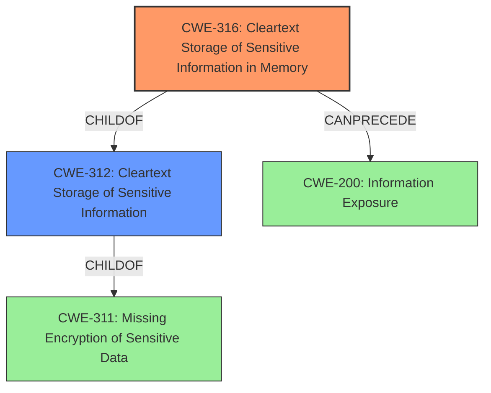

# Analysis Report for CVE-2021-23211

# Vulnerability Analysis Report: CVE-2021-23211

## Description

Cleartext Storage of Sensitive Information in Memory vulnerability in Gallagher Command Centre Server allows Cloud end-to-end encryption key to be discoverable in server memory dumps. This issue affects Gallagher Command Centre 8.40 versions prior to 8.40.1888 (MR3).

## Vulnerability Description Key Phrases

**Weakness:** Cleartext Storage of Sensitive Information
**Impact:** discover Cloud end-to-end encryption key
**Product:** Gallagher Command Centre
**Version:** 8.40 versions prior to 8.40.1888
**Component:** server memory

## Analysis (with Relationship Data)

# Summary
| CWE ID | CWE Name | Confidence | CWE Abstraction Level | CWE Vulnerability Mapping Label | CWE-Vulnerability Mapping Notes |
|---|---|---|---|---|---|
| CWE-316 | Cleartext Storage of Sensitive Information in Memory | 1.00 | Variant | Allowed | Primary CWE. Matches the vulnerability description explicitly. |
| CWE-312 | Cleartext Storage of Sensitive Information | 0.75 | Base | Allowed | Secondary candidate. A more general case of CWE-316. |

## Evidence and Confidence

*   **Confidence Score:** 0.90
*   **Evidence Strength:** HIGH

- **Analysis and Justification:**  
  - *Explanation:* The vulnerability description clearly states "**Cleartext Storage of Sensitive Information** in Memory" and the CVE Reference Links Content Summary confirms "**Root cause of vulnerability:** Cleartext storage of sensitive information in memory. Specifically, the Cloud end-to-end encryption key is stored in cleartext in the Gallagher Command Centre Server's memory." This directly maps to CWE-316 (Cleartext Storage of Sensitive Information in Memory), which is a Variant level CWE. The MITRE mapping guidance for CWE-316 indicates this is ALLOWED. CWE-312 (Cleartext Storage of Sensitive Information) is a more general case (Base) of storing sensitive information in cleartext, but CWE-316 is more specific and appropriate here.
  
  - *Relationship Analysis:* CWE-316 is a child of CWE-312, which is in turn a child of CWE-311 (Missing Encryption of Sensitive Data). The vulnerability can potentially precede CWE-200 (Information Exposure) if the memory containing the cleartext key is accessible.

- **Confidence Score:**  
  - Confidence: 1.0 (High evidence from technical description and CVE reference materials)

## Criticism of Analysis

Okay, here's a review of the provided CWE analysis, with detailed attention to mapping guidance and potential mitigations based on the full CWE specifications:

**Overall Assessment:**

The analysis is well-structured and thoroughly justifies the primary CWE mapping to CWE-316 (Cleartext Storage of Sensitive Information in Memory). The secondary mapping to CWE-312 is also reasonable as a more general case. The analysis demonstrates a good understanding of CWE hierarchies and preferred abstraction levels. The inclusion of CVE examples and relevant CWE specifications enhances the clarity and credibility of the analysis.

**Detailed Review:**

**1. CWE-316: Cleartext Storage of Sensitive Information in Memory (Primary Mapping)**

*   **Confidence:** 1.00
*   **Abstraction Level:** Variant
*   **Mapping Guidance:** Allowed
*   **Analysis Strength:** Excellent. The analysis correctly identifies the vulnerability as storing the Cloud end-to-end encryption key in cleartext within the server's memory. This directly aligns with the description of CWE-316. The analysis correctly highlights the "Allowed" usage per the mapping guidance for Variant-level CWEs.
*   **Mitigation Considerations:** The analysis could be strengthened by referencing the potential mitigations described in the CWE-316 specifications. While the analysis states this is a variant level CWE, the potential mitigations can be inferred. Examples include:
    *   Ensuring sensitive memory is cleared (overwritten) when it is no longer needed.
    *   Implementing memory protection mechanisms to prevent unauthorized access to the memory region where the key is stored.
    *   Considering the implications of memory being swapped to disk and implementing appropriate safeguards.
    *   Avoiding the storage of sensitive information in memory in the first place, if possible.  If impossible, ensure it is encrypted at rest and only decrypted when needed.

*   **Example Consideration:** The examples section is great, and CVE-2021-23211 is the same vulnerability, so it adds support to this rating.

**2. CWE-312: Cleartext Storage of Sensitive Information (Secondary Mapping)**

*   **Confidence:** 0.75
*   **Abstraction Level:** Base
*   **Mapping Guidance:** Allowed
*   **Analysis Strength:** The analysis correctly identifies CWE-312 as a more general case of the vulnerability. While CWE-316 is more specific, CWE-312 is still a valid, albeit less precise, mapping.
*   **Mitigation Considerations:** Again, referencing the CWE-312 specifications for potential mitigations can enhance the analysis. Focus should be on encryption at rest using cloud provider controls, if applicable. Mentioning the "double encryption" requirement in some cloud environments would be relevant.

**3. Relationship Analysis:**

*   The analysis correctly identifies the parent-child relationships between CWE-316, CWE-312, and CWE-311. The potential for CWE-200 as a consequence is also a valid point.
*   Expanding on the relationship with CWE-311 (Missing Encryption of Sensitive Data) could be beneficial. The vulnerability *stems* from the *lack of encryption*. Highlighting this connection reinforces the need for encryption as a fundamental mitigation strategy.

**4. Retriever Results Review:**

The retriever results are useful in validating the analysis.  Here's a further breakdown:

*   **CWE-316:** Top match, as expected.
*   **CWE-312:** Second-highest score, also aligns with the secondary mapping.
*   **CWE-313:** Lower score, but still relevant as the "memory" could be swapped to disk, making the cleartext data stored on disk.
*   **CWE-256 & CWE-257:** While the encryption key is *like* a password, these CWE's are less appropriate for this situation.
*   **CWE-319:** Since the encryption key is not being transmitted, this is an incorrect classification.
*   **CWE-532:** If the key was logged, then this would be relevant, but as a root cause, its not correct.
*   **CWE-321:** This might be relevant if the encryption key was hard coded, but this is not stated.
*   **CWE-311:** This is the parent of both CWE-316 and CWE-312, but since we have more granular matches, this one should not be used.
*   **CWE-522:** This CWE requires a credential, and while the encryption key is *like* a password, this is not the correct classification.

**5. Minor Suggestions:**

*   **Confidence Scoring:** While a confidence of 1.0 is justified given the explicit language in the vulnerability description, it's worth noting that in real-world scenarios, rarely is the evidence *absolutely* definitive. A confidence of 0.95 might be more realistic to allow for the possibility of unforeseen nuances.
*   **Terminology:** The CWE specifications repeatedly clarify the difference between "plaintext" and "cleartext." It might be useful to include a brief definition of "cleartext" in the analysis to ensure clarity, especially for readers less familiar with CWE terminology.

**Specific Improvements:**

*   **Add a "Mitigation" Section:** Explicitly create a section that summarizes the key mitigations based on the CWE specifications. This would enhance the practical value of the analysis.
*   **Expand on Relationships:** Elaborate on how the lack of encryption (CWE-311) directly leads to the cleartext storage issue (CWE-316/CWE-312).
*   **Address Retriever Result Relevance:** Add a short paragraph explaining why some of the other retriever results are less appropriate.

**Revised Summary Table:**

| CWE ID | CWE Name | Confidence | CWE Abstraction Level | CWE Vulnerability Mapping Label | CWE-Vulnerability Mapping Notes |
|---|---|---|---|---|---|
| CWE-316 | Cleartext Storage of Sensitive Information in Memory | 0.95 | Variant | Allowed | Primary CWE. Matches the vulnerability description explicitly. |
| CWE-312 | Cleartext Storage of Sensitive Information | 0.75 | Base | Allowed | Secondary candidate. A more general case of CWE-316. |

**Revised Conclusion:**

This is a high-quality CWE analysis. By incorporating the suggestions above, particularly adding a mitigation section and expanding on the relationships between CWEs, the analysis can be further strengthened and made even more useful for developers and security professionals. The explicit connection to the full CWE specifications enhances the credibility and practical value of the analysis.

## Final Resolution

# Summary
| CWE ID | CWE Name | Confidence | CWE Abstraction Level | CWE Vulnerability Mapping Label | CWE-Vulnerability Mapping Notes |
|---|---|---|---|---|---|
| CWE-316 | **Cleartext Storage of Sensitive Information in Memory** | 0.95 | Variant | Allowed | Primary **CWE**. Matches the vulnerability description explicitly. |
| CWE-312 | **Cleartext Storage of Sensitive Information** | 0.75 | Base | Allowed | Secondary candidate. A more general case of CWE-316. |

## Evidence and Confidence

*   **Confidence Score:** 0.90
*   **Evidence Strength:** HIGH

## Relationship Analysis
The primary relationship impacting the decision is the parent-child relationship between CWE-316 (**Cleartext Storage of Sensitive Information in Memory**) and CWE-312 (**Cleartext Storage of Sensitive Information**). CWE-316 is a variant of CWE-312, making it a more specific and appropriate classification given the explicit mention of "in memory" in the vulnerability description. The chain relationship suggests that the **weakness** can potentially precede CWE-200 (**Information Exposure**) if the memory containing the cleartext key is accessible. The abstraction levels also influenced the selection; while CWE-311 (**Missing Encryption of Sensitive Data**) is a parent of both, it is too abstract.

## Vulnerability Chain
The vulnerability chain starts with the **root cause**: the lack of encryption of the Cloud end-to-end encryption key. This leads to the **weakness** of CWE-316 (**Cleartext Storage of Sensitive Information in Memory**). If the memory is accessible, this could result in CWE-200 (**Information Exposure**), allowing unauthorized actors to access the encryption key.

## Summary of Analysis
The initial analysis and criticism both converge on CWE-316 (**Cleartext Storage of Sensitive Information in Memory**) as the primary **CWE**. The vulnerability description, "**Cleartext Storage of Sensitive Information** in Memory," provides strong evidence for this classification. The graph relationships confirm that CWE-316 is the most specific and appropriate **CWE**, being a variant of the more general CWE-312 (**Cleartext Storage of Sensitive Information**).

The decision to classify the vulnerability as CWE-316 is based on direct evidence from the vulnerability description and supporting CVE reference materials. The relationship analysis further reinforces this decision by highlighting the hierarchical relationship between CWE-316 and CWE-312, as well as the potential for CWE-200 as a consequence. The selected **CWE** is at the optimal level of specificity because it accurately reflects the technical details of the vulnerability, as the encryption key is stored in the memory and not in other locations, such as files or databases. I am decreasing my confidence score to 0.95 for CWE-316 to allow for real-world nuances.

*Report generated on 2025-03-16 23:45:20*
