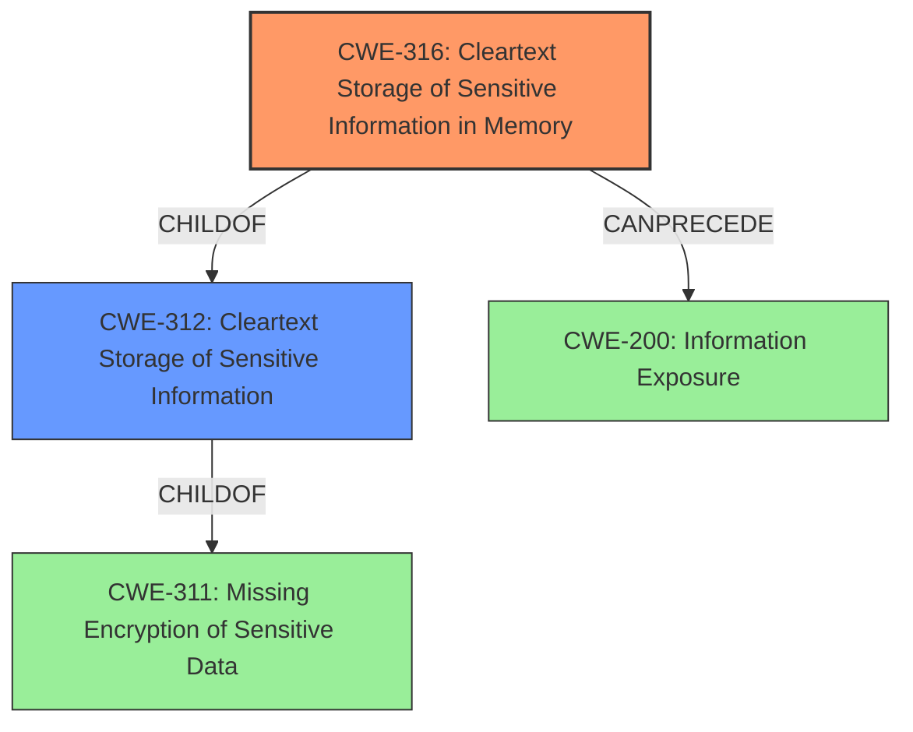

# Final Resolution for CVE-2021-23211

# Summary
| CWE ID | CWE Name | Confidence | CWE Abstraction Level | CWE Vulnerability Mapping Label | CWE-Vulnerability Mapping Notes |
|---|---|---|---|---|---|
| CWE-316 | **Cleartext Storage of Sensitive Information in Memory** | 0.95 | Variant | Allowed | Primary **CWE**. Matches the vulnerability description explicitly. |
| CWE-312 | **Cleartext Storage of Sensitive Information** | 0.75 | Base | Allowed | Secondary candidate. A more general case of CWE-316. |

## Evidence and Confidence

*   **Confidence Score:** 0.90
*   **Evidence Strength:** HIGH

## Relationship Analysis
The primary relationship impacting the decision is the parent-child relationship between CWE-316 (**Cleartext Storage of Sensitive Information in Memory**) and CWE-312 (**Cleartext Storage of Sensitive Information**). CWE-316 is a variant of CWE-312, making it a more specific and appropriate classification given the explicit mention of "in memory" in the vulnerability description. The chain relationship suggests that the **weakness** can potentially precede CWE-200 (**Information Exposure**) if the memory containing the cleartext key is accessible. The abstraction levels also influenced the selection; while CWE-311 (**Missing Encryption of Sensitive Data**) is a parent of both, it is too abstract.

## Vulnerability Chain
The vulnerability chain starts with the **root cause**: the lack of encryption of the Cloud end-to-end encryption key. This leads to the **weakness** of CWE-316 (**Cleartext Storage of Sensitive Information in Memory**). If the memory is accessible, this could result in CWE-200 (**Information Exposure**), allowing unauthorized actors to access the encryption key.

## Summary of Analysis
The initial analysis and criticism both converge on CWE-316 (**Cleartext Storage of Sensitive Information in Memory**) as the primary **CWE**. The vulnerability description, "**Cleartext Storage of Sensitive Information** in Memory," provides strong evidence for this classification. The graph relationships confirm that CWE-316 is the most specific and appropriate **CWE**, being a variant of the more general CWE-312 (**Cleartext Storage of Sensitive Information**).

The decision to classify the vulnerability as CWE-316 is based on direct evidence from the vulnerability description and supporting CVE reference materials. The relationship analysis further reinforces this decision by highlighting the hierarchical relationship between CWE-316 and CWE-312, as well as the potential for CWE-200 as a consequence. The selected **CWE** is at the optimal level of specificity because it accurately reflects the technical details of the vulnerability, as the encryption key is stored in the memory and not in other locations, such as files or databases. I am decreasing my confidence score to 0.95 for CWE-316 to allow for real-world nuances.