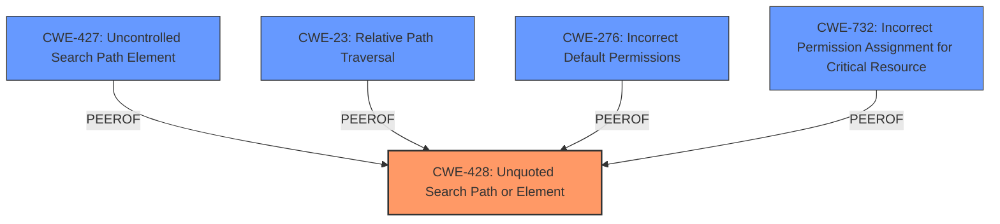

# Final Resolution for CVE-2021-23879

# Summary 
| CWE ID | CWE Name | Confidence | CWE Abstraction Level | CWE Vulnerability Mapping Label | CWE-Vulnerability Mapping Notes |
|---|---|---|---|---|---|
| CWE-428 | Unquoted Search Path or Element | 0.95 | Base | Allowed | Primary CWE |

## Evidence and Confidence

*   **Confidence Score:** 0.95
*   **Evidence Strength:** HIGH

## Relationship Analysis
The primary CWE is CWE-428, which directly addresses the **unquoted search path** vulnerability. While other CWEs such as CWE-427 (Uncontrolled Search Path Element), CWE-23 (Path Traversal), CWE-276 (Incorrect Default Permissions), and CWE-732 (Incorrect Permission Assignment for Critical Resource) are related, they do not specifically address the **root cause** of the **unquoted path**. The relationships between these CWEs are peer-to-peer, but CWE-428 is the most specific and relevant.

## Vulnerability Chain
The vulnerability chain starts with the **root cause**, which is the **unquoted service path** (CWE-428). This allows a local administrator to place a malicious executable in a compromised folder. The tool then executes this malicious executable with higher-level privileges. The **weakness** is that the tool does not enforce and protect the execution path. The consequence is arbitrary code execution with elevated privileges.

## Summary of Analysis
The initial analysis and criticism correctly identified CWE-428 as the primary **weakness**. The vulnerability description explicitly states "**unquoted service path**" as the **root cause**, which directly aligns with CWE-428. The relationship analysis correctly addressed potential overlaps with other CWEs and explained why CWE-428 is the most specific and relevant. The provided examples for CWE-428 are highly relevant and strengthen the analysis, especially the CVE-2021-23879. The selection of CWE-428 is at the optimal level of specificity, as it directly addresses the **unquoted path**, which is the **root cause** of the vulnerability. The analysis is based on the evidence from the vulnerability description and the MITRE CWE specifications. The high confidence score of 0.95 is well-justified.