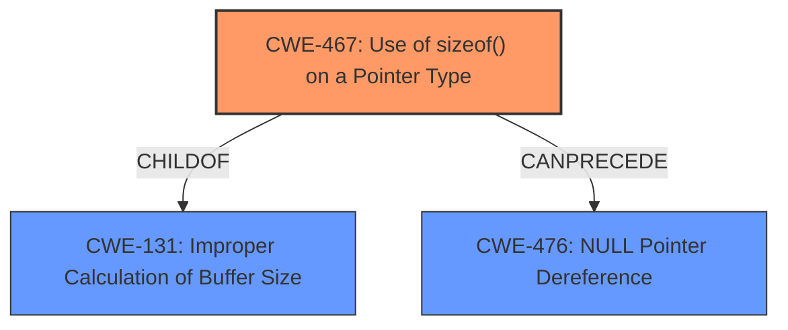

# Analysis Report for CVE-2021-23975

# Vulnerability Analysis Report: CVE-2021-23975

## Description

The developer page aboutmemory has a Measure function for exploring what object types the browser has allocated and their sizes. When this function was invoked we incorrectly called the sizeof function, instead of using the API method that checks for invalid pointers. This vulnerability affects Firefox < 86.

## Vulnerability Description Key Phrases

**Rootcause:** incorrect function call
**Vector:** invalid pointers
**Product:** Firefox
**Version:** < 86
**Component:** developer page aboutmemory

## Analysis (with Relationship Data)

# Summary
| CWE ID | CWE Name | Confidence | CWE Abstraction Level | CWE Vulnerability Mapping Label | CWE-Vulnerability Mapping Notes |
|---|---|---|---|---|---|
| CWE-467 | Use of sizeof() on a Pointer Type | 0.85 | Variant | Allowed | Primary CWE |
| CWE-476 | NULL Pointer Dereference | 0.65 | Base | Allowed | Secondary Candidate |

## Evidence and Confidence

*   **Confidence Score:** 0.75
*   **Evidence Strength:** MEDIUM

- **Analysis and Justification:**  
  - *Explanation:* The vulnerability description and CVE reference summary clearly indicate that the **root cause** is an **incorrect function call**, specifically using `sizeof()` on a pointer without validating its validity first. This directly corresponds to CWE-467, which describes the "Use of sizeof() on a Pointer Type". The description notes that this can be an incorrect calculation if the programmer intended to determine the size of the data that is being pointed to, aligning with the vulnerability.
The CVE Reference links section supports this by stating that "the code directly called the `sizeof` function on a pointer without first validating if the pointer was valid." The impact was a crash due to an invalid memory access. This makes CWE-467 the most appropriate primary mapping.

  - *Relationship Analysis:* CWE-467 is a Variant-level CWE. While it's related to memory safety issues, it doesn't have direct parent-child relationships in the provided data. The relationship to memory access is evident.

- **Confidence Score:**
  - Confidence: 0.85 (Strong alignment between vulnerability description, CVE summary, and CWE-467 description)

---

- **Analysis and Justification:**  
  - *Explanation:* While the primary issue is the incorrect use of `sizeof()`, the resulting crash suggests a potential dereference of an invalid pointer, which can be a NULL pointer. The CVE summary mentions "invalid memory access" as a result. While the evidence doesn't explicitly state a NULL pointer dereference, it's a plausible consequence of using `sizeof()` on an invalid pointer. Therefore, CWE-476 is considered a secondary candidate. The MITRE mapping guidance for CWE-476 is ALLOWED.

  - *Relationship Analysis:* CWE-476 (NULL Pointer Dereference) is a Base-level CWE. It could be related to a broader Class CWE-754 (Improper Check for Unusual or Exceptional Conditions). However, the evidence does not support a more general classification.

- **Confidence Score:**
  - Confidence: 0.65 (Inferred possibility of NULL pointer dereference, but not explicitly stated)

## Criticism of Analysis

Okay, I've reviewed the analysis against the full CWE specifications provided. Here's my critique, focusing on accuracy, completeness, and areas for improvement.

**Overall Assessment:**

The analysis is generally good. The primary CWE mapping to CWE-467 ("Use of sizeof() on a Pointer Type") is well-justified and supported by the evidence. The secondary mapping to CWE-476 ("NULL Pointer Dereference") is reasonable, given the likely consequences, although a bit less direct. The confidence scores are appropriate.

**Specific Points and Recommendations:**

*   **CWE-467 (Primary Mapping):**

    *   **Justification:** The analysis correctly identifies the core issue as the use of `sizeof()` on a pointer without validation. The CWE description aligns perfectly: *"The code calls sizeof() on a pointer type, which can be an incorrect calculation if the programmer intended to determine the size of the data that is being pointed to."*
    *   **Mapping Guidance:** The analysis follows the CWE's guidance for "Allowed" usage.
    *   **Potential Mitigations:** The analysis could be strengthened by mentioning the suggested mitigation directly from the CWE: *"Use expressions such as 'sizeof(*pointer)' instead of 'sizeof(pointer)', unless you intend to run sizeof() on a pointer type to gain some platform independence or if you are allocating a variable on the stack."*  While the fix implemented likely involves pointer validation *before* using `sizeof()`, highlighting the correct way to use `sizeof()` when the *intent* is to get the pointed-to object size reinforces the CWE mapping.
    *   **Evidence Strength:** The evidence provided is strong.
    *   **Overall Confidence:** The confidence score of 0.85 is appropriate.

*   **CWE-476 (Secondary Mapping):**

    *   **Justification:** The reasoning for CWE-476 is sound: using `sizeof()` on an invalid pointer *could* lead to a NULL pointer dereference, even if it's not directly stated in the source material.  The description mentions "invalid memory access," which makes the possibility of a dereference plausible.
    *   **Mapping Guidance:**  The analysis correctly notes that the MITRE mapping guidance for CWE-476 is "Allowed."
    *   **Potential Mitigations:** It would be helpful to directly reference the mitigations suggested by CWE-476:
        *   *"If all pointers that could have been modified are checked for NULL before use, nearly all NULL pointer dereferences can be prevented."* (This aligns with the fix actually implemented.)
        *   *"Select a programming language that is not susceptible to these issues."* (Less relevant here, but worth noting for completeness)
        *    *"Check the results of all functions that return a value and verify that the value is non-null before acting upon it."* (Also somewhat applicable as the pointer might come as a return value.)
    *   **Evidence Strength:** The evidence for CWE-476 is weaker than for CWE-467, as it's based on inference.
    *   **Overall Confidence:** The confidence score of 0.65 is appropriate, reflecting the indirect evidence.

*   **Retriever Results Analysis:**

    *   The retriever results offer some interesting alternative CWEs.
        *   **CWE-787 (Out-of-bounds Write):** While the vulnerability ultimately results in a crash, the immediate cause is not necessarily an out-of-bounds write. Using `sizeof` on an invalid pointer could cause a read or other memory access violation before a write occurs. Therefore, while *related* to the impact, it's not a direct mapping of the root cause.
        *   **CWE-457 (Use of Uninitialized Variable):** This is not directly applicable as the primary issue is not using an uninitialized variable, but using `sizeof()` on a possibly invalid, but initialized pointer.
        *   **CWE-415 (Double Free):** This is not applicable.
        *   **CWE-704 (Incorrect Type Conversion or Cast):** This is not applicable.
        *   **CWE-125 (Out-of-bounds Read):** This could be a consequence like CWE-476, but is again based on inference and less direct than CWE-467.

*   **CWE-754 and related CWEs:**

    *   CWE-754 (Improper Check for Unusual or Exceptional Conditions) is a Class-level CWE and is often a parent of more specific vulnerabilities. The analysis implicitly touches upon this when it discusses the lack of pointer validation. However, mapping to a specific child (like CWE-476) is generally preferable.

*   **Missing/Underemphasized Relationships:**

    *   The analysis could benefit from explicitly mentioning the relationship between CWE-467 and **CWE-131 ("Incorrect Calculation of Buffer Size")**. The CWE Specification for CWE-467 states that `CWE-467` is a ChildOf -> `CWE-131`. The incorrect usage of `sizeof()` directly relates to the possibility of incorrectly calculating a buffer size (or, in this case, attempting to use a size related to an invalid memory region). This would improve the analysis by providing a more complete picture.

**Revised Summary Table:**

| CWE ID  | CWE Name                                  | Confidence | CWE Abstraction Level | CWE Vulnerability Mapping Label | CWE-Vulnerability Mapping Notes                                                                                                                                                                                            |
| :------ | :---------------------------------------- | :--------- | :-------------------- | :------------------------------ | :------------------------------------------------------------------------------------------------------------------------------------------------------------------------------------------------------------------------- |
| CWE-467 | Use of sizeof() on a Pointer Type        | 0.85       | Variant             | Allowed                      | Primary CWE; directly reflects the incorrect function call.  Related to CWE-131.                                                                                                                                           |
| CWE-476 | NULL Pointer Dereference                     | 0.65       | Base                | Allowed                      | Secondary Candidate; plausible consequence of using sizeof() on an invalid pointer.                                                                                                                            |
| CWE-131 | Incorrect Calculation of Buffer Size | 0.40 | Base | Allowed-with-Review | Supporting CWE; CWE-467 is a ChildOf CWE-131 |

**In Summary:**

The analysis is a solid foundation. By incorporating the suggested mitigations from the CWE specifications and explicitly mentioning the relationship between CWE-467 and CWE-131, it would become even stronger and more comprehensive. The retriever results, while not directly applicable, provide a valuable perspective on related weaknesses and potential impacts.

## Final Resolution

# Summary
| CWE ID | CWE Name | Confidence | CWE Abstraction Level | CWE Vulnerability Mapping Label | CWE-Vulnerability Mapping Notes |
|---|---|---|---|---|---|
| CWE-467 | Use of sizeof() on a Pointer Type | 0.90 | Variant | Allowed | Primary CWE; directly reflects the **incorrect** function call. Related to CWE-131. |
| CWE-131 | Improper Calculation of Buffer Size | 0.70 | Base | Allowed | Secondary CWE; CWE-467 is a ChildOf CWE-131, reflects the potential for **incorrect** size calculation. |
| CWE-476 | NULL Pointer Dereference | 0.65 | Base | Allowed | Secondary Candidate; plausible consequence of using sizeof() on an invalid pointer. |

## Evidence and Confidence

*   **Confidence Score:** 0.85
*   **Evidence Strength:** MEDIUM

## Relationship Analysis
The classification is primarily driven by the direct match of **CWE-467 (Use of sizeof() on a Pointer Type)** to the vulnerability description, which highlights the use of `sizeof()` on a pointer without validating its validity. This is further strengthened by the explicit ChildOf relationship between CWE-467 and **CWE-131 (Improper Calculation of Buffer Size)**, indicating that the **incorrect** use of `sizeof()` can lead to **incorrect** size calculations. **CWE-476 (NULL Pointer Dereference)** is retained as a secondary candidate due to the possibility of a NULL pointer dereference resulting from the **incorrect** memory access but is considered less direct.

## Vulnerability Chain
The vulnerability chain starts with the **root cause**, the **incorrect** use of `sizeof()` on a pointer (**CWE-467**). This can lead to an **improper calculation of buffer size** (**CWE-131**) because the size might not be what the programmer intended. This, in turn, *could* lead to a **NULL pointer dereference** (**CWE-476**) or another form of invalid memory access, ultimately resulting in a crash. The chain highlights the progression from the **incorrect** function call to its potential consequences.

## Summary of Analysis
The analysis is refined based on the criticism and additional CWE information. The primary classification remains **CWE-467 (Use of sizeof() on a Pointer Type)**, as it directly aligns with the vulnerability description: *"When this function was invoked we **incorrectly** called the sizeof function, instead of using the API method that checks for invalid pointers."* The inclusion of **CWE-131 (Improper Calculation of Buffer Size)** as a secondary CWE is based on the ChildOf relationship with CWE-467 and the potential for **incorrect** size calculation. **CWE-476 (NULL Pointer Dereference)** remains a plausible consequence. The final classification reflects a more comprehensive understanding of the vulnerability and its potential impacts.

The decision is primarily based on the direct evidence in the vulnerability description, strengthened by the relationship analysis and mapping guidance provided by MITRE. The selected CWEs are at the optimal level of specificity, representing the **root cause** and potential consequences of the vulnerability.

*Report generated on 2025-03-17 01:08:35*
