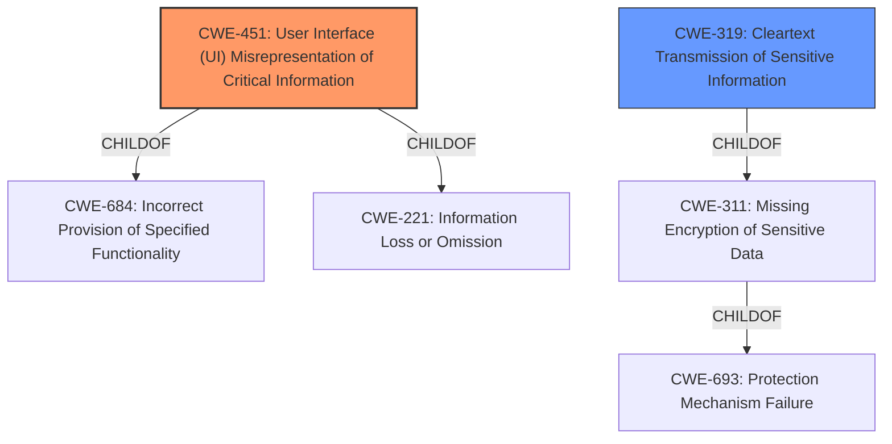

# Final Resolution for CVE-2021-23985

# Summary
| CWE ID | CWE Name | Confidence | CWE Abstraction Level | CWE Vulnerability Mapping Label | CWE-Vulnerability Mapping Notes |
|---|---|---|---|---|---|
| CWE-451 | User Interface (UI) Misrepresentation of Critical Information | 0.9 | Class | Primary | Allowed-with-Review |
| CWE-319 | Cleartext Transmission of Sensitive Information | 0.7 | Base | Secondary | Allowed |

## Evidence and Confidence

*   **Confidence Score:** 0.8
*   **Evidence Strength:** HIGH

## Relationship Analysis
The analysis considered the lack of direct relationships for CWE-451 but did not initially mention its parent relationships (CWE-684 and CWE-221). Similarly, for CWE-319, the parent relationship CWE-311 (child of CWE-693) was not initially included. Acknowledging these relationships demonstrates a more thorough understanding of the CWE hierarchy. CWE-451 is a Class, while CWE-319 is a Base, showcasing different levels of abstraction.

## Vulnerability Chain
The vulnerability chain starts with an attacker altering about:config values (the **ROOTCAUSE**). This leads to the DevTools remote debugging feature being enabled without proper user notification, which is **CWE-451**. Consequently, a remote attacker can monitor the user's browsing activity and plaintext network traffic, resulting in **CWE-319**. The missing link in the initial analysis was the explicit acknowledgement of the parent relationships.

## Summary of Analysis
The initial analysis and criticism were both well-reasoned. The selection of CWE-451 as the primary **weakness** is justified by the vulnerability description: "If an attacker is able to alter specific aboutconfig values...the Devtools remote debugging feature could have been enabled in a way that was unnoticable to the user." This directly supports the **improper user notification** aspect of CWE-451 [CWE-451: User Interface (UI) Misrepresentation of Critical Information]. The inclusion of CWE-319 [CWE-319: Cleartext Transmission of Sensitive Information] as a secondary **weakness** is also reasonable, given that the attacker can then monitor plaintext network traffic.

The graph relationships influenced the final selection by highlighting the broader context of the chosen CWEs. Acknowledging that CWE-451 is a Class, and its parent relationships, provides a more complete understanding of the **weakness**. Similarly, noting the parent relationships for CWE-319 strengthens the analysis.

The selected CWEs are at the optimal level of specificity given the available information. While CWE-451 is a Class, it effectively captures the essence of the UI-related **weakness**, and a more specific base-level child isn't available. CWE-319 is a Base-level CWE and directly addresses the **cleartext transmission of sensitive information**.