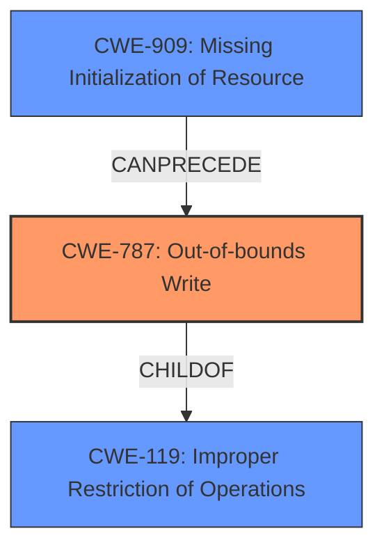

# Final Resolution for CVE-2021-23994

# Summary
| CWE ID | CWE Name | Confidence | CWE Abstraction Level | CWE Vulnerability Mapping Label | CWE-Vulnerability Mapping Notes |
|---|---|---|---|---|---|
| **CWE-787** | Out-of-bounds Write | 0.9 | Base | Primary | Allowed |
| CWE-909 | Missing Initialization of Resource | 0.7 | Class | Secondary | Allowed-with-Review |

## Evidence and Confidence

*   **Confidence Score:** 0.9
*   **Evidence Strength:** HIGH

## Relationship Analysis
The primary relationship is that **CWE-909 (Missing Initialization of Resource)** can lead to other issues, including **CWE-787 (Out-of-bounds Write)**. CWE-787 is a child of **CWE-119 (Improper Restriction of Operations within the Bounds of a Memory Buffer)**, indicating that it's a specific type of buffer-related issue. The abstraction levels guided the choice of CWE-787 as it is at the Base level.

## Vulnerability Chain
The vulnerability chain begins with the **ROOTCAUSE** being a missing initialization of a WebGL framebuffer, represented by **CWE-909 (Missing Initialization of Resource)**. This leads to memory corruption and ultimately results in an **out-of-bounds write**, represented by **CWE-787 (Out-of-bounds Write)**.

## Summary of Analysis
The initial analysis and criticism both correctly identified **CWE-787 (Out-of-bounds Write)** as the primary issue due to the vulnerability description explicitly stating an "out-of-bounds write." The criticism suggested adding **CWE-909 (Missing Initialization of Resource)**, which is a good suggestion. The vulnerability chain clearly shows that the missing initialization is the **ROOTCAUSE**, which led to the out-of-bounds write.

The graph relationships influenced the final selection by confirming that CWE-787 is a specific type of memory buffer issue (child of CWE-119) and that missing initialization can precede an out-of-bounds write.

The selected CWEs are at the optimal level of specificity because CWE-787 is a Base-level CWE, and it directly describes the observed effect (out-of-bounds write). CWE-909 is a Class-level CWE which is also acceptable, as it is also a direct cause.