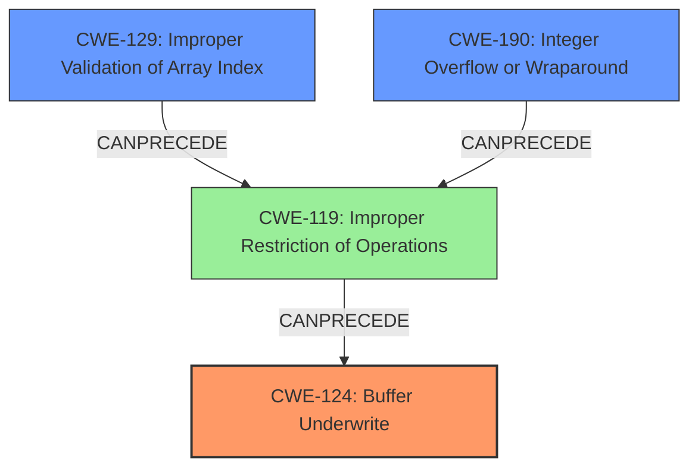

# Final Resolution for CVE-2021-24018

# Summary
| CWE ID | CWE Name | Confidence | CWE Abstraction Level | CWE Vulnerability Mapping Label | CWE-Vulnerability Mapping Notes |
|---|---|---|---|---|---|
| CWE-124 | Buffer Underwrite ('Buffer Underflow') | 1.0 | Base | Allowed | Primary CWE |
| CWE-129 | Improper Validation of Array Index | 0.6 | Variant | Allowed | Secondary Candidate |
| CWE-190 | Integer Overflow or Wraparound | 0.5 | Base | Allowed | Secondary Candidate |

## Evidence and Confidence

*   **Confidence Score:** 0.9
*   **Evidence Strength:** HIGH

## Relationship Analysis
The primary CWE is **CWE-124 (Buffer Underwrite)**, which is a base level CWE. The analysis considered related CWEs like **CWE-129 (Improper Validation of Array Index)** and **CWE-190 (Integer Overflow or Wraparound)**, which could potentially lead to the underwrite. **CWE-129** can **CANPRECEDE** **CWE-119 (Improper Restriction of Operations within the Bounds of a Memory Buffer)**, which in turn can lead to **CWE-124**. Similarly, **CWE-190** can also **CANPRECEDE** **CWE-119** and thus contribute to **CWE-124**. The selection of **CWE-124** as the primary CWE reflects the direct description of the vulnerability, while the others are potential contributing factors.

## Vulnerability Chain
The vulnerability chain starts with a potentially crafted firmware image. This could lead to:
1.  **CWE-129 (Improper Validation of Array Index)**: An invalid array index (e.g., negative index) is used due to missing or incorrect validation.
2.  **CWE-190 (Integer Overflow or Wraparound)**: An integer overflow or wraparound occurs during the calculation of the index, leading to a negative or small value.
3.  **CWE-124 (Buffer Underwrite)**: This occurs when the code attempts to write to a memory location before the start of the buffer, leading to potential arbitrary code execution.

## Summary of Analysis
The initial analysis correctly identifies **CWE-124 (Buffer Underwrite)** as the primary **weakness**, based on the explicit mention of "buffer underwrite" in the vulnerability description: "A **buffer underwrite** vulnerability in the firmware verification routine". The criticism suggests further exploration of contributing factors such as **CWE-129** and **CWE-190**, which is reasonable.

The graph relationships show how **CWE-129** and **CWE-190** can **CANPRECEDE** **CWE-119**, which in turn leads to **CWE-124**. This supports the inclusion of **CWE-129** and **CWE-190** as secondary CWEs, as they can contribute to the root cause. The abstraction levels are appropriate, with **CWE-124** being a base CWE and **CWE-129** being a variant, offering a good level of specificity.

The final decision is to keep **CWE-124** as the primary CWE, with a confidence of 1.0, and add **CWE-129** and **CWE-190** as secondary candidates, with confidence scores of 0.6 and 0.5 respectively. This reflects the direct evidence of a **buffer underwrite** while acknowledging the potential for contributing factors. The selected CWEs are at the optimal level of specificity, providing a clear and accurate representation of the vulnerability.