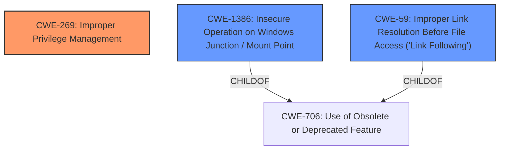

# Analysis Report for CVE-2021-24090

# Vulnerability Analysis Report: CVE-2021-24090

## Description

Windows Error Reporting Elevation of Privilege Vulnerability

## Vulnerability Description Key Phrases

**Impact:** Elevation of Privilege
**Product:** Windows
**Component:** Error Reporting

## Analysis (with Relationship Data)

# Summary
| CWE ID        | CWE Name                                                                  | Confidence | CWE Abstraction Level | CWE Vulnerability Mapping Label | CWE-Vulnerability Mapping Notes |
|---------------|---------------------------------------------------------------------------|------------|-----------------------|---------------------------------|-------------------------------|
| CWE-269       | Improper Privilege Management                                             | 0.6        | Class                 | Primary                           | Discouraged                   |
| CWE-1386      | Insecure Operation on Windows Junction / Mount Point                      | 0.4        | Base                  | Secondary                         | Allowed                       |
| CWE-59        | Improper Link Resolution Before File Access ('Link Following')            | 0.3        | Base                  | Secondary                         | Allowed                       |

## Evidence and Confidence

*   **Confidence Score:** 0.6
*   **Evidence Strength:** LOW

- **Analysis and Justification:**
  - *Explanation:* The vulnerability description indicates an "Elevation of Privilege" in the Windows Error Reporting component. The primary suggested CWE is CWE-NVD-noinfo, which means there is no specific CWE available. However, given the impact is "Elevation of Privilege", I am going to map CWE-269, "Improper Privilege Management", since this is a common root cause for such vulnerabilities. Note: CWE-269 is discouraged due to frequent misuse and can be conflated with privilege escalation.
  - *Relationship Analysis:* CWE-269 is a class-level CWE, which is less specific than a base or variant. It is related to other privilege-related CWEs, such as CWE-266 (Incorrect Privilege Assignment) and CWE-280 (Incorrect Handling of Insufficient Privileges). Since the description doesn't go into detail, it's difficult to select a more specific CWE.

- **Confidence Score:**
  - Confidence: 0.6 (Low evidence from vulnerability description and CVE reference materials)

---

- **Analysis and Justification:**
  - *Explanation:* The retriever results suggest CWE-1386 (Insecure Operation on Windows Junction / Mount Point) and CWE-59 (Improper Link Resolution Before File Access ('Link Following')). These CWEs might be relevant if the elevation of privilege involves manipulating file system junctions or links. However, there is no specific information in the vulnerability description to confirm this. Therefore, I will include them as secondary candidates.
  - *Relationship Analysis:* CWE-1386 and CWE-59 are base-level CWEs. CWE-59 can be preceded by CWE-363 (Race Condition Enabling Link Following).

- **Confidence Score:**
  - Confidence: 0.4 (Low evidence from vulnerability description and CVE reference materials for CWE-1386)
  - Confidence: 0.3 (Low evidence from vulnerability description and CVE reference materials for CWE-59)

---

## Criticism of Analysis

Okay, let's review the CWE analysis, focusing on the provided CWE specifications and the mapping guidance.

**Overall Assessment**

The analysis is reasonable given the limited information in the vulnerability description. The primary CWE choice, CWE-269, is a plausible high-level starting point, *but* it's important to recognize its limitations and consider more specific alternatives. The secondary CWEs (CWE-1386, CWE-59) are also plausible, especially if the vulnerability involves file system manipulation. However, the low confidence levels accurately reflect the lack of concrete evidence.  The analysis correctly points out that CWE-269 is discouraged.

Here's a breakdown of the analysis and some suggestions:

**1. CWE-269: Improper Privilege Management (Primary)**

*   **Confidence:** The confidence score of 0.6 is reasonable. The justification clearly articulates the reasoning: "Elevation of Privilege" is the key impact, making CWE-269 a relevant, though generic, classification.
*   **Justification Critique:**  The justification is accurate in noting that CWE-269 is discouraged and that it's often a misused catch-all for privilege escalation issues. The comment about being a common root cause for EoP vulnerabilities is *partially* true. It's a *result* of a privilege issue, but the root cause is generally something more specific. The analysis *does* try to relate it to children of CWE-269, which is good.
*   **CWE Specification Notes:**
    *   **Mapping Guidance:** The analysis acknowledges the "Discouraged" usage of CWE-269.  This is crucial. The specifications emphasize that a more specific CWE should be identified if possible. The provided justification does a good job of acknowledging this limitation, though doesn't have enough to go on.
    *   **Potential Mitigations:** These mitigations are very high-level ("Very carefully manage...privileges").  While generally good advice, they don't provide concrete guidance on *how* to fix a specific vulnerability.
*   **Suggestions:**
    *   **Consider CWE-284 (Improper Access Control) as a potential alternative to CWE-269.** Both are Class-level, but CWE-284 is *also* Discouraged, so it does not buy you much. The specifications for CWE-284 emphasize looking at its children.
    *   **Specifically explore children of CWE-269:**  As the analysis already mentions, and the CWE specifications emphasize, look for a more specific child of CWE-269. Given the "Error Reporting" component, consider if the error reporting mechanism is running with elevated privileges (CWE-250: Execution with Unnecessary Privileges). Is there a case where incorrect privileges are granted, leading to escalation (CWE-266)?
    *   **Error Handling?** Is the error handling code path somehow mishandling privileges?
    *   **Add a note explaining *why* a more specific CWE can't be determined with the available information.** This strengthens the justification.
    *   *CWE-280* could be considered if it is an error path, but it's also a base level, and it handles *insufficient* privileges.

**2. CWE-1386: Insecure Operation on Windows Junction / Mount Point (Secondary)**

*   **Confidence:** 0.4 is appropriate. The retriever results suggest this, but there's no specific evidence in the vulnerability description.
*   **Justification Critique:** The justification is sound. It correctly identifies that this CWE *could* be relevant but acknowledges the lack of confirmation.
*   **CWE Specification Notes:**
    *   **Mapping Guidance:** "Allowed" usage. Base level of abstraction.
    *   **Potential Mitigations:** The mitigation focuses on checking for hard links/mount points. The recommendation to use "dir /al /s /b" or PowerShell's `LinkType` filter is helpful and specific.
*   **Suggestions:**
    *   **Explain *why* this CWE might apply in the context of error reporting.**  Does error reporting involve creating temporary files in predictable locations?  Could an attacker create a junction/mount point that redirects the error reporting mechanism to a malicious location?
    *   **Consider potential chains:** If CWE-1386 is involved, could there be a race condition (CWE-362 or CWE-367) where an attacker replaces a legitimate file with a junction/mount point *after* the system has checked the file's initial state?
    *   CWE-65 (Windows Hard Link) is a more specific option than CWE-59 and could be examined.
    *   If temporary files are created, consider external control of filename or path (CWE-73)

**3. CWE-59: Improper Link Resolution Before File Access ('Link Following') (Secondary)**

*   **Confidence:** 0.3 is appropriate. Similar to CWE-1386, it's a possibility, but lacks direct evidence.
*   **Justification Critique:** Valid.
*   **CWE Specification Notes:**
    *   **Mapping Guidance:** "Allowed" usage. Base level of abstraction.
    *   **Potential Mitigations:** The mitigations focus on the principle of least privilege and compartmentalization.
*   **Suggestions:**
    *   **Clarify the relationship with CWE-1386.** CWE-1386 is a child of CWE-59.  Are they both needed, or is CWE-1386 sufficient if the vulnerability involves junctions/mount points?
    *   **Consider if the link following vulnerability is caused by a Time Of Check To Time Of Use (TOCTOU) Race Condition - CWE-363. This is a common pattern.**
    *   **Is the error reporting handling directory traversal? (CWE-23 Relative Path Traversal)**
    *    CWE-61, CWE-62, or CWE-64 could be considered based on if the root cause is specific to one link type

**General Recommendations**

*   **Prioritize More Specific CWEs:** Always strive for the most specific CWE possible.  CWE-NVD-noinfo is a starting point, but the goal is to dig deeper and find the underlying weakness.
*   **Explain the Context:**  Connect the CWEs to the specific actions of the "Error Reporting" component. How might this component be vulnerable to privilege escalation through the identified weaknesses?
*   **Chain Analysis:** Consider potential CWE chains. A single vulnerability often involves multiple weaknesses working together.
*   **Mitigation Awareness:** Consider the provided mitigations in the CWE specifications. Would these mitigations be effective against the *specific* way the vulnerability manifests in the Windows Error Reporting component?
*   **Review Example CVEs:**  Carefully examine the example CVEs provided in the CWE specifications for similar patterns.

By following these recommendations and digging deeper into the specific functionality of the Windows Error Reporting component, you can improve the accuracy and usefulness of the CWE analysis. Remember to document your reasoning and acknowledge the limitations of the available information.

## Final Resolution

# Summary
| CWE ID        | CWE Name                                                                  | Confidence | CWE Abstraction Level | CWE Vulnerability Mapping Label | CWE-Vulnerability Mapping Notes |
|---------------|---------------------------------------------------------------------------|------------|-----------------------|---------------------------------|-------------------------------|
| CWE-269       | Improper Privilege Management                                             | 0.6        | Class                 | Primary                           | Discouraged                   |
| CWE-1386      | Insecure Operation on Windows Junction / Mount Point                      | 0.4        | Base                  | Secondary                         | Allowed                       |
| CWE-59        | Improper Link Resolution Before File Access ('Link Following')            | 0.3        | Base                  | Secondary                         | Allowed                       |

## Evidence and Confidence

*   **Confidence Score:** 0.6
*   **Evidence Strength:** LOW

## Relationship Analysis
The primary CWE chosen is CWE-269, a class-level weakness. This is a parent of more specific **weaknesses**, but due to limited information, a more precise classification isn't possible. The secondary CWEs, CWE-1386 and CWE-59, are both base-level and children of CWE-706 (Use of Obsolete or Deprecated Feature). CWE-1386 is also a parent of CWE-65 (Windows Hard Link). These relationships highlight the potential for file system manipulation leading to privilege escalation.

## Vulnerability Chain
The vulnerability chain starts with **improper privilege management** (CWE-269). This could potentially lead to an attacker manipulating file system junctions or mount points (CWE-1386) or exploiting link following vulnerabilities (CWE-59) to gain elevated privileges. Due to the lack of specific details, the exact chain cannot be fully mapped. A missing link is how the Windows Error Reporting service is specifically vulnerable to these file system manipulations.

## Summary of Analysis
The initial analysis and criticism both accurately identify the limitations due to the lack of specific information about the vulnerability. The decision to use CWE-269 as the primary CWE is reasonable given the "Elevation of Privilege" impact, but it's crucial to acknowledge that it's a discouraged class-level CWE. The secondary CWEs, CWE-1386 and CWE-59, are plausible candidates if the vulnerability involves file system manipulation, but their inclusion is based on the retriever results rather than direct evidence from the vulnerability description.

The assessment relies heavily on the limited information provided in the vulnerability description: "Windows Error Reporting Elevation of Privilege Vulnerability". The graph relationships confirm the potential for file system manipulation leading to privilege escalation, but without more specific details, it's impossible to select a more specific CWE.

The selected CWEs represent the optimal level of specificity given the available evidence. While a more specific CWE would be preferable, the lack of information prevents a more precise classification. Adding a note explaining *why* a more specific CWE can't be determined with the available information strengthens the justification.

*Report generated on 2025-03-16 23:18:57*
