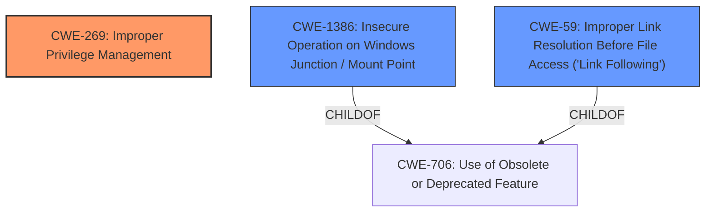

# Final Resolution for CVE-2021-24090

# Summary
| CWE ID        | CWE Name                                                                  | Confidence | CWE Abstraction Level | CWE Vulnerability Mapping Label | CWE-Vulnerability Mapping Notes |
|---------------|---------------------------------------------------------------------------|------------|-----------------------|---------------------------------|-------------------------------|
| CWE-269       | Improper Privilege Management                                             | 0.6        | Class                 | Primary                           | Discouraged                   |
| CWE-1386      | Insecure Operation on Windows Junction / Mount Point                      | 0.4        | Base                  | Secondary                         | Allowed                       |
| CWE-59        | Improper Link Resolution Before File Access ('Link Following')            | 0.3        | Base                  | Secondary                         | Allowed                       |

## Evidence and Confidence

*   **Confidence Score:** 0.6
*   **Evidence Strength:** LOW

## Relationship Analysis
The primary CWE chosen is CWE-269, a class-level weakness. This is a parent of more specific **weaknesses**, but due to limited information, a more precise classification isn't possible. The secondary CWEs, CWE-1386 and CWE-59, are both base-level and children of CWE-706 (Use of Obsolete or Deprecated Feature). CWE-1386 is also a parent of CWE-65 (Windows Hard Link). These relationships highlight the potential for file system manipulation leading to privilege escalation.

## Vulnerability Chain
The vulnerability chain starts with **improper privilege management** (CWE-269). This could potentially lead to an attacker manipulating file system junctions or mount points (CWE-1386) or exploiting link following vulnerabilities (CWE-59) to gain elevated privileges. Due to the lack of specific details, the exact chain cannot be fully mapped. A missing link is how the Windows Error Reporting service is specifically vulnerable to these file system manipulations.

## Summary of Analysis
The initial analysis and criticism both accurately identify the limitations due to the lack of specific information about the vulnerability. The decision to use CWE-269 as the primary CWE is reasonable given the "Elevation of Privilege" impact, but it's crucial to acknowledge that it's a discouraged class-level CWE. The secondary CWEs, CWE-1386 and CWE-59, are plausible candidates if the vulnerability involves file system manipulation, but their inclusion is based on the retriever results rather than direct evidence from the vulnerability description.

The assessment relies heavily on the limited information provided in the vulnerability description: "Windows Error Reporting Elevation of Privilege Vulnerability". The graph relationships confirm the potential for file system manipulation leading to privilege escalation, but without more specific details, it's impossible to select a more specific CWE.

The selected CWEs represent the optimal level of specificity given the available evidence. While a more specific CWE would be preferable, the lack of information prevents a more precise classification. Adding a note explaining *why* a more specific CWE can't be determined with the available information strengthens the justification.