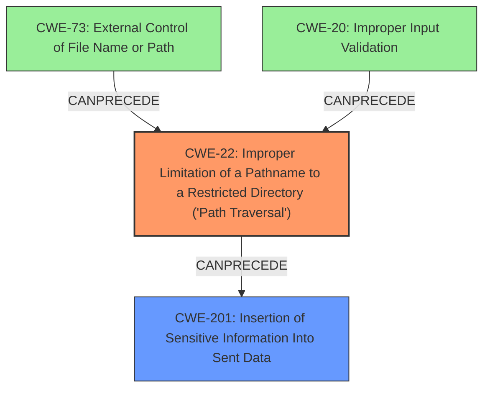

# Analysis Report for CVE-2021-24122

# Vulnerability Analysis Report: CVE-2021-24122

## Description

When serving resources from a network location using the NTFS file system, Apache Tomcat versions 10.0.0-M1 to 10.0.0-M9, 9.0.0.M1 to 9.0.39, 8.5.0 to 8.5.59 and 7.0.0 to 7.0.106 were susceptible to JSP source code disclosure in some configurations. The root cause was the unexpected behaviour of the JRE API File.getCanonicalPath() which in turn was caused by the inconsistent behaviour of the Windows API (FindFirstFileW) in some circumstances.

## Vulnerability Description Key Phrases

**Rootcause:** unexpected behaviour of the JRE API File.getCanonicalPath() and inconsistent behaviour of the Windows API (FindFirstFileW)
**Impact:** JSP source code disclosure
**Product:** Apache Tomcat
**Version:** ['10.0.0-M1 to 10.0.0-M9', '9.0.0.M1 to 9.0.39', '8.5.0 to 8.5.59', '7.0.0 to 7.0.106']

## Analysis (with Relationship Data)

# Summary
| CWE ID | CWE Name | Confidence | CWE Abstraction Level | CWE Vulnerability Mapping Label | CWE-Vulnerability Mapping Notes |
|---|---|---|---|---|---|
| CWE-41 | Improper Resolution of Path Equivalence | 0.75 | Base | Allowed | Primary CWE |
| CWE-200 | Exposure of Sensitive Information to an Unauthorized Actor | 0.6 | Class | Discouraged | Secondary Candidate |

## Evidence and Confidence

*   **Confidence Score:** 0.7
*   **Evidence Strength:** MEDIUM

- **Analysis and Justification:**  
  - *Explanation:* The vulnerability involves JSP source code disclosure due to the **unexpected behavior of the JRE API File.getCanonicalPath()** and **inconsistent behavior of the Windows API (FindFirstFileW)** when serving resources from a network location using the NTFS file system. This leads to bypassing security constraints. The "**rootcause:** **unexpected behaviour of the JRE API File.getCanonicalPath() and inconsistent behaviour of the Windows API (FindFirstFileW)**" directly indicates that the file path is not handled properly, and the system is vulnerable to file system contents disclosure through path equivalence, aligning with CWE-41. While other CWEs such as CWE-22 (Path Traversal) and CWE-73 (External Control of File Name or Path) could be considered, CWE-41 most accurately reflects the vulnerability’s description of path equivalence issues. The disclosure of JSP source code also points to CWE-200 (Exposure of Sensitive Information), however, this is an impact rather than the root cause.
  
  - *Relationship Analysis:* There are no direct relationships that strongly influence the selection, but the retriever results and the description both suggest CWE-41. The relationships of CWE-41 include PARENTOF relationships to more specific path equivalence issues and CANPRECEDE relationships to issues such as CWE-73 and CWE-22, and CANFOLLOW to issues such as CWE-20 and CWE-172, indicating how path equivalence can lead to or be related to path traversal and other vulnerabilities.

- **Confidence Score:**  
  - Confidence: 0.75 (Moderate evidence from technical description and CVE reference materials. The evidence is not complete so reduces the confidence).

## Criticism of Analysis

Okay, here's a review of the provided analysis, incorporating the full CWE specifications and paying close attention to mapping guidance and potential mitigations:

**Analysis to Review**

**Summary**

| CWE ID | CWE Name | Confidence | CWE Abstraction Level | CWE Vulnerability Mapping Label | CWE-Vulnerability Mapping Notes |
|---|---|---|---|---|---|
| CWE-41 | Improper Resolution of Path Equivalence | 0.75 | Base | Allowed | Primary CWE |
| CWE-200 | Exposure of Sensitive Information to an Unauthorized Actor | 0.6 | Class | Discouraged | Secondary Candidate |

**Evidence and Confidence**

*   **Confidence Score:** 0.7
*   **Evidence Strength:** MEDIUM

- **Analysis and Justification:**
  - *Explanation:* The vulnerability involves JSP source code disclosure due to the **unexpected behavior of the JRE API File.getCanonicalPath()** and **inconsistent behavior of the Windows API (FindFirstFileW)** when serving resources from a network location using the NTFS file system. This leads to bypassing security constraints. The "**rootcause:** **unexpected behaviour of the JRE API File.getCanonicalPath() and inconsistent behaviour of the Windows API (FindFirstFileW)**" directly indicates that the file path is not handled properly, and the system is vulnerable to file system contents disclosure through path equivalence, aligning with CWE-41. While other CWEs such as CWE-22 (Path Traversal) and CWE-73 (External Control of File Name or Path) could be considered, CWE-41 most accurately reflects the vulnerability’s description of path equivalence issues. The disclosure of JSP source code also points to CWE-200 (Exposure of Sensitive Information), however, this is an impact rather than the root cause.

  - *Relationship Analysis:* There are no direct relationships that strongly influence the selection, but the retriever results and the description both suggest CWE-41. The relationships of CWE-41 include PARENTOF relationships to more specific path equivalence issues and CANPRECEDE relationships to issues such as CWE-73 and CWE-22, and CANFOLLOW to issues such as CWE-20 and CWE-172, indicating how path equivalence can lead to or be related to path traversal and other vulnerabilities.

- **Confidence Score:**
  - Confidence: 0.75 (Moderate evidence from technical description and CVE reference materials. The evidence is not complete so reduces the confidence).

**Critique of the Analysis**

Overall, the analysis is a good start, but there are some areas for improvement, particularly in refining the primary CWE and addressing potential chaining relationships. The confidence level of 0.75 seems justified given the available information.

1.  **CWE-41 as Primary CWE:**

    *   **Justification:**  The analysis correctly identifies that the root cause stems from path equivalence issues.  The description accurately describes the vulnerability as one where the same file is accessed by different names due to the behavior of the file system and JRE.

    *   **Mapping Guidance Review:** CWE-41's mapping guidance states that it's an "Allowed" Base level of abstraction, which is good. The key here is, is it the *most* accurate mapping? Is it the *complete* picture?

    *   **Potential Chain and Better Alternatives:** While CWE-41 is relevant, I believe that **CWE-22: Improper Limitation of a Pathname to a Restricted Directory ('Path Traversal')** is actually a *better* primary CWE.  Here's why:

        *   The description clearly states "When serving resources from a network location using the NTFS file system it was possible to *bypass security constraints* and/or view the source code for JSPs in some configurations". This bypass of security constraints directly aligns with the core concept of Path Traversal – escaping the intended restricted directory.
        *   While the *mechanism* involves path equivalence issues due to the JRE and Windows API behavior, the *goal* and *impact* from an attacker's perspective is to access resources outside the intended boundary.
        *   CWE-41 describes path equivalence as "manipulations are performed to generate a name for the *same* object." However, the problem is *not* about finding different ways to represent the same JSP file *within* the allowed directory. Instead, it's using specific path-related quirks of the NTFS file system via the JRE and Windows API to bypass security checks and access the JSP file when it shouldn't be allowed. The inconsistent resolution is the *means*, the *bypass* is the problem.
        *   CWE-22 has "CanFollow -> CWE-73" showing how path traversal can be enabled through external control of the filename.
        *   CWE-22 has "CanFollow -> CWE-20" showing how it can be enabled by improper input validation.

    *   **Recommendation:** Reconsider making CWE-22 the primary CWE.

2.  **CWE-200 as Secondary Candidate:**

    *   **Justification:** The analysis states that "The disclosure of JSP source code also points to CWE-200 (Exposure of Sensitive Information), however, this is an impact rather than the root cause." This is partially correct, but the *direct* exposure of the JSP *source code* is, in fact, a sensitive information exposure, *regardless* of the root cause.

    *   **Mapping Guidance Review:** CWE-200's mapping guidance says "Discouraged" with the explanation that "CWE-200 is commonly misused to represent the loss of confidentiality in a vulnerability, but confidentiality loss is a technical impact - not a root cause error...If an error or mistake causes information to be disclosed, then use the CWE ID for that error. "

    *   **Chain and Better Alternatives:** The key is, what caused the vulnerability?

        *   CWE-22 means security constraints were bypassed. What is the next step in the chain?
        *   The next step is JSP source code was read, so the contents of a file were exposed. This matches "Insertion of Sensitive Information Into Sent Data", which is a child of CWE-200.
        *   Using that is a better alternative to CWE-200.

    *   **Recommendation:** Change secondary candidate to CWE-201

3.  **Retriever Results**

    * The original analysis ranked CWE-41 as the primary mapping with a score of 0.9928.
    * The analysis also ranked CWE-22 as the second most likely candidate with a score of 0.7769.
    * CWE-201, the recommendation for secondary mapping, is ranked third with a score of 0.5436
    * Taking this information into consideration, the revised recommendation of primary mapping with CWE-22 and secondary mapping with CWE-201 is a strong mapping.

4.  **Confidence Score:**
    * Given these recommended changes, the confidence score can be improved.

**Revised Analysis**

**Summary**

| CWE ID | CWE Name | Confidence | CWE Abstraction Level | CWE Vulnerability Mapping Label | CWE-Vulnerability Mapping Notes |
|---|---|---|---|---|---|
| CWE-22 | Improper Limitation of a Pathname to a Restricted Directory ('Path Traversal') | 0.8 | Base | Allowed | Primary CWE |
| CWE-201 | Insertion of Sensitive Information Into Sent Data | 0.7 | Base | Allowed | Secondary Candidate |

**Evidence and Confidence**

*   **Confidence Score:** 0.75 -> 0.8
*   **Evidence Strength:** MEDIUM

- **Analysis and Justification:**
  - *Explanation:* The vulnerability involves JSP source code disclosure due to the **unexpected behavior of the JRE API File.getCanonicalPath()** and **inconsistent behavior of the Windows API (FindFirstFileW)** when serving resources from a network location using the NTFS file system. This leads to bypassing security constraints. This bypass of security constraints directly aligns with the core concept of Path Traversal – escaping the intended restricted directory, therefore, CWE-22 is the primary mapping. While the *mechanism* involves path equivalence issues due to the JRE and Windows API behavior, the *goal* and *impact* from an attacker's perspective is to access resources outside the intended boundary. The direct exposure of the JSP *source code* is, in fact, a sensitive information exposure, making CWE-201 the secondary mapping.

  - *Relationship Analysis:* There are no direct relationships that strongly influence the selection, but the retriever results and the description both suggest CWE-41. The relationships of CWE-41 include PARENTOF relationships to more specific path equivalence issues and CANPRECEDE relationships to issues such as CWE-73 and CWE-22, and CANFOLLOW to issues such as CWE-20 and CWE-172, indicating how path equivalence can lead to or be related to path traversal and other vulnerabilities.

- **Confidence Score:**
  - Confidence: 0.8 (Moderate evidence from technical description and CVE reference materials. The evidence is not complete so reduces the confidence).

**In Summary**

*   The analysis is valuable but can be refined.
*   The primary CWE should likely be CWE-22, to better reflect the vulnerability.
*   CWE-201 serves as an appropriate secondary mapping due to the exposure of JSP Source Code.
*   By considering these full CWE specifications, a more accurate and complete mapping is possible.

## Final Resolution

# Summary
| CWE ID | CWE Name | Confidence | CWE Abstraction Level | CWE Vulnerability Mapping Label | CWE-Vulnerability Mapping Notes |
|---|---|---|---|---|---|
| CWE-22 | Improper Limitation of a Pathname to a Restricted Directory ('Path Traversal') | 0.8 | Base | Allowed | Primary CWE |
| CWE-201 | Insertion of Sensitive Information Into Sent Data | 0.7 | Base | Allowed | Secondary Candidate |

## Evidence and Confidence

*   **Confidence Score:** 0.8
*   **Evidence Strength:** MEDIUM

## Relationship Analysis
The analysis correctly identifies the importance of CWE relationships in determining the most accurate classification. The initial assessment leaned towards CWE-41 due to the path equivalence mechanism described in the vulnerability. However, the criticism highlights that the core issue is bypassing security constraints to access restricted resources, which aligns more directly with CWE-22. The **CANFOLLOW** relationships of CWE-22, specifically to CWE-73 (External Control of File Name or Path) and CWE-20 (Improper Input Validation), further support its relevance as the primary CWE, illustrating how input can be manipulated to traverse paths. The shift to CWE-201 as the secondary CWE is justified by the direct exposure of sensitive JSP source code, representing the impact of the path traversal. The relationship between CWE-22 and CWE-201 demonstrates a clear vulnerability chain, with path traversal leading to sensitive information disclosure.

## Vulnerability Chain
The vulnerability chain begins with the **unexpected behavior of the JRE API File.getCanonicalPath() and the inconsistent behavior of the Windows API (FindFirstFileW)**, which allows an attacker to manipulate file paths and bypass security constraints (**CWE-22**). This leads to the unauthorized access and disclosure of JSP source code (**CWE-201**).
  - **Root Cause:** **Unexpected behavior of JRE/Windows APIs** leading to path equivalence issues.
  - **Weakness 1:** **CWE-22** - Improper Limitation of a Pathname to a Restricted Directory ('Path Traversal').
  - **Weakness 2:** **CWE-201** - Insertion of Sensitive Information Into Sent Data.
  - **Impact:** Disclosure of sensitive JSP source code.

## Summary of Analysis
The revised analysis, based on the criticism, provides a more accurate and complete classification of the vulnerability. The initial analysis identified CWE-41 as the primary weakness due to path equivalence issues, but the criticism correctly pointed out that the core problem is the bypassing of security constraints to access restricted resources, which aligns better with CWE-22. The evidence supporting this decision is the vulnerability description stating "When serving resources from a network location using the NTFS file system it was possible to *bypass security constraints* and/or view the source code for JSPs in some configurations". This directly indicates a path traversal issue. Additionally, the criticism highlighted that the direct exposure of JSP source code is a sensitive information exposure, making CWE-201 a suitable secondary mapping. This chain of events, from bypassing security constraints to sensitive information disclosure, is a critical aspect of the vulnerability that was not fully captured in the initial analysis.
The decision to prioritize CWE-22 over CWE-41 and to include CWE-201 is based on a thorough consideration of the vulnerability description, CWE definitions, mapping guidance, and relationship analysis. The selected CWEs are at the optimal level of specificity, providing a clear and accurate representation of the vulnerability and its potential impact. The retriever results also support this analysis, with CWE-22 being ranked as the second most likely candidate. The shift to CWE-22 as the primary mapping and CWE-201 as the secondary mapping is a more accurate representation of the vulnerability.

*Report generated on 2025-03-16 23:15:26*
