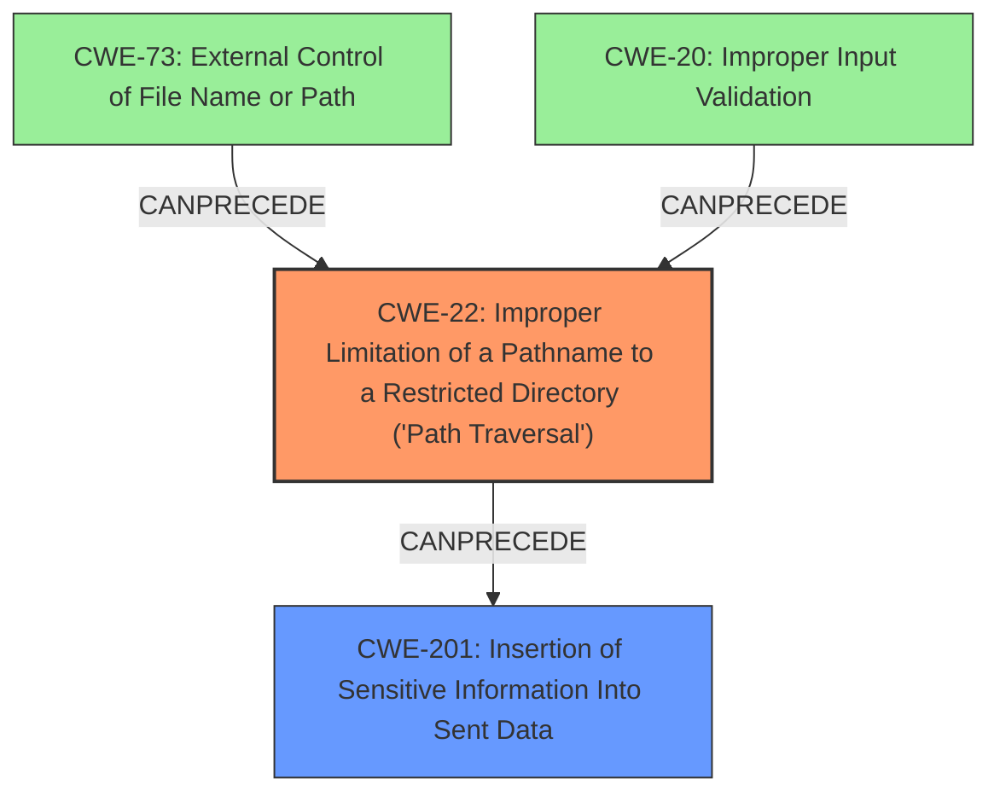

# Final Resolution for CVE-2021-24122

# Summary
| CWE ID | CWE Name | Confidence | CWE Abstraction Level | CWE Vulnerability Mapping Label | CWE-Vulnerability Mapping Notes |
|---|---|---|---|---|---|
| CWE-22 | Improper Limitation of a Pathname to a Restricted Directory ('Path Traversal') | 0.8 | Base | Allowed | Primary CWE |
| CWE-201 | Insertion of Sensitive Information Into Sent Data | 0.7 | Base | Allowed | Secondary Candidate |

## Evidence and Confidence

*   **Confidence Score:** 0.8
*   **Evidence Strength:** MEDIUM

## Relationship Analysis
The analysis correctly identifies the importance of CWE relationships in determining the most accurate classification. The initial assessment leaned towards CWE-41 due to the path equivalence mechanism described in the vulnerability. However, the criticism highlights that the core issue is bypassing security constraints to access restricted resources, which aligns more directly with CWE-22. The **CANFOLLOW** relationships of CWE-22, specifically to CWE-73 (External Control of File Name or Path) and CWE-20 (Improper Input Validation), further support its relevance as the primary CWE, illustrating how input can be manipulated to traverse paths. The shift to CWE-201 as the secondary CWE is justified by the direct exposure of sensitive JSP source code, representing the impact of the path traversal. The relationship between CWE-22 and CWE-201 demonstrates a clear vulnerability chain, with path traversal leading to sensitive information disclosure.

## Vulnerability Chain
The vulnerability chain begins with the **unexpected behavior of the JRE API File.getCanonicalPath() and the inconsistent behavior of the Windows API (FindFirstFileW)**, which allows an attacker to manipulate file paths and bypass security constraints (**CWE-22**). This leads to the unauthorized access and disclosure of JSP source code (**CWE-201**).
  - **Root Cause:** **Unexpected behavior of JRE/Windows APIs** leading to path equivalence issues.
  - **Weakness 1:** **CWE-22** - Improper Limitation of a Pathname to a Restricted Directory ('Path Traversal').
  - **Weakness 2:** **CWE-201** - Insertion of Sensitive Information Into Sent Data.
  - **Impact:** Disclosure of sensitive JSP source code.

## Summary of Analysis
The revised analysis, based on the criticism, provides a more accurate and complete classification of the vulnerability. The initial analysis identified CWE-41 as the primary weakness due to path equivalence issues, but the criticism correctly pointed out that the core problem is the bypassing of security constraints to access restricted resources, which aligns better with CWE-22. The evidence supporting this decision is the vulnerability description stating "When serving resources from a network location using the NTFS file system it was possible to *bypass security constraints* and/or view the source code for JSPs in some configurations". This directly indicates a path traversal issue. Additionally, the criticism highlighted that the direct exposure of JSP source code is a sensitive information exposure, making CWE-201 a suitable secondary mapping. This chain of events, from bypassing security constraints to sensitive information disclosure, is a critical aspect of the vulnerability that was not fully captured in the initial analysis.
The decision to prioritize CWE-22 over CWE-41 and to include CWE-201 is based on a thorough consideration of the vulnerability description, CWE definitions, mapping guidance, and relationship analysis. The selected CWEs are at the optimal level of specificity, providing a clear and accurate representation of the vulnerability and its potential impact. The retriever results also support this analysis, with CWE-22 being ranked as the second most likely candidate. The shift to CWE-22 as the primary mapping and CWE-201 as the secondary mapping is a more accurate representation of the vulnerability.