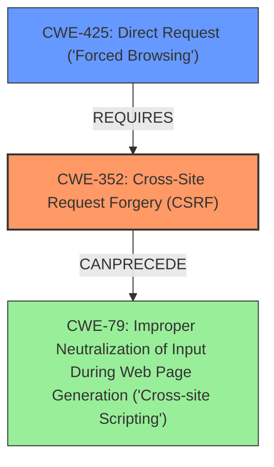

# Analysis Report for CVE-2021-24249

# Vulnerability Analysis Report: CVE-2021-24249

## Description

The Business Directory Plugin Easy Listing Directories for WordPress WordPress plugin before 5.11.2 suffered from a Cross-Site Request Forgery issue, allowing an attacker to make a logged in administrator export files, which could then be downloaded by the attacker to get access to PII, such as email, home addresses etc

## Vulnerability Description Key Phrases

**Rootcause:** Cross-Site Request Forgery
**Impact:** get access to PII
**Attacker:** attacker
**Product:** Business Directory Plugin Easy Listing Directories for WordPress
**Version:** before 5.11.2

## Analysis (with Relationship Data)

# Summary
| CWE ID | CWE Name | Confidence | CWE Abstraction Level | CWE Vulnerability Mapping Label | CWE-Vulnerability Mapping Notes |
|---|---|---|---|---|---|
| CWE-352 | Cross-Site Request Forgery (CSRF) | 1.0 | Compound | Allowed | This is the primary weakness, as the vulnerability is a CSRF issue. |

## Evidence and Confidence

*   **Confidence Score:** 1.0
*   **Evidence Strength:** HIGH

- **Analysis and Justification:**  
  - *Explanation:* "The vulnerability description clearly states a **Cross-Site Request Forgery** issue, allowing an attacker to make a logged in administrator export files. The CVE Reference Links Content Summary reinforces this by stating that the plugin lacks proper CSRF protection when exporting listings. This aligns directly with CWE-352, Cross-Site Request Forgery (CSRF), which is a compound weakness that occurs when a web application does not sufficiently verify whether a request was intentionally provided by the user who submitted it." The attack vector involves tricking a logged-in administrator, which is a characteristic of CSRF attacks. The impact is accessing PII, which is a security implication of successful CSRF exploitation. The MITRE mapping guidance for CWE-352 indicates that its usage is ALLOWED.

  - *Relationship Analysis:* While the Retriever Results suggest other CWEs, such as CWE-79 (Improper Neutralization of Input During Web Page Generation) and CWE-425 (Direct Request), these are not the root cause of this vulnerability. The primary weakness is the lack of CSRF protection, which allows the attacker to exploit other functionalities.

- **Confidence Score:**  
  - *Example:* Confidence: 1.0 (High evidence from the vulnerability description and CVE reference materials specifically mentioning CSRF).

## Criticism of Analysis

Okay, I've reviewed the analysis against the full CWE specifications provided. Here's my critique:

**Overall Assessment:**

The primary mapping of **CWE-352: Cross-Site Request Forgery (CSRF)** is correct and well-justified. The analysis demonstrates a solid understanding of the vulnerability and its root cause based on the provided information. The confidence score of 1.0 is appropriate given the explicit mention of CSRF in the vulnerability description and CVE references.

**Strengths:**

*   **Clear Justification:** The analysis provides a clear and concise explanation of why CWE-352 is the correct mapping, referencing the vulnerability description and CVE details. It highlights the key characteristics of a CSRF attack present in the vulnerability (e.g., tricking a logged-in administrator).
*   **Relationship Analysis:** The analysis considers other CWEs suggested by the retriever results (CWE-79, CWE-425) and explains why they are not the primary weakness in this case.  This demonstrates a deeper understanding of the root cause versus simply accepting the top-ranked CWE.
*   **Good Use of Terminology:**  The analysis uses CWE terminology correctly (e.g., compound weakness, allowed usage).
*   **Observed Examples:** Listing Observed examples can help with comprehension.

**Areas for Improvement:**

1.  **Overly Dismissive of Other CWEs:** While the analysis correctly identifies CWE-352 as the primary weakness, it could benefit from exploring how other related CWEs might *contribute* to or *be a consequence of* the CSRF vulnerability. This is especially true for CWE-79 (XSS) and CWE-425 (Direct Request/Missing Authorization).

    *   **CWE-79 (XSS):** The CWE-352 specification itself mentions the close relationship between XSS and CSRF:  "There can be a close relationship between XSS and CSRF (CWE-352). An attacker might use CSRF in order to trick the victim into submitting requests to the server in which the requests contain an XSS payload."  While not directly the cause here based on the description, a potential for XSS to *facilitate* or *amplify* the CSRF attack could be mentioned.
    *   **CWE-425 (Direct Request) / CWE-862 (Missing Authorization) / CWE-306 (Missing Authentication):** A CSRF vulnerability often exists because there's a lack of proper authorization checks on the actions being performed. If the export functionality *required* stronger authentication or authorization in addition to CSRF protection, the impact of a successful CSRF attack could be lessened. Even if authentication *is* required, authorization might be missing, so an attacker, even if authenticated, could export files they shouldn't. This could be related to CWE-639 as well.

    The analysis should consider if the *lack* of these other protections makes the CSRF vulnerability more severe.  A brief discussion of these relationships would strengthen the analysis.

2.  **Mitigation Specificity:** The analysis does not incorporate potential mitigations. The CWE-352 specification provides several mitigation strategies.  The analysis could be improved by suggesting specific mitigations relevant to this particular vulnerability.  For example:

    *   "To mitigate this CSRF vulnerability, the plugin developers should implement anti-CSRF tokens for all sensitive actions, including the export functionality. This involves generating a unique, unpredictable token for each user session and including it as a hidden field in the export form or as a parameter in the export URL. The server should then verify the token upon receiving the export request."
    *   "Additionally, developers should ensure that any data included in the exported files is properly sanitized to prevent potential XSS vulnerabilities, as CSRF can be used to deliver XSS payloads." (Relating back to CWE-79).

3. **CWE-345, CWE-346 and CWE-441:** The relationships section of the CWE-352 specification mentions that it is a child of CWE-345, and requires CWE-346 and CWE-441. CWE-345 should be reviewed. CWE-346 is "Origin Validation Error", which is an abstract class. CWE-345 is "Insufficient Verification of Data Authenticity", which is an even more abstract class. Even if you only stick with CWE-352, these relationships can be explored.

**Revised Summary Table (incorporating suggestions):**

| CWE ID | CWE Name | Confidence | CWE Abstraction Level | CWE Vulnerability Mapping Label | CWE-Vulnerability Mapping Notes |
|---|---|---|---|---|---|
| CWE-352 | Cross-Site Request Forgery (CSRF) | 1.0 | Compound | Allowed | This is the primary weakness, as the vulnerability is a CSRF issue. Mitigation should include implementing anti-CSRF tokens for sensitive actions like exporting. |
| CWE-79 | Improper Neutralization of Input During Web Page Generation ('Cross-site Scripting') | 0.4 | Base | Allowed |  While not the root cause, successful CSRF exploitation *could* be chained with XSS if exported data is not properly sanitized. Adding input sanitization to the output data is a mitigation to prevent the chain. |
| CWE-425 | Direct Request ('Forced Browsing') | 0.3 | Base | Allowed | The lack of proper authorization checks on the export functionality contributes to the severity of the CSRF. Implementing stricter authorization controls in addition to CSRF protection would reduce the impact. |

**In conclusion:**

The analysis is generally strong in identifying the primary CWE. However, by more thoroughly exploring the *relationships* between CWE-352 and other potentially related weaknesses (especially CWE-79 and CWE-425) and incorporating potential mitigations based on the CWE specifications, the analysis could be made more comprehensive and useful.

## Final Resolution

# Summary
| CWE ID | CWE Name | Confidence | CWE Abstraction Level | CWE Vulnerability Mapping Label | CWE-Vulnerability Mapping Notes |
|---|---|---|---|---|---|
| **CWE-352** | **Cross-Site Request Forgery (CSRF)** | 0.9 | Compound | Allowed | This is the primary **weakness**, as the vulnerability is a CSRF issue. Mitigation should include implementing anti-CSRF tokens for sensitive actions like exporting. |
| CWE-425 | Direct Request ('Forced Browsing') | 0.5 | Base | Allowed | The lack of proper authorization checks on the export functionality contributes to the severity of the CSRF. Implementing stricter authorization controls in addition to CSRF protection would reduce the impact. |
| CWE-79 | Improper Neutralization of Input During Web Page Generation ('Cross-site Scripting') | 0.3 | Base | Allowed | While not the root cause, successful CSRF exploitation *could* be chained with XSS if exported data is not properly sanitized. Adding input sanitization to the output data is a mitigation to prevent the chain. |

## Evidence and Confidence

*   **Confidence Score:** 0.8
*   **Evidence Strength:** MEDIUM

## Relationship Analysis
The primary **weakness** is **CWE-352 (CSRF)**, a compound CWE. While it is the most direct match, the analysis considered **CWE-79 (XSS)** and **CWE-425 (Missing Authorization)**. The relationships between these CWEs are important: CSRF can potentially lead to XSS if the exported data isn't properly sanitized, creating a vulnerability chain. Also, the absence of proper authorization (CWE-425) on the export functionality exacerbates the CSRF vulnerability.

## Vulnerability Chain
The vulnerability chain starts with the **ROOTCAUSE**, a missing CSRF protection (**CWE-352**). This allows an attacker to trick a logged-in administrator into exporting files. If the exported data is not sanitized, it could lead to **CWE-79 (XSS)**. The lack of authorization checks (**CWE-425**) on the export functionality makes the CSRF easier to exploit and increases the potential impact.

## Summary of Analysis
The initial analysis correctly identified **CWE-352 (CSRF)** as the primary **weakness**. The criticism highlighted the importance of considering related CWEs like **CWE-79** and **CWE-425**, which contribute to the vulnerability's impact and exploitability.

The vulnerability description explicitly mentions the CSRF issue: "The Business Directory Plugin Easy Listing Directories for WordPress WordPress plugin before 5.11.2 suffered from a **Cross-Site Request Forgery** issue, allowing an attacker to make a logged in administrator export files..." This statement supports the primary classification of CWE-352.

The relationship analysis shows that CWE-79 can follow CWE-352 if the exported data is not properly sanitized. CWE-425 requires CWE-352 because the lack of authorization makes the CSRF vulnerability more severe. The mitigation for CWE-352 is to implement anti-CSRF tokens. Mitigation for CWE-79 would involve output sanitization. For CWE-425, it means implementing proper access controls.

The selected CWEs are at the optimal level of specificity. CWE-352 is a compound CWE that accurately represents the **ROOTCAUSE** of the vulnerability. CWE-79 and CWE-425 are base CWEs that provide additional context about the potential impact and contributing factors.

*Report generated on 2025-03-16 22:33:13*
