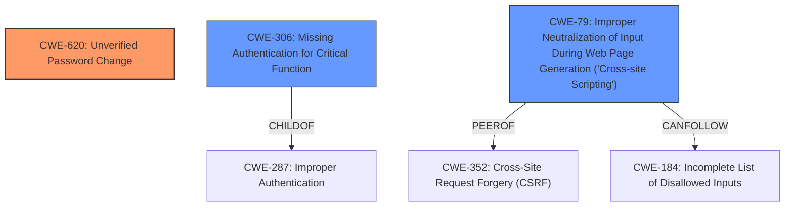

# Final Resolution for CVE-2021-24359

# Summary
| CWE ID | CWE Name | Confidence | CWE Abstraction Level | CWE Vulnerability Mapping Label | CWE-Vulnerability Mapping Notes |
|---|---|---|---|---|---|
| CWE-620 | Unverified Password Change | 0.95 | Base | Allowed | Primary CWE |
| CWE-306 | Missing Authentication for Critical Function | 0.75 | Base | Allowed | Secondary Candidate |
| CWE-79 | Improper Neutralization of Input During Web Page Generation ('Cross-site Scripting') | 0.60 | Base | Allowed | Tertiary Candidate |

## Evidence and Confidence

*   **Confidence Score:** 0.9
*   **Evidence Strength:** HIGH

## Relationship Analysis
The primary CWE, CWE-620, does not have any direct relationships, highlighting its specific focus on password change vulnerabilities. The secondary CWE, CWE-306, is a child of CWE-287 (Improper Authentication), indicating a broader authentication context. CWE-79 (Improper Neutralization of Input During Web Page Generation) is a peer of CWE-352 (Cross-Site Request Forgery) and can follow CWE-184 (Incomplete List of Disallowed Inputs), suggesting potential avenues for exploitation if input sanitization is lacking in the password reset email functionality. The abstraction levels influenced the selection by prioritizing Base-level CWEs for direct mapping, while considering Class-level CWEs for broader context.

## Vulnerability Chain
The vulnerability chain begins with **CWE-620 (Unverified Password Change)**, where the system fails to properly authenticate the user requesting a password reset. This leads to **CWE-306 (Missing Authentication for Critical Function)**, as the password reset process lacks sufficient authentication mechanisms. Furthermore, if the password reset email functionality allows for unescaped HTML or script insertion, it introduces **CWE-79 (Improper Neutralization of Input During Web Page Generation)**, enabling potential cross-site scripting attacks. This chain highlights how the initial authentication failure can be exploited further due to inadequate input sanitization.

## Summary of Analysis
The initial analysis and criticism both align on the primary weakness being **CWE-620 (Unverified Password Change)**. The vulnerability description explicitly states that the plugin "did not properly check that a user requesting a password reset was the legitimate user," which directly corresponds to **CWE-620's** definition: "When setting a new password for a user, the product does not require knowledge of the original password, or using another form of authentication."

The graph relationships confirm that **CWE-620** is the most specific and appropriate classification, while **CWE-306** provides a broader context of missing authentication. Additionally, the retriever results and the criticism highlighted the potential relevance of **CWE-79 (Improper Neutralization of Input During Web Page Generation ('Cross-site Scripting'))**, if the password reset email allows for unescaped HTML or script insertion.

The selected CWEs are at the optimal level of specificity because they directly address the identified weaknesses in the vulnerability description. **CWE-620** captures the core issue of unverified password changes, **CWE-306** highlights the broader lack of authentication, and **CWE-79** addresses the potential for cross-site scripting vulnerabilities in the password reset email functionality.