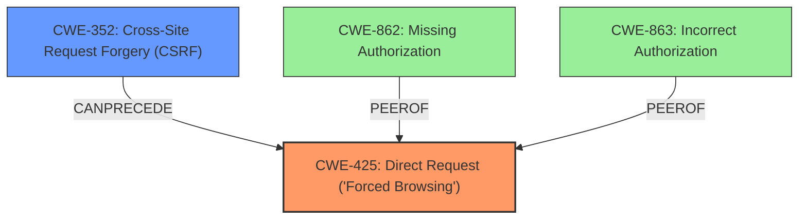

# Final Resolution for CVE-2021-24583

# Summary
| CWE ID | CWE Name | Confidence | CWE Abstraction Level | CWE Vulnerability Mapping Label | CWE-Vulnerability Mapping Notes |
|---|---|---|---|---|---|
| CWE-425 | Direct Request ('Forced Browsing') | 0.95 | Base | Allowed | Primary CWE: Inadequate authorization enforcement allows unauthorized access to resources. |
| CWE-352 | Cross-Site Request Forgery (CSRF) | 0.85 | Compound | Allowed | Secondary CWE: Lack of CSRF protection allows exploiting the access control issue. |

## Evidence and Confidence

*   **Confidence Score:** 0.95
*   **Evidence Strength:** HIGH

## Relationship Analysis
The primary weakness is **CWE-425 (Direct Request)**, a Base-level CWE, accurately representing the **root cause** of the vulnerability: insufficient authorization enforcement. **CWE-352 (Cross-Site Request Forgery)** is a Compound CWE and a secondary weakness because it provides a means to exploit the **CWE-425**. No parent-child relationships were found that affected my decision, reinforcing that the selected CWEs are at the appropriate abstraction level. Although **CWE-862 (Missing Authorization)** and **CWE-863 (Incorrect Authorization)** were considered, **CWE-425** was selected for being the most accurate and specific **root cause**.

## Vulnerability Chain
The vulnerability chain starts with **CWE-425**, where inadequate access controls allow unauthorized users with `edit_posts` capability to delete arbitrary timeslots. The lack of CSRF protection, **CWE-352**, then enables an attacker to exploit this **weakness** by tricking a logged-in user into unknowingly performing the action. The **root cause** is the **improper access control (CWE-425)**. The impact is the unauthorized deletion of timeslots.

## Summary of Analysis
The initial analysis and criticism both correctly identified **CWE-425** and **CWE-352** as the primary and secondary **weaknesses**, respectively. The vulnerability description explicitly mentions "**improper access control**" and "**no CSRF check**" which directly relate to these CWEs. The chosen CWEs are at the optimal level of specificity, with **CWE-425** being a Base-level CWE that clearly defines the **root cause**, and **CWE-352** describing the secondary **weakness** that allows exploitation of the primary **weakness**. The analysis considered alternative CWEs like **CWE-862** and **CWE-863**, but these were rejected as less specific than **CWE-425**. The final decision is strongly based on the evidence from the vulnerability description and aligns with the CWE mapping guidance and relationship analysis.