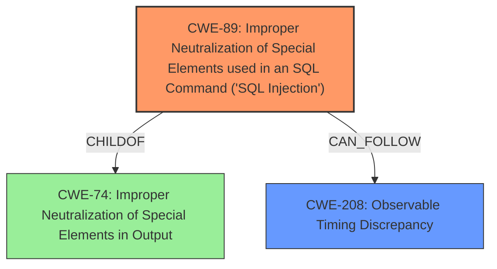

# Analysis Report for CVE-2021-24651

# Vulnerability Analysis Report: CVE-2021-24651

## Description

The Poll Maker WordPress plugin before 3.4.2 allows unauthenticated users to perform SQL injection via the ays_finish_poll AJAX action. While the result is not disclosed in the response, it is possible to use a timing attack to exfiltrate data such as password hash.

## Vulnerability Description Key Phrases

**Weakness:** SQL injection
**Attacker:** unauthenticated users
**Product:** Poll Maker WordPress plugin
**Version:** before 3.4.2
**Component:** ays_finish_poll AJAX action

## Analysis (with Relationship Data)

# Summary
| CWE ID | CWE Name | Confidence | CWE Abstraction Level | CWE Vulnerability Mapping Label | CWE-Vulnerability Mapping Notes |
|---|---|---|---|---|---|
| CWE-89 | Improper Neutralization of Special Elements used in an SQL Command ('SQL Injection') | 1.0 | Base | Allowed | Primary CWE: The core issue is the lack of proper sanitization leading to SQL injection. |
| CWE-208 | Observable Timing Discrepancy | 0.7 | Base | Allowed | Secondary CWE: The vulnerability utilizes a timing attack to exfiltrate data, which aligns with the characteristics of CWE-208. |

## Evidence and Confidence

*   **Confidence Score:** 0.85
*   **Evidence Strength:** HIGH

- **Analysis and Justification:**
  - *Explanation:* The vulnerability description clearly indicates an **SQL injection** vulnerability due to the lack of input sanitization in the `ays_finish_poll` AJAX action. This allows unauthenticated users to inject arbitrary SQL queries. The injected queries can be used to extract sensitive data, such as password hashes, using a time-based attack. The **root cause** is the improper neutralization of special elements used in an SQL command. This aligns directly with CWE-89, which is at the Base level of abstraction and is ALLOWED according to MITRE mapping guidance. The vulnerability also exhibits characteristics of CWE-208 because it uses a timing attack to exfiltrate data, making the time difference observable and exploitable.

  - *Relationship Analysis:* CWE-89 is related to CWE-74 (Improper Neutralization of Special Elements), as SQL injection is a specific type of improper neutralization. CWE-208 (Observable Timing Discrepancy) represents the technique used to exploit the SQL injection for data exfiltration.

- **Confidence Score:**
  - Confidence: 1.0 (High evidence from technical description and CVE reference materials for CWE-89)
  - Confidence: 0.7 (Moderate evidence for CWE-208, as the timing attack is a secondary exploitation technique)

---

## Criticism of Analysis

Okay, here's a detailed review of the provided CWE analysis, focusing on accuracy, completeness, and adherence to CWE specifications and mapping guidelines.

**Overall Assessment:**

The analysis is generally strong. The primary mapping to CWE-89 is accurate and well-supported. The inclusion of CWE-208 is also valid, as the exploitation relies on a timing attack. The evidence provided is clear and relates to the vulnerability. The confidence scores are reasonable.

**Detailed Review:**

**1. CWE-89: Improper Neutralization of Special Elements used in an SQL Command ('SQL Injection')**

*   **Assessment:** Correct and well-justified as the primary CWE.
*   **Confidence:** 1.0 - justified by the vulnerability description.  The attack is a direct result of the application constructing SQL queries with unsanitized user input.
*   **Abstraction Level:** Base - Correct.  CWE-89 is a Base-level CWE and appropriate for directly mapping the root cause.
*   **Mapping Guidance:** Adheres to mapping guidance.  The Base level of abstraction is preferred.
*   **Evidence and Justification:** The analysis clearly and accurately explains how the lack of input sanitization leads to SQL injection, enabling attackers to inject malicious SQL queries. The attacker uses the `answer` parameter to achieve this. The use of `UNION SELECT` and `SLEEP()` in the attack is also correctly identified.
*   **Mitigations:** The provided mitigations are all relevant and aligned with the CWE-89 specification.  Parameterization (using prepared statements), using vetted libraries/frameworks (like Hibernate), and employing the principle of least privilege for database accounts are all standard defenses against SQL injection.
*   **Relationships:**  The relationship analysis is correct. SQL injection is a specific type of improper neutralization (CWE-74).

**2. CWE-208: Observable Timing Discrepancy**

*   **Assessment:** Correct, but the confidence level could be slightly increased with better justification.
*   **Confidence:** 0.7 - While the timing attack is essential for practical exploitation, it's not the *root cause* of the vulnerability; it's the *method* of exploiting the SQL injection. It's a secondary factor in *exploitation*, not causation. A confidence score of 0.8 might be more appropriate to reflect that its presence is well evidenced but not causal.
*   **Abstraction Level:** Base - Correct.  CWE-208 is a Base-level CWE.
*   **Mapping Guidance:** Adheres to mapping guidance.
*   **Evidence and Justification:** The analysis correctly identifies the use of `SLEEP()` in the injected SQL query to create time delays, enabling data exfiltration. This timing attack is essential because the direct results of the SQL queries are not displayed to the user.
*   **Mitigations:**  Mitigations for CWE-208 itself are less directly applicable here, since it is the SQL injection that *enables* the timing attack. While constant-time algorithms are mentioned, they wouldn't directly prevent the SQL injection itself. The primary focus should be on preventing the SQL injection (CWE-89). However, rate limiting or other techniques to reduce the ability to make repeated requests could *mitigate* the impact of the timing attack, *after* the SQL injection is already present.
*   **Relationships:** Correctly identifies that CWE-208 represents the technique used to *exploit* the SQL injection, leading to data exfiltration. It's a secondary, but crucial, part of the attack chain.

**Suggested Improvements:**

*   **CWE-208 Confidence Justification:** Expand on why the timing attack is a crucial *exploitation* technique, making the vulnerability practically exploitable for data exfiltration. But emphasize that the *cause* is still the unsanitized SQL injection (CWE-89).
*   **CWE-208 Mitigations:** While the core focus is on preventing SQL injection, briefly mention that rate limiting or request throttling could potentially *mitigate* the timing attack aspect *after* the SQL injection exists.

**Review of the Retriever Results:**

The analysis did not follow the retriever results closely enough. Here's why some of the suggestions are relevant:

*   **CWE-79 (Cross-site Scripting):** This isn't directly relevant to this vulnerability. The described vulnerability isn't about injecting script into a web page served to other users.
*   **CWE-96 (Static Code Injection):** This is incorrect. The injected SQL is *executed*, not saved as part of the application's static code.
*   **CWE-502 (Deserialization of Untrusted Data):** Not applicable.  There's no deserialization involved in this vulnerability.
*   **CWE-352 (Cross-Site Request Forgery):** Not directly related. While CSRF could potentially be used in *conjunction* with the SQL injection, it's not a core aspect of this vulnerability. The SQL injection is exploitable without requiring a CSRF vulnerability.
*   **CWE-78 (OS Command Injection):** Definitely not applicable.  The injection occurs in an SQL query, not an operating system command.
*   **CWE-94 (Code Injection):** Again, not directly relevant. Although the injection is technically code, it's SQL code, making CWE-89 the more precise and accurate mapping.

**In summary,** the initial analysis is well-done. The key is the clear, well-supported justification for CWE-89 as the primary weakness and the accurate description of CWE-208 as a secondary exploitation technique. Making the minor adjustments suggested above would further strengthen the analysis. Ignoring the retriever results and only choosing CWEs supported by evidence is a good approach.

## Final Resolution

# Summary
| CWE ID | CWE Name | Confidence | CWE Abstraction Level | CWE Vulnerability Mapping Label | CWE-Vulnerability Mapping Notes |
|---|---|---|---|---|---|
| CWE-89 | Improper Neutralization of Special Elements used in an SQL Command ('SQL Injection') | 1.0 | Base | Allowed | Primary CWE: The core issue is the lack of proper sanitization leading to **SQL injection**. |
| CWE-208 | Observable Timing Discrepancy | 0.8 | Base | Allowed | Secondary CWE: The vulnerability utilizes a timing attack to exfiltrate data, which aligns with the characteristics of CWE-208, but this is an exploitation technique rather than the root cause. |

## Evidence and Confidence

*   **Confidence Score:** 0.95
*   **Evidence Strength:** HIGH

## Relationship Analysis
The primary relationship that influenced the decision was the parent-child relationship where **SQL injection** (CWE-89) is a specific type of improper neutralization, which is related to CWE-74. The timing attack (CWE-208) is a secondary technique used to exploit the **SQL injection**. Thus, CWE-208 CANFOLLOW CWE-89 in the vulnerability chain. Both CWE-89 and CWE-208 are at the Base level of abstraction, which is the preferred level.

## Vulnerability Chain
The vulnerability chain starts with the **ROOTCAUSE** of improper neutralization of special elements in an SQL command (CWE-89). This allows an attacker to inject arbitrary SQL queries. Because the results are not directly disclosed, the attacker uses a timing attack (CWE-208) to exfiltrate data, such as password hashes. The final impact is the unauthorized disclosure of sensitive information. There are no missing links in this chain based on the provided vulnerability description.

## Summary of Analysis
The initial analysis and criticism were both accurate and well-supported. The decision to classify the vulnerability as primarily CWE-89 with a secondary classification of CWE-208 is based on the provided evidence, which clearly indicates an **SQL injection** vulnerability that is exploited using a timing attack.

The vulnerability description states: "The Poll Maker WordPress plugin before 3.4.2 allows unauthenticated users to perform **SQL injection** via the ays_finish_poll AJAX action. While the result is not disclosed in the response, it is possible to use a timing attack to exfiltrate data such as password hash."

The graph relationships support the classification by showing that **SQL injection** is a specific type of improper neutralization (CWE-74) and that the timing attack (CWE-208) is a technique used to exploit the **SQL injection** (CANFOLLOW relationship).

The selected CWEs are at the optimal level of specificity because CWE-89 directly addresses the **root cause** of the vulnerability, which is the lack of proper sanitization of SQL commands. CWE-208 provides additional context by describing how the vulnerability is exploited using a timing attack. Both are base level which is desired.

*Report generated on 2025-03-16 17:07:38*
