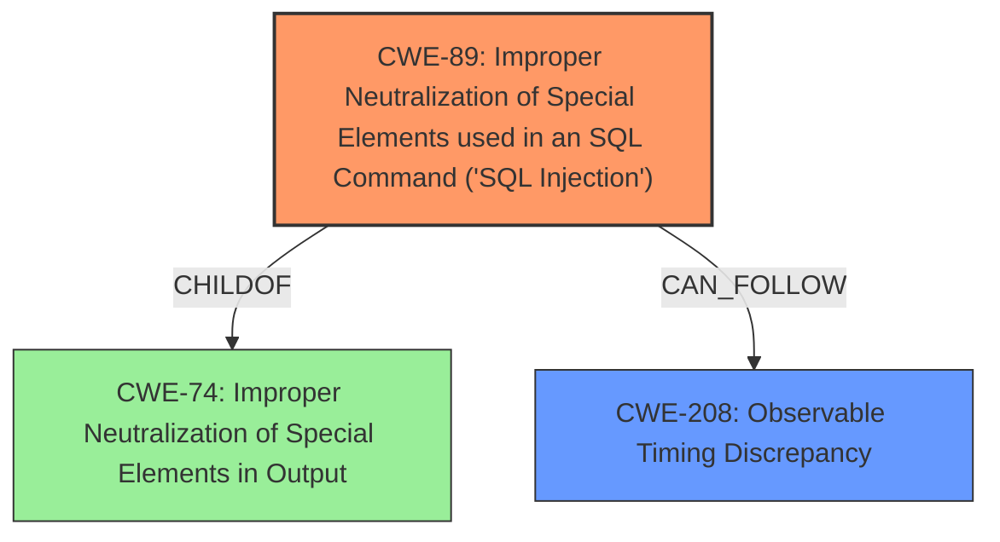

# Final Resolution for CVE-2021-24651

# Summary
| CWE ID | CWE Name | Confidence | CWE Abstraction Level | CWE Vulnerability Mapping Label | CWE-Vulnerability Mapping Notes |
|---|---|---|---|---|---|
| CWE-89 | Improper Neutralization of Special Elements used in an SQL Command ('SQL Injection') | 1.0 | Base | Allowed | Primary CWE: The core issue is the lack of proper sanitization leading to **SQL injection**. |
| CWE-208 | Observable Timing Discrepancy | 0.8 | Base | Allowed | Secondary CWE: The vulnerability utilizes a timing attack to exfiltrate data, which aligns with the characteristics of CWE-208, but this is an exploitation technique rather than the root cause. |

## Evidence and Confidence

*   **Confidence Score:** 0.95
*   **Evidence Strength:** HIGH

## Relationship Analysis
The primary relationship that influenced the decision was the parent-child relationship where **SQL injection** (CWE-89) is a specific type of improper neutralization, which is related to CWE-74. The timing attack (CWE-208) is a secondary technique used to exploit the **SQL injection**. Thus, CWE-208 CANFOLLOW CWE-89 in the vulnerability chain. Both CWE-89 and CWE-208 are at the Base level of abstraction, which is the preferred level.

## Vulnerability Chain
The vulnerability chain starts with the **ROOTCAUSE** of improper neutralization of special elements in an SQL command (CWE-89). This allows an attacker to inject arbitrary SQL queries. Because the results are not directly disclosed, the attacker uses a timing attack (CWE-208) to exfiltrate data, such as password hashes. The final impact is the unauthorized disclosure of sensitive information. There are no missing links in this chain based on the provided vulnerability description.

## Summary of Analysis
The initial analysis and criticism were both accurate and well-supported. The decision to classify the vulnerability as primarily CWE-89 with a secondary classification of CWE-208 is based on the provided evidence, which clearly indicates an **SQL injection** vulnerability that is exploited using a timing attack.

The vulnerability description states: "The Poll Maker WordPress plugin before 3.4.2 allows unauthenticated users to perform **SQL injection** via the ays_finish_poll AJAX action. While the result is not disclosed in the response, it is possible to use a timing attack to exfiltrate data such as password hash."

The graph relationships support the classification by showing that **SQL injection** is a specific type of improper neutralization (CWE-74) and that the timing attack (CWE-208) is a technique used to exploit the **SQL injection** (CANFOLLOW relationship).

The selected CWEs are at the optimal level of specificity because CWE-89 directly addresses the **root cause** of the vulnerability, which is the lack of proper sanitization of SQL commands. CWE-208 provides additional context by describing how the vulnerability is exploited using a timing attack. Both are base level which is desired.