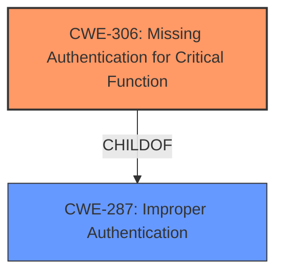

# Analysis Report for CVE-2021-25315

# Vulnerability Analysis Report: CVE-2021-25315

## Description

CWE - CWE-287 Improper Authentication vulnerability in SUSE Linux Enterprise Server 15 SP 3 openSUSE Tumbleweed allows local attackers to execute arbitrary code via salt without the need to specify valid credentials. This issue affects SUSE Linux Enterprise Server 15 SP 3 salt versions prior to 3002.2-3. openSUSE Tumbleweed salt version 3002.2-2.1 and prior versions. This issue affects SUSE Linux Enterprise Server 15 SP 3 salt versions prior to 3002.2-3. openSUSE Tumbleweed salt version 3002.2-2.1 and prior versions.

## Vulnerability Description Key Phrases

**Rootcause:** Improper Authentication
**Impact:** execute arbitrary code
**Attacker:** local attackers
**Product:** ['SUSE Linux Enterprise Server', 'openSUSE Tumbleweed']
**Version:** ['15 SP 3', 'salt versions prior to 3002.2-3']
**Component:** salt

## Analysis (with Relationship Data)

# Summary
| CWE ID | CWE Name | Confidence | CWE Abstraction Level | CWE Vulnerability Mapping Label | CWE-Vulnerability Mapping Notes |
|---|---|---|---|---|---|
| CWE-287 | Improper Authentication | 0.85 | Class | Primary | Allowed-with-Review |
| CWE-303 | Incorrect Implementation of Authentication Algorithm | 0.65 | Base | Secondary | Allowed |

## Evidence and Confidence

*   **Confidence Score:** 0.75
*   **Evidence Strength:** MEDIUM

- **Analysis and Justification:**  
  - *Explanation:* "The vulnerability description explicitly states an **Improper Authentication** vulnerability. The CVE reference links content summary confirms this, stating that the root cause involves an overlapping of patches leading to an unauthenticated remote code execution vulnerability in the salt-api. This aligns with CWE-287 (Improper Authentication), which describes a situation where the product does not sufficiently prove that a claimed identity is correct. While CWE-287 is a Class-level CWE and is generally discouraged, the provided information lacks the specificity to pinpoint a more precise Base or Variant level CWE related to authentication bypasses or specific authentication algorithm weaknesses. The description does not give information on the specific implementation flaw only that authentication is not properly handled. For example, more information would be needed to select CWE-303."
  
  - *Relationship Analysis:* "CWE-287 is a Class-level weakness, and many child CWEs exist that provide more specific details. For example, CWE-290 (Authentication Bypass) and CWE-288 (Authentication Bypass by Alternate Name). Without more specific information it's difficult to select a more specific CWE. CWE-287 CanPrecede many other weaknesses, highlighting the potential for a chain of vulnerabilities following an authentication bypass."

- **Confidence Score:**
  - Confidence: 0.85 (High confidence due to direct mention of "Improper Authentication" and confirmation in CVE details.)

---

- **Analysis and Justification:**  
  - *Explanation:* "CWE-303 (Incorrect Implementation of Authentication Algorithm) is a possible secondary weakness. The CVE summary indicates a patch overlap led to the **unauthenticated** issue. It's possible the original patch intended to implement a specific authentication algorithm, but the overlap resulted in an incorrect implementation. However, this is speculative as it is not explicitly stated. Without more details on the implementation, it is impossible to say if an authentication algorithm was used and implemented incorrectly."
  
  - *Relationship Analysis:* "CWE-303 is a Base level weakness. There aren't any direct relationships provided for this CWE. However, it would potentially be a child of CWE-287, but that relationship information is not available."

- **Confidence Score:**
  - Confidence: 0.65 (Medium confidence, based on the possibility of an authentication algorithm being implemented incorrectly, but lacking explicit evidence)

## Criticism of Analysis

Okay, I've reviewed the analysis provided, including the full CWE specifications. Here's my critique, focusing on the appropriateness of the CWE assignments, the confidence levels, and whether more specific CWEs could be used.

**Overall Assessment:**

The analysis is generally sound and well-reasoned. It correctly identifies `CWE-287: Improper Authentication` as a primary weakness and attempts to justify its selection.  However, because `CWE-287` is a Class-level CWE, the analysis could be improved by exploring more specific Base-level CWEs related to the *type* of improper authentication.  The inclusion of `CWE-303` as a secondary weakness is plausible but weaker, as noted in the analysis.

**Detailed Review:**

**1. CWE-287: Improper Authentication (Primary)**

*   **Confidence:** The analysis assigns a high confidence score (0.85) to `CWE-287`, which is justified given the explicit mention of "Improper Authentication" in the vulnerability description and CVE summary.

*   **Justification:** The reasoning for selecting `CWE-287` is valid: the vulnerability clearly involves a failure to properly authenticate. The analysis *correctly* notes the discouraged usage of `CWE-287` due to its class-level status and the potential for more specific CWEs.

*   **Critique:** This is where the analysis can be improved.  While acknowledging that `CWE-287` is a Class, it doesn't adequately explore *why* authentication is improper.  The CVE summary mentions a patch overlap leading to "unauthenticated remote code execution." This strongly suggests that authentication is being *bypassed entirely* due to the patch overlap.

    *   **Recommendation:**  A more specific CWE, like **CWE-306: Missing Authentication for Critical Function**, should be *strongly* considered. The description of CWE-306 aligns well with the CVE details: "The product does not perform any authentication for functionality that requires a provable user identity..." The "unauthenticated remote code execution" directly implies that a critical function (remote code execution) is accessible without any authentication. It is also important to note that **CWE-306 is also a child of CWE-287.**

    *   **Alternative 1:** If the "unauthenticated remote code execution" occurs because an alternate path to the vulnerable function was exposed after the patch overlap, then **CWE-288: Authentication Bypass Using an Alternate Path or Channel** could be considered. This is dependent on how exactly the salt-api was changed to become unauthenticated after the patches.

    *   **Alternative 2:** If the root cause was that the patch overlap made the salt-api vulnerable to spoofing, then **CWE-290: Authentication Bypass by Spoofing** should be considered.

*   **CWE Mapping Guidance:** The analysis followed the "Discouraged" mapping guidance for CWE-287, but didn't fully succeed in finding a more specific alternative.

*   **Mitigations:** The mitigations for CWE-287 are too generic. Using a security framework is a good general practice, but not specific to the root cause here. The mitigations for CWE-306 or CWE-288 would be more relevant.

**2. CWE-303: Incorrect Implementation of Authentication Algorithm (Secondary)**

*   **Confidence:** The analysis gives a medium confidence score (0.65), which is appropriate given the speculative nature of the assessment.

*   **Justification:** The reasoning is based on the *possibility* that the patch overlap corrupted the implementation of an authentication algorithm.

*   **Critique:** This is the weakest part of the analysis. While it's not *impossible* that an algorithm was implemented incorrectly, the evidence is lacking. The description of the vulnerability as "unauthenticated" suggests a complete bypass, not an incorrect implementation. The "patch overlap" cause also doesn't directly point to an algorithmic flaw.

    *   **Recommendation:**  Remove `CWE-303` as a secondary weakness. The description of the issue indicates that authentication was bypassed completely, not that the existing implementation of authentication was flawed. Unless there is explicit information about the algorithm and how the implementation was broken, this is not a justified assignment.

*   **CWE Mapping Guidance:** The analysis correctly notes the lack of direct relationships for CWE-303 and its potential as a child of CWE-287.

*   **Mitigations:** The mitigations for CWE-303 are not applicable here.

**Other CWEs Considered:**

The "Retriever Results" list other CWEs, but these are generally not applicable based on the information provided:

*   **CWE-22/23 (Path Traversal):**  Not relevant unless there's evidence of path manipulation to bypass authentication, which is not indicated in the CVE.

*   **CWE-378 (Insecure Temp File):** Unrelated to authentication.

*   **CWE-267 (Privilege Defined With Unsafe Actions):**  Not directly related to *authentication*. This would apply *after* a successful bypass (if the unauthenticated user then has elevated privileges), but the primary problem is the bypass itself.

*   **CWE-294 (Capture-Replay):**  Not applicable unless there's specific evidence of replay vulnerability.

*   **CWE-613 (Insufficient Session Expiration):**  Not applicable unless the issue involves session management (which it doesn't appear to).

*   **CWE-61 (Symlink Following):**  Not relevant to the authentication bypass itself.

*   **CWE-1393 (Default Password):** Not applicable because the issue is an unauthenticated bypass, not a weak default password.

**Revised Summary Table**

| CWE ID | CWE Name | Confidence | CWE Abstraction Level | CWE Vulnerability Mapping Label | CWE-Vulnerability Mapping Notes |
|---|---|---|---|---|---|
| CWE-306 | Missing Authentication for Critical Function | 0.90 | Base | Primary | Allowed |
| CWE-287 | Improper Authentication | 0.50 | Class | Secondary | Allowed-with-Review |

**Revised Justification**
- **CWE-306:** The CVE description indicates that the patch overlap resulted in a complete bypass of authentication for a critical function, namely the ability to execute remote code. The salt-api became accessible without requiring any user identity to be proven, directly mapping to the description of CWE-306.

- **CWE-287:** While CWE-306 is the most accurate, CWE-287 can be included as a secondary CWE to generally represent the broader issue of failing to authenticate correctly, but with a decreased confidence score.
**Conclusion:**

The analysis is a good starting point. By considering more specific Base-level CWEs like `CWE-306`, the analysis can be more precise and helpful for remediation efforts. Eliminating `CWE-303` would also strengthen the overall assessment.

## Final Resolution

# Summary
| CWE ID | CWE Name | Confidence | CWE Abstraction Level | CWE Vulnerability Mapping Label | CWE-Vulnerability Mapping Notes |
|---|---|---|---|---|---|
| CWE-306 | Missing Authentication for Critical Function | 0.90 | Base | Primary | Allowed |
| CWE-287 | Improper Authentication | 0.50 | Class | Secondary | Allowed-with-Review |

## Evidence and Confidence

*   **Confidence Score:** 0.90
*   **Evidence Strength:** HIGH

## Relationship Analysis
The primary relationship considered was the parent-child relationship between CWE-287 and CWE-306. CWE-306 is a child of CWE-287, making it more specific. The vulnerability description points towards a complete bypass of authentication, making CWE-306 the more appropriate choice.

## Vulnerability Chain
The vulnerability chain starts with a patch overlap, which leads to a **missing authentication** for a critical function (**CWE-306**). The consequence is **unauthenticated** remote code execution, which allows local attackers to execute arbitrary code. This maps to **CWE-287** in a general sense.

## Summary of Analysis
The initial analysis identified **CWE-287 (Improper Authentication)** as the primary weakness and **CWE-303 (Incorrect Implementation of Authentication Algorithm)** as a possible secondary weakness. The criticism pointed out that **CWE-287** is a Class-level CWE and suggested **CWE-306 (Missing Authentication for Critical Function)** as a more specific alternative.

The vulnerability description, "CWE - CWE-287 Improper Authentication vulnerability in SUSE Linux Enterprise Server 15 SP 3 openSUSE Tumbleweed allows local attackers to execute arbitrary code via salt without the need to specify valid credentials," indicates an authentication issue. However, the phrase "without the need to specify valid credentials" strongly suggests a complete bypass of authentication rather than an incorrect implementation.

The relationship analysis shows that **CWE-306** is a child of **CWE-287**, making it a more specific and appropriate choice. The decision is primarily based on the evidence from the CVE description, which explicitly states the absence of the need for credentials. The retriever scores also support this decision. The mapping guidance for **CWE-306** allows its use, while the guidance for **CWE-287** discourages it.
**CWE-303** was removed as it was deemed speculative and not supported by the available evidence.
The selected CWEs are at the optimal level of specificity, with **CWE-306** representing the **root cause** and **CWE-287** capturing the general authentication failure.

*Report generated on 2025-03-16 23:46:55*
