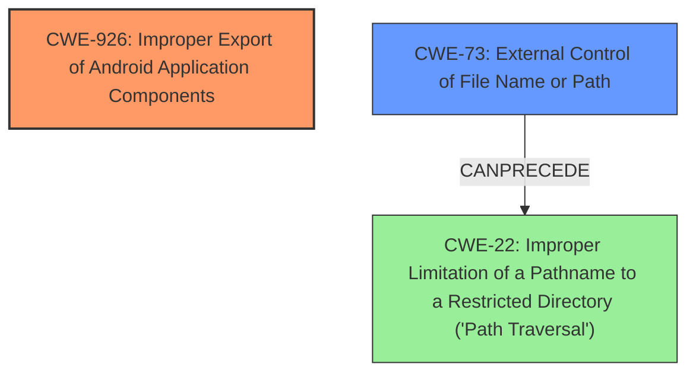

# Analysis Report for CVE-2021-25397

# Vulnerability Analysis Report: CVE-2021-25397

## Description

An improper access control vulnerability in TelephonyUI prior to SMR MAY-2021 Release 1 allows local attackers to write arbitrary files of telephony process via untrusted applications.

## Vulnerability Description Key Phrases

**Rootcause:** improper access control
**Impact:** write arbitrary files
**Attacker:** local attackers
**Product:** TelephonyUI
**Version:** prior to SMR MAY-2021 Release 1

## Analysis (with Relationship Data)

# Summary
| CWE ID | CWE Name | Confidence | CWE Abstraction Level | CWE Vulnerability Mapping Label | CWE-Vulnerability Mapping Notes |
|---|---|---|---|---|---|
| CWE-926 | Improper Export of Android Application Components | 0.85 | Variant | Allowed | Primary CWE |
| CWE-22 | Improper Limitation of a Pathname to a Restricted Directory ('Path Traversal') | 0.70 | Base | Allowed | Secondary Candidate |

## Evidence and Confidence

*   **Confidence Score:** 0.80
*   **Evidence Strength:** HIGH

- **Analysis and Justification:**
  - *Explanation:* The vulnerability description and CVE Reference Links Content Summary explicitly state an **improper access control** issue in TelephonyUI that allows local attackers to write arbitrary files. The key is that a receiver is exported and that it does not properly restrict which applications can launch the component or access the data it contains. This aligns directly with CWE-926, Improper Export of Android Application Components, as the vulnerability leverages an exported component (`com.samsung.android.app.telephonyui.carrierui.photoring.model.PhotoringReceiver`) to write files without proper authorization. The attacker can send broadcast intents to this receiver, exploiting its functionality to write arbitrary files.

  - *Relationship Analysis:* CWE-926 is a Variant of weaknesses related to access control. The retriever results confirm this by identifying CWE-269 (Improper Privilege Management), CWE-285 (Improper Authorization), and CWE-284 (Improper Access Control) as related weaknesses. While these are higher-level classes, CWE-926 provides the most specific mapping for this Android-specific vulnerability.

- **Confidence Score:**
  - Confidence: 0.85 (High evidence from the vulnerability description and CVE reference materials).

---

- **Analysis and Justification:**
  - *Explanation:* The vulnerability allows local attackers to write arbitrary files via untrusted applications by sending a broadcast intent with crafted parameters. Specifically, the `down_file` parameter determines the destination path. If the application doesn't properly validate or sanitize this path, it can lead to writing files outside the intended directory, which is a classic path traversal scenario. Therefore, CWE-22 (Improper Limitation of a Pathname to a Restricted Directory) is a relevant secondary weakness.

  - *Relationship Analysis:* CWE-22 is a base CWE and a child of CWE-668 (Exposure of Resource to Wrong Sphere). The ability to write arbitrary files is the impact, and CWE-22 helps explain how the arbitrary file write is achieved due to path traversal.

- **Confidence Score:**
  - *Example:* Confidence: 0.70 (Moderate evidence as path traversal is implied by the ability to write arbitrary files, but not explicitly stated as the root cause).

## Criticism of Analysis

Okay, I've reviewed the provided analysis, paying close attention to the CWE specifications, mapping guidance, and potential mitigations. Here's my critique:

**Overall Assessment:**

The analysis is generally well-reasoned and provides a good explanation for the chosen CWE mappings. The confidence scores are appropriate given the information available. The inclusion of evidence and relationship analysis is helpful. However, there's room for improvement in considering alternative CWEs and exploring the nuances of the vulnerability.

**Specific Comments:**

**1. CWE-926: Improper Export of Android Application Components (Primary CWE)**

*   **Assessment:**  The mapping to CWE-926 is strong and well-justified. The vulnerability description explicitly mentions an exported component and a lack of proper restrictions on who can access it, which is precisely what CWE-926 describes.
*   **Confidence:** The confidence score of 0.85 is appropriate and justified.
*   **Mapping Guidance Alignment:**  The analysis correctly identifies CWE-926 as a Variant, which is the preferred level of abstraction.
*   **Mitigations Alignment:** The described mitigations are relevant. Making the component unexported or restricting access to only signed apps are standard ways to address this issue.
*   **Suggestion:** The analysis could benefit from an even more detailed explanation of _why_ the component was exported in the first place. Was it a design flaw, a misunderstanding of Android's component model, or a deliberate choice that lacked proper security considerations? Adding this context would provide a richer understanding of the root cause.

**2. CWE-22: Improper Limitation of a Pathname to a Restricted Directory ('Path Traversal') (Secondary Candidate)**

*   **Assessment:** This is a plausible secondary CWE, as the `down_file` parameter provides an attacker the ability to influence where files are written, which can potentially lead to writing outside the intended directory.
*   **Confidence:** The confidence score of 0.70 is reasonable, reflecting the fact that path traversal is *implied* but not explicitly stated in the CVE description as a direct root cause. It's derived from the arbitrary file write capability.
*   **Mapping Guidance Alignment:** The analysis correctly identifies CWE-22 as a Base.
*   **Mitigations Alignment:** The analysis correctly identifies that validating or sanitizing the file path is a mitigation, and mentions canonicalization.
*   **Suggestion:**
    *   Explicitly state the assumption that the `down_file` parameter is used directly as part of a file system path without proper sanitization. If there's any transformation or processing of the path before use, that should be considered and potentially change the CWE.
    *   Consider the relationship with **CWE-73: External Control of File Name or Path.** CWE-73 is a broader category where the attacker controls the filename or path used in a filesystem operation. Since the attacker has control over `down_file`, which becomes part of the path, CWE-73 might be a better fit as a *primary* or at least a *co-primary* CWE. The current analysis focuses more on the consequences (path traversal) rather than the initial point of control (the file path).
    *   **CWE-184: Incomplete List of Disallowed Inputs** could be relevant if the application is attempting to sanitize the filename but missing certain characters like `\` on Windows or unusual encodings.

**3. Other CWE Considerations:**

*   **CWE-285: Improper Authorization** is listed as a ParentOf CWE-926, so it was considered indirectly. Reviewing the definition for CWE-285, it would be more appropriate to map to CWE-862/CWE-863.

*   **CWE-668: Exposure of Resource to Wrong Sphere** is listed as a ParentOf CWE-22, so it was considered indirectly. Reviewing the defintion for CWE-668, it is high-level and discouraged.

*    **CWE-20: Improper Input Validation**: While seemingly relevant, remember CWE-20 is discouraged and over-used, as you've correctly identified.

**4. Minor Improvements:**

*   In the "Evidence and Confidence" section, it's good to explain the rationale for the confidence score in terms of the strength of evidence (e.g., "explicit statement" vs. "implied behavior").
*   When discussing relationships between CWEs, it's useful to mention the Abstraction level. This can help justify the choice of a more specific CWE over a more general one.

**Revised Summary Table:**

| CWE ID | CWE Name | Confidence | CWE Abstraction Level | CWE Vulnerability Mapping Label | CWE-Vulnerability Mapping Notes |
|---|---|---|---|---|---|
| CWE-926 | Improper Export of Android Application Components | 0.85 | Variant | Allowed | Primary CWE |
| CWE-73 | External Control of File Name or Path | 0.75 | Base | Allowed | Secondary/Co-Primary Candidate |
| CWE-22 | Improper Limitation of a Pathname to a Restricted Directory ('Path Traversal') | 0.70 | Base | Allowed | Tertiary Candidate - Consequence of Improper Path Handling.  |

**Key Takeaways:**

*   The core analysis is solid. The reviewer has correctly mapped to the primary weakness.
*   The analysis could benefit from a more thorough consideration of alternative CWEs, especially those related to file path manipulation (CWE-73).
*   Explaining the rationale behind the confidence scores is helpful.
*   Focus on the root cause and the initial point of attacker control, rather than solely on the consequences.

By incorporating these suggestions, the analysis would be even more robust and provide a deeper understanding of the vulnerability.

## Final Resolution

# Summary
| CWE ID | CWE Name | Confidence | CWE Abstraction Level | CWE Vulnerability Mapping Label | CWE-Vulnerability Mapping Notes |
|---|---|---|---|---|---|
| CWE-926 | Improper Export of Android Application Components | 0.85 | Variant | Allowed | Primary CWE |
| CWE-73 | External Control of File Name or Path | 0.75 | Base | Allowed | Secondary CWE |
| CWE-22 | Improper Limitation of a Pathname to a Restricted Directory ('Path Traversal') | 0.70 | Base | Allowed | Secondary Candidate |

## Evidence and Confidence

*   **Confidence Score:** 0.80
*   **Evidence Strength:** HIGH

## Relationship Analysis
The primary weakness is CWE-926, which is a Variant-level CWE. The secondary CWEs are related to file path manipulation. CWE-73 is a broader category where the attacker controls the filename or path used in a filesystem operation and CANPRECEDE CWE-22. CWE-22 is a more specific case of path traversal. The hierarchy is that CWE-73 can lead to CWE-22.

## Vulnerability Chain
The vulnerability chain starts with the improper export of an Android application component (CWE-926). This allows untrusted applications to send broadcast intents to the exported component. The `down_file` parameter in the intent is then used to control the destination path of a file write operation (CWE-73). If the application does not properly sanitize this path, it can lead to writing files outside the intended directory, resulting in a path traversal vulnerability (CWE-22) and ultimately allowing local attackers to write arbitrary files of the telephony process.

## Summary of Analysis
The initial analysis correctly identified CWE-926 as the primary **WEAKNESS**. The criticism suggested that CWE-73 should be considered as a co-primary **ROOTCAUSE** or secondary CWE since the attacker has control over the `down_file` parameter. The vulnerability description states, "An improper access control vulnerability in TelephonyUI prior to SMR MAY-2021 Release 1 allows local attackers to write arbitrary files of telephony process via untrusted applications". This statement indicates the improper export of the component and external control over the file path, making CWE-926 and CWE-73 highly relevant. The initial analysis mentioned that the `down_file` parameter is used to determine the destination path. Considering the relationships and the evidence, the final decision is to keep CWE-926 as the primary CWE due to the improper export, and have CWE-73 as a secondary CWE due to external control of the file path. CWE-22 is the consequence of improper path handling, so it is less important to classify, but could be a tertiary candidate.

The selected CWEs are at the optimal level of specificity, with CWE-926 being a Variant specific to Android application components and CWE-73 being a Base CWE applicable to file path manipulation.

*Report generated on 2025-03-17 00:29:42*
