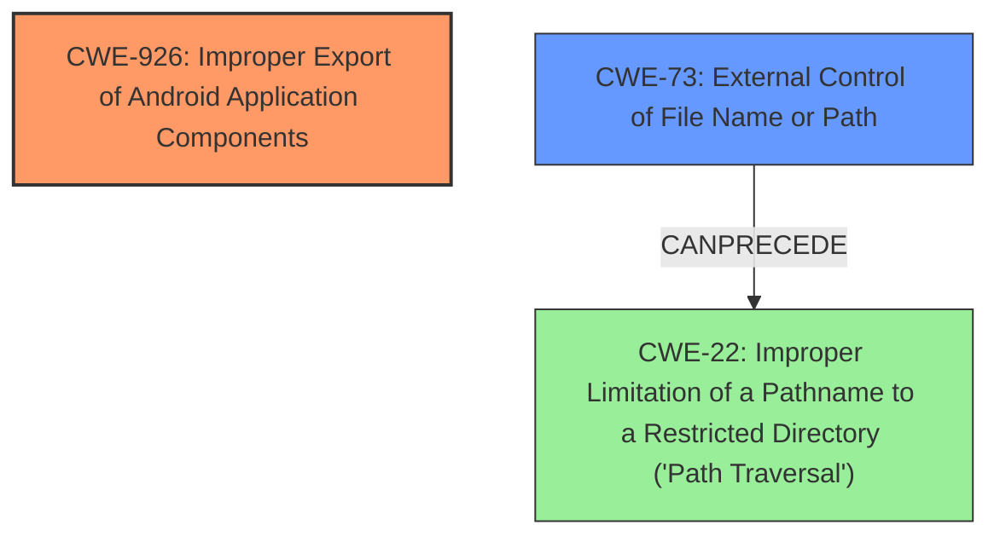

# Final Resolution for CVE-2021-25397

# Summary
| CWE ID | CWE Name | Confidence | CWE Abstraction Level | CWE Vulnerability Mapping Label | CWE-Vulnerability Mapping Notes |
|---|---|---|---|---|---|
| CWE-926 | Improper Export of Android Application Components | 0.85 | Variant | Allowed | Primary CWE |
| CWE-73 | External Control of File Name or Path | 0.75 | Base | Allowed | Secondary CWE |
| CWE-22 | Improper Limitation of a Pathname to a Restricted Directory ('Path Traversal') | 0.70 | Base | Allowed | Secondary Candidate |

## Evidence and Confidence

*   **Confidence Score:** 0.80
*   **Evidence Strength:** HIGH

## Relationship Analysis
The primary weakness is CWE-926, which is a Variant-level CWE. The secondary CWEs are related to file path manipulation. CWE-73 is a broader category where the attacker controls the filename or path used in a filesystem operation and CANPRECEDE CWE-22. CWE-22 is a more specific case of path traversal. The hierarchy is that CWE-73 can lead to CWE-22.

## Vulnerability Chain
The vulnerability chain starts with the improper export of an Android application component (CWE-926). This allows untrusted applications to send broadcast intents to the exported component. The `down_file` parameter in the intent is then used to control the destination path of a file write operation (CWE-73). If the application does not properly sanitize this path, it can lead to writing files outside the intended directory, resulting in a path traversal vulnerability (CWE-22) and ultimately allowing local attackers to write arbitrary files of the telephony process.

## Summary of Analysis
The initial analysis correctly identified CWE-926 as the primary **WEAKNESS**. The criticism suggested that CWE-73 should be considered as a co-primary **ROOTCAUSE** or secondary CWE since the attacker has control over the `down_file` parameter. The vulnerability description states, "An improper access control vulnerability in TelephonyUI prior to SMR MAY-2021 Release 1 allows local attackers to write arbitrary files of telephony process via untrusted applications". This statement indicates the improper export of the component and external control over the file path, making CWE-926 and CWE-73 highly relevant. The initial analysis mentioned that the `down_file` parameter is used to determine the destination path. Considering the relationships and the evidence, the final decision is to keep CWE-926 as the primary CWE due to the improper export, and have CWE-73 as a secondary CWE due to external control of the file path. CWE-22 is the consequence of improper path handling, so it is less important to classify, but could be a tertiary candidate.

The selected CWEs are at the optimal level of specificity, with CWE-926 being a Variant specific to Android application components and CWE-73 being a Base CWE applicable to file path manipulation.