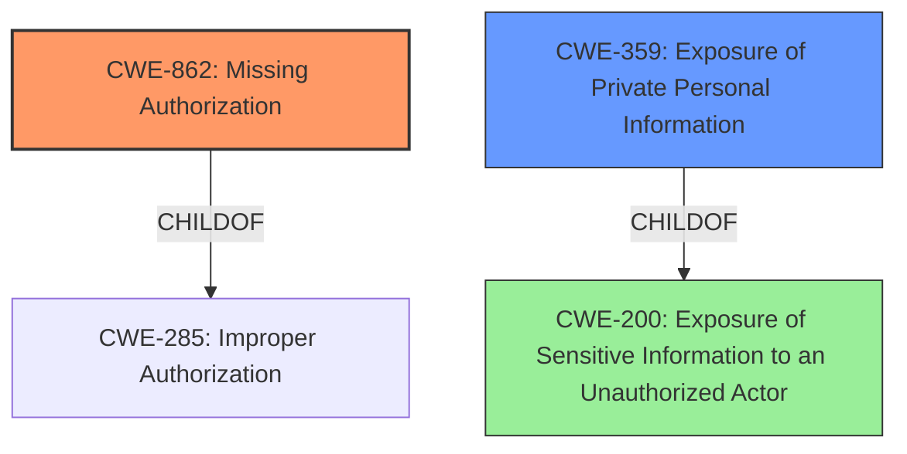

# Final Resolution for CVE-2021-25406

# Summary
| CWE ID | CWE Name | Confidence | CWE Abstraction Level | CWE Vulnerability Mapping Label | CWE-Vulnerability Mapping Notes |
|---|---|---|---|---|---|
| CWE-862 | Missing Authorization | 0.85 | Base | Primary | Allowed |
| CWE-359 | Exposure of Private Personal Information | 0.70 | Base | Secondary Candidate | Allowed |

## Evidence and Confidence

*   **Confidence Score:** 0.80
*   **Evidence Strength:** MEDIUM

## Relationship Analysis
The initial assessment correctly identified a confidentiality issue. However, it incorrectly chose CWE-200, which is a class-level CWE and discouraged for direct mapping. The criticism pointed out that the root cause needed to be identified. The relationships considered included:

*   **CWE-862 (Missing Authorization):** This is a strong candidate because the vulnerability description indicates unauthorized access to device information.
*   **CWE-359 (Exposure of Private Personal Information):** Bluetooth device information can be considered private information, making this a relevant secondary consideration.
*   **CWE-200 (Information Exposure):** While related, it's too general and discouraged for use when more specific CWEs exist.

The hierarchical relationships show that CWE-862 and CWE-359 are more specific than CWE-200. There are no direct chain relationships evident in the provided data. Peer relationships were not significantly impactful in this decision. The abstraction levels played a crucial role, favoring Base-level CWEs like CWE-862 and CWE-359 over the Class-level CWE-200.

## Vulnerability Chain
The vulnerability chain starts with a **ROOTCAUSE** of **CWE-862 (Missing Authorization)**. Because the Gear S Plugin does not properly authorize applications requesting access to the connected BT device information, unauthorized applications can gain access to this information. This leads to **CWE-200 (Exposure of Sensitive Information)** as an impact, and potentially **CWE-359 (Exposure of Private Personal Information)** if the BT device information is considered private to the user.

## Summary of Analysis
The initial analysis correctly identified the information exposure but failed to pinpoint the **ROOTCAUSE**. The criticism correctly highlighted this and suggested considering CWE-862.

The evidence for CWE-862 is the statement that "unstrusted applications [can] access connected BT device information." This directly implies a lack of authorization, making CWE-862 a strong candidate.

The graph relationships influenced the decision by showing that CWE-862 is a more specific Base-level CWE compared to the general Class-level CWE-200. This aligns with CWE's guidance to choose the most specific applicable CWE.

The selected CWEs are at the optimal level of specificity. CWE-862 addresses the core issue of missing authorization. CWE-359 is a secondary candidate that addresses the exposure of potentially private information. Choosing CWE-200 would be too general and would not provide sufficient information for effective mitigation.